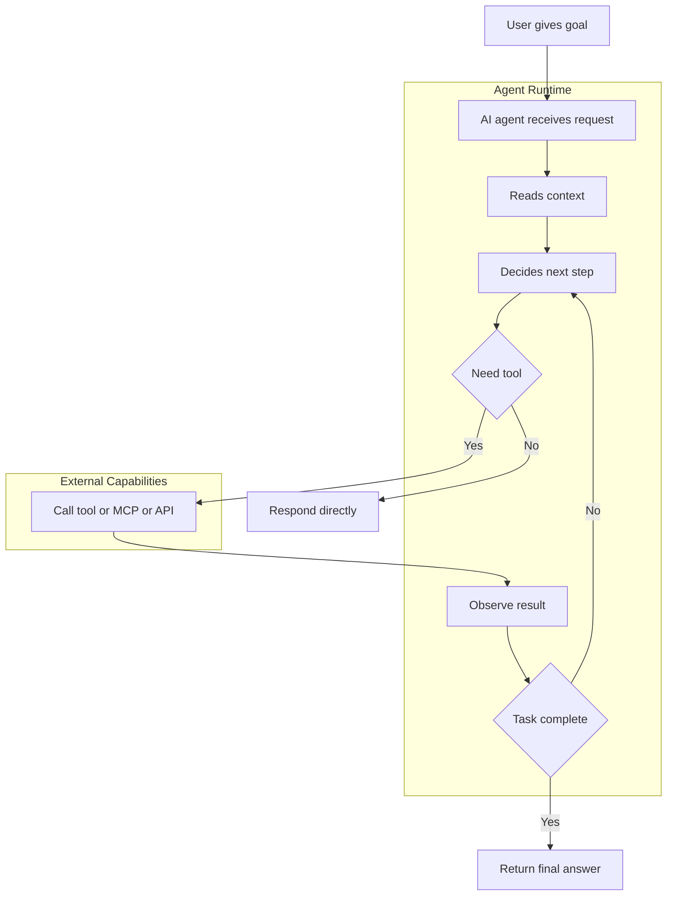

```mermaid
flowchart TD
    A[User gives goal] --> B[AI agent receives request]
    B --> C[Reads context]
    C --> D[Decides next step]
    D --> E{Need tool}
    E -- No --> F[Respond directly]
    E -- Yes --> G[Call tool or MCP or API]
    G --> H[Observe result]
    H --> I{Task complete}
    I -- No --> D
    I -- Yes --> J[Return final answer]

    subgraph Runtime[Agent Runtime]
        B
        C
        D
        E
        H
        I
    end

    subgraph Tools[External Capabilities]
        G
    end
```
