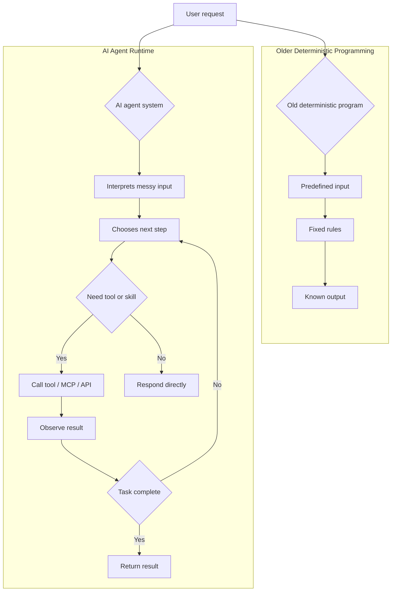

```mermaid
flowchart TD
    A[User request] --> B{Old deterministic program}

    B --> C[Predefined input]
    C --> D[Fixed rules]
    D --> E[Known output]

    A --> F{AI agent system}

    F --> G[Interprets messy input]
    G --> H[Chooses next step]
    H --> I{Need tool or skill}
    I -- Yes --> J[Call tool / MCP / API]
    I -- No --> K[Respond directly]
    J --> L[Observe result]
    L --> M{Task complete}
    M -- No --> H
    M -- Yes --> N[Return result]

    subgraph OldProgramming[Older Deterministic Programming]
        B
        C
        D
        E
    end

    subgraph AgentProgramming[AI Agent Runtime]
        F
        G
        H
        I
        J
        K
        L
        M
        N
    end
```
