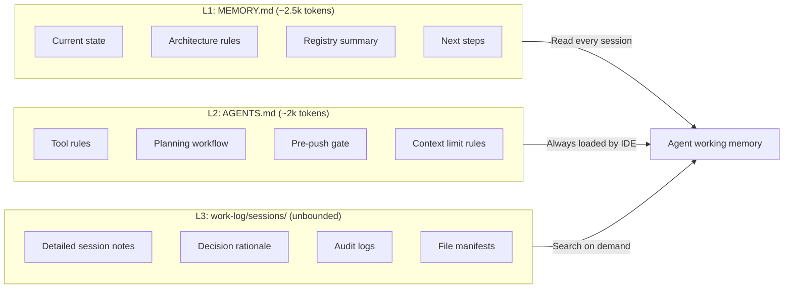
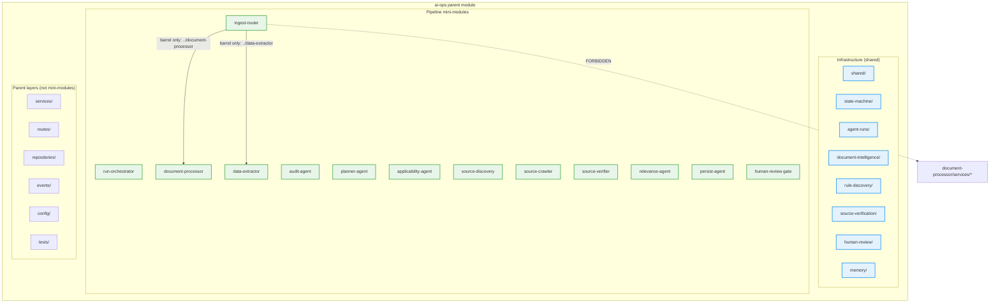
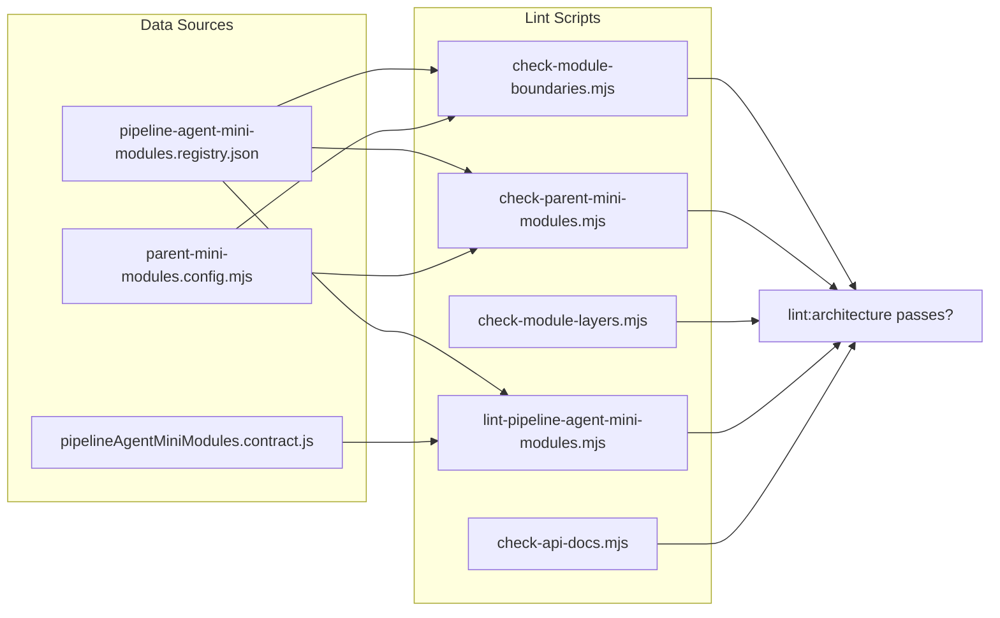
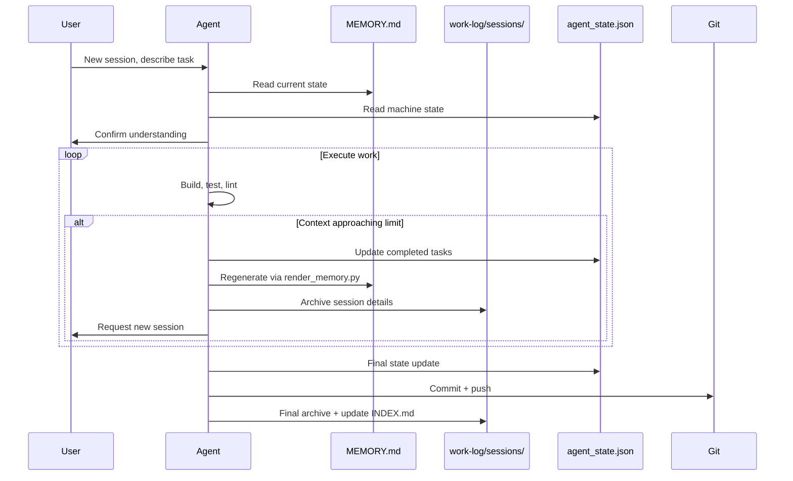

# Study Log — create-modular-monolith

**Date:** 2026-06-06
**Author:** Teres + AI agent pair
**Project:** generic modular monolith scaffold with pipeline agent mini-modules
**Branch:** `architecture/pipeline-agent-mini-modules-v001`

---

## Problems We Solved

### 1. LLM agents lose context between sessions
**Problem:** Each new session starts from zero. Agent wastes tokens re-learning architecture decisions, module contracts, and project state.

**Solution:** Three-layer memory system.
- L1: `MEMORY.md` — current state only (~2.5k tokens), read every session
- L2: `AGENTS.md` — agent rules, always loaded by IDE (~2k tokens)
- L3: `work-log/sessions/` — detailed history, unbounded, searchable on demand

**Result:** Active context baseline is ~5k tokens. ~24k tokens remaining for actual work per session on a 32k model.

### 2. No machine-readable source of truth
**Problem:** `MEMORY.md` was the only state file. Agent had to parse Markdown to update project state, risking format drift and inconsistent updates.

**Solution:** Hard state management with `buildplan/agent_state.json` as the single source of truth. `MEMORY.md` is now a rendered view generated by `render_memory.py`. Agent writes JSON directly.

**Result:** Machine-readable state with integrity checksum (`agent_state.sha256`). Rendered view stays consistent. Agent cannot corrupt the human-readable file.

### 3. No enforcement of context budget
**Problem:** No way to measure or enforce token limits. Agent could blow through context and lose work.

**Solution:** `measure_context.py` enforces a hard 24k token limit. Exits with code 1 when budget exceeded. Atomic writes via `os.replace`. Session reset with `--start-session` flag.

**Result:** Hard gate prevents context overflow. Agent must compact, archive, and reset before continuing.

### 4. Module transitions not gated
**Problem:** Agent could switch active modules without verifying architecture lints pass, potentially carrying forward broken state.

**Solution:** `check_gate.py` runs `npm run lint:architecture` before allowing module transitions. Updates `agent_state.json` with lint result. Blocks if lint fails.

**Result:** Module transitions are gated. Lint must pass before the agent moves to the next module.

### 5. Deep imports between sibling mini-modules
**Problem:** Pipeline agents could import from each other's internal `services/`, `routes/`, etc., creating hidden coupling.

**Solution:** `lint:mini-modules` script enforces barrel-only imports. Sibling mini-modules must import via `../<slug>` (barrel `index.js`), never deep paths.

**Verification:** Created deliberate violation:
```js
import { processDocument } from "../document-processor/services/processor.service.js";
```
Lint correctly caught it and pointed to barrel pattern. Rolled back, all green.

### 6. Registry and disk state mismatch
**Problem:** Registry listed 13 mini-modules. Only `model-condenser/` existed on disk. Frontend had only `_reference/`.

**Solution:** Scaffolded all 12 pipeline mini-modules (backend + frontend), 8 infrastructure mini-modules, and 9 parent layer directories. Registry, folders, and manifests now align.

**Verification:** `lint:pipeline-agent-mini-modules` passes. Registry ↔ folder ↔ manifest alignment confirmed.

### 7. Domain-specific naming in a generic scaffold
**Problem:** Mini-modules started with legal-tech names (`parser-agent`, `ocr-agent`, `filing-audit-agent`), making the scaffold less portable.

**Solution:** Renamed all 12 to generic slugs across registry, manifests, API docs, and frontend mirror:

| Legal slug | Generic slug |
|---|---|
| `parser-agent` | `ingest-router` |
| `ocr-agent` | `document-processor` |
| `extractor-agent` | `data-extractor` |
| `filing-audit-agent` | `audit-agent` |
| `authority-planner-agent` | `planner-agent` |
| `rule-applicability-agent` | `applicability-agent` |
| `source-discovery-agent` | `source-discovery` |
| `source-crawler-agent` | `source-crawler` |
| `source-verifier-agent` | `source-verifier` |
| `rule-relevance-agent` | `relevance-agent` |
| `rule-filing-persist-agent` | `persist-agent` |
| `rule-discovery-run` | `run-orchestrator` |

### 8. Python scripts failing with path resolution errors
**Problem:** Scripts in `scripts/` used `__file__` to resolve `_REPO_ROOT`, but `FileNotFoundError` occurred when running from CLI because the path resolution logic didn't account for being invoked from different working directories.

**Solution:** Scripts use a two-step resolution:
1. Find `template/` directory by walking up from script location
2. Parent of `template/` is `_REPO_ROOT`

**Result:** Scripts work from any working directory. Mirrored to `template/scripts/` with adjusted defaults for scaffolded usage.

### 9. FSM templates don't match internal contract
**Problem:** Template files for agent state machines had 8 findings (3 blockers):
- No `index.js` composition root (contract requires `register(app, context)`)
- Import paths wrong for ai-ops mini-modules (need extra `../` for nested depth)
- Migration creates global tables with no per-module prefixing

**Status:** Documented in `work-log/sessions/2026-06-06-fsm-template-audit.md`. Not yet fixed — blockers for ai-ops mini-module implementation.

---

## Architecture Visualized

```mermaid
graph TB
    subgraph Session["Each Session Lifecycle"]
        Start[Start] --> Read[Read MEMORY.md]
        Read --> Work[Execute task(s)]
        Work --> Check{Context <br/>approaching limit?}
        Check -- No --> Done[Done]
        Check -- Yes --> Compact[Compact immediately]
        Compact --> Archive
        Done --> Archive[Archive to<br/>work-log/sessions/]
        Archive --> Prune[Prune MEMORY.md<br/>to current state only]
        Prune --> End[End session]
    end

    subgraph Persistence["Cross-Session Persistence"]
        MEMORY[template/MEMORY.md<br/>~96 lines, current state only]
        Sessions[work-log/sessions/*.md<br/>detailed history, searchable]
        Index[work-log/sessions/INDEX.md<br/>table of contents]
        State[buildplan/agent_state.json<br/>machine-readable truth]
        MEMORY --- Sessions
        MEMORY --- Index
        MEMORY --- State
    end

    subgraph Guardrails["Enforced via Lint Scripts"]
        Boundaries[lint:boundaries<br/>cross-module imports]
        MiniMods[lint:mini-modules<br/>barrel-only sibling imports]
        Layers[lint:layers<br/>intra-module layer rules]
        Registry[lint:pipeline-agent<br/>registry ↔ folder alignment]
        Gate[check_gate.py<br/>blocks module transitions]
        Budget[measure_context.py<br/>hard 24k token limit]
    end

    Session --> Persistence
    Guardrails --> Session
```

### Three-Layer Memory System



### Mini-Module Architecture



### Enforcement System



### Session Workflow



---

## Architecture

```
create-modular-monolith/
├── scripts/                        ← Repo management Python scripts
│   ├── measure_context.py          ← Token budget enforcement (hard limit: 24k)
│   ├── render_memory.py            ← Generates MEMORY.md from agent_state.json
│   └── check_gate.py               ← Lint gate before module transition
├── template/
│   ├── buildplan/                  ← Hard state management
│   │   ├── agent_state.json        ← Machine-readable source of truth
│   │   ├── agent_state.sha256      ← Integrity checksum
│   │   └── context_budget.json     ← Token budget tracker
│   ├── scripts/                    ← Scaffolded copies (adjusted paths)
│   ├── backend/
│   │   └── src/modules/ai-ops/     ← 12 pipeline mini-modules
│   │       ├── ingest-router/      ← [assigner] backend: implemented
│   │       ├── document-processor/ ← [worker]
│   │       ├── data-extractor/     ← [worker]
│   │       ├── audit-agent/        ← [worker]
│   │       ├── planner-agent/      ← [worker] planned
│   │       ├── applicability-agent/← [worker]
│   │       ├── source-discovery/   ← [worker]
│   │       ├── source-crawler/     ← [worker]
│   │       ├── source-verifier/    ← [worker]
│   │       ├── relevance-agent/    ← [worker] planned
│   │       ├── persist-agent/      ← [worker] planned
│   │       ├── run-orchestrator/   ← [orchestrator]
│   │       └── human-review/       ← [gate] orchestrated
│   ├── frontend/
│   │   └── src/modules/ai-ops/     ← 12 pipeline + 8 infra mini-modules
│   ├── docs/                       ← Architecture contracts
│   ├── work-log/                   ← Sessions, planning, dev-logs
│   └── MEMORY.md                   ← Rendered view (read-only to agent)
└── AGENTS.md                       ← Agent rules (repo root)
```

---

## Token Budget

<details>
<summary><b>Click to expand: token budget analysis</b></summary>

| Layer | File | Lines | Est. tokens | Loaded when? |
|-------|------|-------|-------------|--------------|
| L1 | `template/MEMORY.md` | 96 | ~2,400 | Every session start |
| L2 | `template/AGENTS.md` | 95 | ~2,300 | Always (IDE rule) |
| L3 | Session archives | varies | ~800/session | On-demand search |
| L3 | `INDEX.md` | 6 | ~150 | Session archive update |
| **Total active** | — | — | **~5,000** | Working context baseline |

**Remaining budget per session:** ~24,000 tokens for actual work (on a 32k model).

The key insight: MEMORY.md stays under 3k tokens by design. It stores only current state, not history. History lives in Layer 3 where it's searchable but not loaded automatically.
</details>

---

## Enforcement Test Results

<details>
<summary><b>Click to expand: violation test details</b></summary>

**Test file created:** `backend/src/modules/ai-ops/ingest-router/services/violation-test.js`

```js
// VIOLATION TEST — deep import from sibling (should fail lint)
import { processDocument } from "../document-processor/services/processor.service.js";

export function routeDocument(file) {
  return processDocument(file);
}
```

**Result from `npm run lint:mini-modules`:**
```
Parent mini-module boundary violations found:

- backend/src/modules/ai-ops/ingest-router/services/violation-test.js
  deep-imports document-processor via
  "../document-processor/services/processor.service.js"
  (use ../document-processor or ../document-processor/index.js)
```

**Verdict:** ✅ Enforcement works. The script correctly identified the deep import into a sibling mini-module's internal `services/` folder and pointed to the correct barrel import pattern.

**Rollback:** Removed test file, all lints passed green.
</details>

### Internal Directory Allowlist

The linter knows which subdirectories count as "internal" and forbidden for cross-mini-module imports:

| Directory | Frontend | Backend |
|-----------|----------|---------|
| `components/` | ✅ | ✅ |
| `services/` | ✅ | ✅ |
| `data/` | ✅ | ✅ |
| `pages/` | ✅ | ✅ |
| `hooks/` | ✅ | ✅ |
| `utils/` | ✅ | ✅ |
| `agents/` | ❌ | ✅ |
| `routes/` | ❌ | ✅ |
| `schemas/` | ❌ | ✅ |
| `prompts/` | ❌ | ✅ |
| `evals/` | ❌ | ✅ |
| `repositories/` | ❌ | ✅ |
| `adapters/` | ❌ | ✅ |
| `domain/` | ❌ | ✅ |
| `events/` | ❌ | ✅ |
| `config/` | ❌ | ✅ |

---

## Key Agent Rules

<details>
<summary><b>Click to expand: agent discipline rules</b></summary>

1. **Hard ~24k token working limit** — 32k model, ~8k reserved for system prompt + MEMORY.md + AGENTS.md. At 24k of working context, stop and compact.

2. **Read discipline** — Never read large files or multiple files if not strictly necessary. Prefer `grep`/`glob` over `read`. Minimize tool calls that consume context.

3. **One task per session** — Scope each session to a single, bounded task. Don't start two independent threads in one session.

4. **Archive before prune** — Always write the detailed session note to `work-log/sessions/` first, then prune `MEMORY.md`. Never delete before archiving.

5. **MEMORY.md is current state only** — No completed items, no history, no "we decided X because Y." That belongs in Layer 3. MEMORY.md stores: what's true now, what's next, and the rules.

6. **Generic scaffold** — The template is domain-agnostic. Pipeline agent slugs are generic (`ingest-router`, `document-processor`, `audit-agent`), not tied to any specific domain. Swap the slugs for any project.

7. **Verification before commit** — Always run `npm run lint:architecture` before committing. Never push first — write dev logs, verify, commit, then push.

8. **MEMORY.md is read-only** — Agent writes to `agent_state.json`. `render_memory.py` generates the view. Agent cannot corrupt the human-readable file.
</details>

---

## Session Archives

| Date | Slug | Link |
|------|------|------|
| 2026-06-06 | audit-and-memory-setup | [→](./work-log/sessions/2026-06-06-audit-and-memory-setup.md) |
| 2026-06-06 | fsm-template-audit | [→](./work-log/sessions/2026-06-06-fsm-template-audit.md) |
| 2026-06-06 | generic-rename-and-enforcement-test | [→](./work-log/sessions/2026-06-06-generic-rename-and-enforcement-test.md) |

---

## Lessons Learned

### What worked
- **Three-layer memory** separated current state from history. Kept active context under 5k tokens.
- **Hard state management** with JSON source of truth + rendered view. Agent cannot corrupt the human file.
- **Registry-driven architecture** — JSON registry is the single source of truth. Lints derive everything from it.
- **Enforcement test** — creating a deliberate violation proved the lints work before relying on them.
- **Pruning aggressively** — MEMORY.md stores only "what's true now." History lives in Layer 3.

### What we'd do differently
- **Start with generic names** — scaffolded with domain-specific names, then renamed. Starting generic saves a commit.
- **Automate the frontend registry mirror** — currently a manual copy. A post-lint hook would be better.
- **Bigger context model helps** — 24k working limit forced aggressive scoping. 128k model enables bigger tasks, but the three-layer pattern still applies.
- **Script duplication** — having scripts in both `scripts/` and `template/scripts/` with adjusted paths works but adds maintenance burden. A single copy with smarter path resolution would be cleaner.

---

## Commit History

| Commit | Message |
|--------|---------|
| `1dbcd50` | feat: clear install prompt with numbered options, mini-modules as default |
| `1b98976` | feat: add interactive prompt for mini-modules during install |
| `84f6bca` | docs(release): 2.4.0 mini-modules and context engineering |
| `c7ac6fb` | chore(memory): update MEMORY.md to generic state, archive session |
| `73ca5c8` | feat(architecture): rename pipeline agents to generic slugs, add enforcement test |
| `79e3fa6` | feat(architecture): scaffold ai-ops parent module and pipeline agent mini-modules v001 |
| `c6e428e` | chore(architecture): sync platform starter with pipeline agent mini-modules v001 |

---

## Cheat Sheet

```bash
# Architecture checks
npm run lint:architecture                    # All checks combined
npm run lint:boundaries                      # Cross-module imports
npm run lint:mini-modules                    # Barrel-only sibling imports
npm run lint:layers                          # Intra-module layer rules
npm run lint:pipeline-agent-mini-modules     # Registry alignment

# Hard state management
python scripts/measure_context.py --tokens <n>        # Check token budget
python scripts/render_memory.py                      # Regenerate MEMORY.md
python scripts/check_gate.py --module <slug>          # Gate before transition
cd buildplan && sha256sum -c agent_state.sha256       # Verify checksum

# Planning
npm run plan:finalize -- --slug <slug>
npm run plan:gate -- --slug <slug>

# Pre-push
npm run dev-log:pre-push -- --slug <topic> --program <NNN>
npm run dev-log:verify
npm run dev-log:sync-head -- --latest
```

---

## Mini-Module Reference

<details>
<summary><b>Click to expand: mini-module slug reference</b></summary>

| Slug | Kind | Status |
|------|------|--------|
| `run-orchestrator` | orchestrator | implemented |
| `ingest-router` | assigner | implemented |
| `document-processor` | worker | implemented |
| `data-extractor` | worker | implemented |
| `audit-agent` | worker | implemented |
| `planner-agent` | worker | planned |
| `applicability-agent` | worker | implemented |
| `source-discovery` | worker | implemented |
| `source-crawler` | worker | implemented |
| `source-verifier` | worker | implemented |
| `relevance-agent` | worker | planned |
| `persist-agent` | worker | planned |
| `human-review` | gate | orchestrated |
</details>

---

*End of study log. User-owned. Not subject to agent auto-pruning.*
