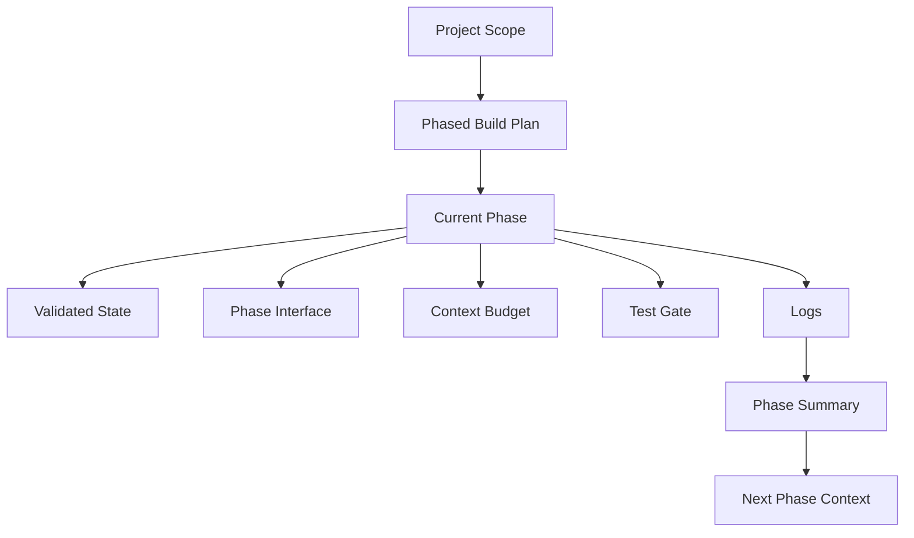
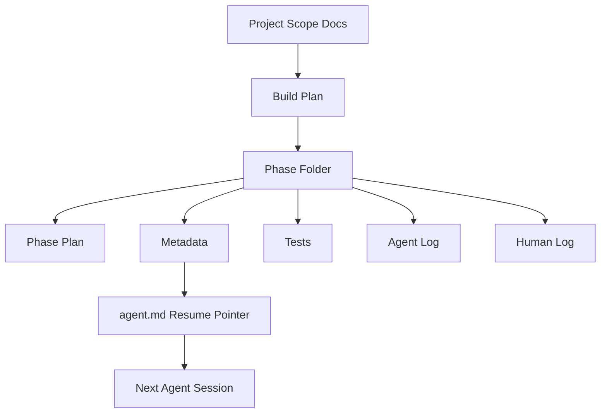
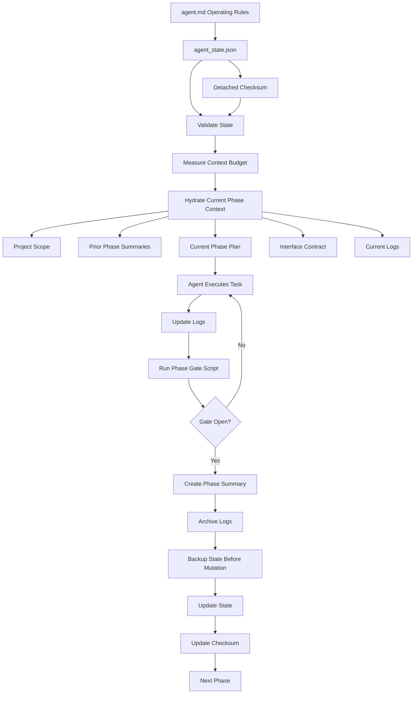
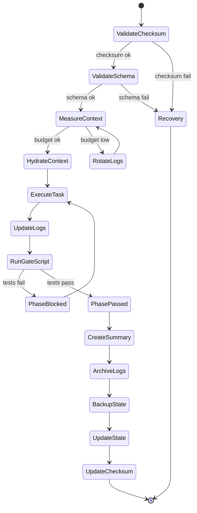

# Study Log: Context Engineering for Agentic Software Development

**Date:** 2026-06-06  
**Engineer:** Pujan Bajracharya  
**Review Mode:** Principal Engineer Architecture Review  
**Project:** Buildplan Context Control System  
**Status:** V1 Architecture Approved for Future Prototype Implementation  

**Validation Note:**  
This document is a reference architecture and study log. It explains the context engineering problem, design direction, review findings, and future implementation requirements. It intentionally does not include full implementation code. Scripts, schemas, recovery logic, and phase-gate enforcement will be specified in a separate future implementation file.

---

## Introduction

This study log documents the design of a context engineering system for agentic software development.

The core problem was not simply that the model had a limited context window. The deeper problem was that the repository did not yet have a reliable way to tell the agent what to remember, what to ignore, what phase it was in, what tests must pass, and what state was safe to resume from.

The first version used a phased folder structure with `agent.md`, phase plans, logs, metadata, and tests. That structure was directionally correct, but it was still passive. A senior architecture review showed that the system needed operational controls: schema validation, context budgets, log rotation, phase summaries, test gates, checksums, and recovery checkpoints.

The final direction is to treat agent context as a controlled working memory system.



---

## Table of Contents

1. Problem Discovery  
2. Initial V0 Architecture  
3. Senior Engineer Review  
4. Gap Analysis  
5. Structural Review Corrections  
6. V1 Design Direction  
7. V1 Architecture Scope  
8. V1.5 / V2 Deferred Scope  
9. Final Reference Architecture  
10. Core Design Principle  
11. Required Artifacts  
12. State Machine Flow  
13. Context Budget Strategy  
14. Log Rotation Strategy  
15. Phase Gates  
16. Interface Contracts  
17. Recovery and Checkpoints  
18. Study Knowledge Separation  
19. Known Limitations  
20. Future Implementation File  
21. OpenCode Scaffold Prompt  
22. Final Takeaway  

---

## 1. Problem Discovery

When using OpenCode or any agentic IDE with a 64k context window, the agent can easily attempt to reason over too much at once.

The failure was not that 64k context is too small. The failure was that the context was not structured enough.

### Main failure modes

| Failure Mode | What Happens |
|---|---|
| Context collapse | The agent loads too much old information and loses current task focus |
| Hallucinated state | The agent assumes something was completed when it was only planned |
| Cross-phase regression | A change in one phase silently breaks later phases |
| Constraint drift | Global requirements slowly disappear from the agent’s working memory |
| Log overload | Agent and human logs grow until they become unusable as context |
| State corruption | Resume state becomes malformed or stale without detection |

### Root cause

The context window was being treated like storage.

That is the wrong abstraction.

A context window should be treated like working memory.

The repo needs to decide:

- what gets loaded
- what gets ignored
- what gets summarized
- what gets archived
- what gets validated
- what blocks phase advancement
- what counts as safe state

---

## 2. Initial V0 Architecture

The first version used a phased folder system.

```text
project/
  docs/
    project_scope.md

  buildplan/
    phases/
      phase_01/
        plan.md
        metadata
        agent_log.md
        human_log.md
        tests/

      phase_02/
        ...

  agent.md
```

The idea was strong:

- Keep the full project scope in docs
- Break the build into phases
- Give each phase its own plan
- Keep agent and human logs
- Use `agent.md` as the resume pointer
- Use tests before each phase

### V0 context flow



### V0 assessment

The folder structure was correct.

The missing part was enforcement.

V0 organized files, but it did not yet guarantee that:

- logs would stay small
- state would remain valid
- tests would block phase transitions
- interfaces would be tracked
- context usage would stay within budget
- corrupted state could be detected
- recovery would use a valid backup

So V0 was a good filing system, but not yet a reliable state machine.

---

## 3. Senior Engineer Review

A strict principal-engineer review found several operational defects.

| Severity | Finding | Location | Why It Matters |
|---|---|---|---|
| Critical | Unbounded log growth | `agent_log.md`, `human_log.md` | Eventually consumes the 64k context window |
| High | No phase interfaces | all phase folders | Cross-phase breakage becomes invisible |
| High | `agent.md` as state source | root `agent.md` | One malformed write can corrupt the session |
| High | No context budget telemetry | phase context | No way to measure whether 64k is enough |
| High | Test gates lack enforcement | phase transitions | Agent can move forward despite failing tests |
| Medium | Study knowledge mixed with logs | `human_log.md` | Learning becomes hard to query later |
| Medium | No rollback checkpoint | state management | Recovery requires manual git archaeology |
| Medium | Constraint drift | `project_scope.md` | Global rules may disappear from active context |
| Low | Manual hydration | pre-session workflow | Human copy-paste errors can corrupt context |

### Key review insight

> Logs are evidence. Summaries are context. Interfaces are contracts. Gates are enforcement. Checkpoints are recovery.

This became the central design principle for V1.

---

## 4. Gap Analysis

The review showed that the architecture did not need more documentation. It needed operational controls.

| Problem | Weak Fix | Strong Fix |
|---|---|---|
| Logs grow forever | Tell agent to be concise | Rotate logs and create phase summaries |
| Agent forgets interfaces | Add notes in plan | Add `interface.md` per phase |
| State corruption | Trust `agent.md` | Use validated state files |
| Context overflow | Hope 64k is enough | Add context budget tracking |
| Test bypass | Tell agent to run tests | Add enforced phase gates |
| No rollback | Use git manually | Add semantic checkpoints |
| Knowledge buried in logs | Search manually | Separate `study_log/` structure |

The conclusion:

The system should become a validated state machine, not just a folder hierarchy.

---

## 5. Structural Review Corrections

A later review found that the architecture document itself had implementation-layer gaps. These corrections define what the future implementation file must include.

| Issue | Required Correction |
|---|---|
| Schema files had no defined location | Add `buildplan/schemas/` |
| `checkpoint.json` was discussed but absent | Add `checkpoint.json` to each active phase |
| `agent_state.bak.json` had no maintenance rule | Define backup-before-mutation rule |
| Detached checksum was missing | Add `agent_state.json.sha256` |
| Required root files were inconsistent | Include constraints, budget policy, and recovery SOP |
| Scripts were only described | Move runnable scripts into future implementation file |
| `session_id` validation was too weak | Use strict session ID format |
| Phase gate enforcement was underdefined | Add future `check_phase_gate.py` script |
| Budget numbers were unmoored | Make `context_budget.policy.json` the source of truth |
| Scaffold created 12 phases too early | Create only 3 phases for V1 validation |
| Study index could rot | Keep manual in V1, automate later |
| Test command was hardcoded | Make test command configurable |

This version keeps the architecture readable and moves implementation details to a future file.

---

## 6. V1 Design Direction

V1 keeps the original phased build idea but adds validation and operational safety.

### Main changes

| V0 | V1 |
|---|---|
| `agent.md` stores state | `agent.md` becomes operating instructions only |
| metadata is ambiguous | state is split into explicit JSON files |
| schemas are scattered or implied | schemas live in `buildplan/schemas/` |
| logs stay active forever | logs rotate into archive after summary |
| tests are policy | tests become phase gates |
| no token measurement | context budget is tracked |
| no phase contracts | every phase has an interface file |
| no corruption detection | detached checksum is required |
| manual recovery | checkpoint and backup strategy |
| study notes in human log | study notes move to `study_log/` |

---

## 7. V1 Architecture Scope

V1 should stay small enough to actually validate.

### Required V1 artifacts

| Artifact | Purpose |
|---|---|
| `agent.md` | Human-readable operating rules only |
| `agent_state.json` | Single source of truth for current phase/task |
| `agent_state.json.sha256` | Detached checksum for state integrity |
| `agent_state.bak.json` | Last known good state backup |
| `project_scope.md` | Project-level scope and build goal |
| `constraints_checklist.md` | Global constraints that must be reaffirmed |
| `context_budget.policy.json` | Source of truth for context budget numbers |
| `recovery_sop.md` | Manual recovery instructions |
| `schemas/` | Required schema location |
| `phase_state.json` | Current phase status |
| `interface.md` | Phase input/output contract |
| `context_budget.json` | Phase-level context budget tracking |
| `phase_gate.json` | Test gate and transition blocker |
| `checkpoint.json` | Phase-level rollback metadata |
| `phase_summary.md` | Compressed context after phase completion |
| `agent_log.md` | Agent execution evidence |
| `human_log.md` | Human decisions and corrections |
| `summaries/` | Stores completed phase summaries |
| `logs/archive/` | Stores archived logs |
| `study_log/` | Stores learning notes separate from execution logs |

### Required future scripts

The implementation details for these scripts should live in a separate future file.

| Future Script | Purpose |
|---|---|
| `validate_all_state.py` | Validate JSON state files and checksums |
| `measure_context.py` | Estimate active context size |
| `hydrate_context.py` | Assemble context payload |
| `rotate_logs.py` | Archive logs and preserve summaries |
| `check_phase_gate.py` | Execute tests and update gate status |

### Why V1 is intentionally smaller

The first goal is not to build the perfect system.

The first goal is to prove that:

- the agent can resume correctly
- schemas are discoverable
- logs do not overload context
- phase summaries are enough for memory
- state validation catches errors
- checksum validation catches mutation/corruption
- phase gates prevent unsafe transitions
- backup state is maintained
- the 64k context budget remains usable

---

## 8. V1.5 / V2 Deferred Scope

These are useful but should not block the first implementation.

| Deferred Item | Why Deferred |
|---|---|
| `dependency_graph.json` | Useful after interfaces stabilize |
| `update_dependencies.py` | Needs real phase data first |
| `update_study_index.py` | Manual index is acceptable for V1 |
| Full recovery automation | Manual recovery should be tested first |
| Spaced-repetition study system | Valuable later, not needed to prove context control |
| Advanced checkpoint rollback | Start with simple checkpoints first |
| CI enforcement | Add after local scripts prove useful |
| File permission hardening | Add after protected files are finalized |
| Scaffold all 12 phases | Start with 3 phases for V1 validation |

---

## 9. Final Reference Architecture

V1 should scaffold only `phase_01` through `phase_03` for validation. The remaining phases can be created after the system proves itself.

```text
buildplan/
├── agent.md
├── agent_state.json
├── agent_state.json.sha256
├── agent_state.bak.json
├── project_scope.md
├── constraints_checklist.md
├── context_budget.policy.json
├── recovery_sop.md
├── schemas/
│   ├── agent_state.schema.json
│   ├── phase_state.schema.json
│   ├── phase_gate.schema.json
│   ├── context_budget.schema.json
│   └── checkpoint.schema.json
├── phased_build/
│   └── phases/
│       ├── phase_01/
│       │   ├── phase_plan.md
│       │   ├── phase_state.json
│       │   ├── interface.md
│       │   ├── context_budget.json
│       │   ├── phase_gate.json
│       │   ├── checkpoint.json
│       │   ├── phase_summary.md
│       │   ├── agent_log.md
│       │   ├── human_log.md
│       │   └── tests/
│       │       ├── test_plan.md
│       │       └── test_report.md
│       ├── phase_02/
│       │   └── same structure as phase_01
│       └── phase_03/
│           └── same structure as phase_01
├── summaries/
├── logs/
│   └── archive/
├── study_log/
│   ├── concepts/
│   ├── mistakes/
│   ├── decisions/
│   └── index.md
└── scripts/
    ├── validate_all_state.py
    ├── measure_context.py
    ├── hydrate_context.py
    ├── rotate_logs.py
    └── check_phase_gate.py
```

### Final architecture diagram



---

## 10. Core Design Principle

The system is built around this rule:

> Do not let logs become memory. Let summaries become memory.

| Artifact | Role |
|---|---|
| Logs | Evidence of what happened |
| Summaries | Compressed memory for future phases |
| Interfaces | Contracts between phases |
| Gates | Enforcement before progression |
| Checkpoints | Recovery points |
| Context budget | Resource control |
| State files | Resume control |
| Detached checksum | Corruption detection |
| Backup state | Recovery baseline |

This is the difference between a folder system and a context engineering system.

---

## 11. Required Artifacts

<details>
<summary>agent.md</summary>

`agent.md` should not store mutable phase state.

It should store operating rules.

Core rules:

```markdown
# Agent Operating Rules

1. Read `buildplan/agent_state.json` first.
2. Validate `agent_state.json` against `buildplan/agent_state.json.sha256` before loading.
3. Validate all state files against schemas in `buildplan/schemas/`.
4. Load only the current phase folder.
5. Load prior phase summaries, not old full logs.
6. Check `context_budget.json` before code generation.
7. Check `phase_gate.json` before phase transition.
8. Do not edit protected files directly:
   - phase_gate.json
   - checkpoint.json
   - agent_state.json.sha256
9. Before mutating `agent_state.json`, preserve the previous valid state in `agent_state.bak.json`.
10. Never write `agent_state.json` and `agent_state.bak.json` in the same action.
11. Update `agent_log.md` after execution.
12. Update `human_log.md` only when the human gives a decision.
13. Never advance phase unless the phase gate is open.
14. Use future gate script to execute tests and update gate status.
15. Use future log rotation script after phase completion.
```

</details>

<details>
<summary>agent_state.json</summary>

The source of truth for current phase and task.

Example:

```json
{
  "current_phase": 1,
  "current_task": "Initialize Phase 1 context engineering structure",
  "last_completed_phase": 0,
  "last_updated": "2026-06-06T00:00:00Z",
  "current_phase_path": "buildplan/phased_build/phases/phase_01",
  "last_known_good_checkpoint": null,
  "session_id": "sess_20260606_000000"
}
```

</details>

<details>
<summary>agent_state.json.sha256</summary>

Detached checksum for `agent_state.json`.

This avoids circular hashing inside the JSON state file.

Example format:

```text
a1b2c3d4...  agent_state.json
```

</details>

<details>
<summary>agent_state.bak.json</summary>

Backup copy of the last known valid state.

Maintenance rule:

- After validation passes, but before mutating `agent_state.json`, copy the current valid state to `agent_state.bak.json`.
- Never update `agent_state.json` and `agent_state.bak.json` in the same agent action.
- Recovery should prefer `agent_state.bak.json` only if checksum validation fails.

</details>

<details>
<summary>context_budget.policy.json</summary>

Source of truth for context budget numbers.

```json
{
  "window_limit": 64000,
  "reserved_for_reasoning": 16000,
  "max_loaded_context": 48000,
  "minimum_available_for_code": 8000,
  "log_rotation_trigger": 8000
}
```

</details>

<details>
<summary>phase_state.json</summary>

Tracks the current status of a phase.

```json
{
  "phase": 1,
  "status": "active",
  "current_task": "Complete Phase 1 setup",
  "allowed_files": [],
  "blocked_files": [],
  "started_at": "2026-06-06T00:00:00Z",
  "completed_at": null
}
```

</details>

<details>
<summary>interface.md</summary>

Defines phase contracts.

```markdown
# Phase 1 Interface

## Exported to Downstream Phases

- TBD after implementation begins.

## Consumed From Upstream Phases

- `buildplan/project_scope.md` — project-level build scope
- `buildplan/constraints_checklist.md` — global constraints
- `buildplan/context_budget.policy.json` — context budget source of truth

## Impact Map

If this phase changes, affected phases:

- Phase 2
- Phase 3

## Compatibility Notes

- Do not change exported contracts without updating this file.
- Downstream phases must consume this interface rather than infer behavior from logs.
```

</details>

<details>
<summary>phase_gate.json</summary>

Tracks whether a phase is allowed to advance.

```json
{
  "phase": 1,
  "test_status": "not_run",
  "coverage": null,
  "threshold": 0.8,
  "gate_open": false,
  "block_reason": "Tests have not passed yet.",
  "last_test_run": null,
  "test_runner_command": "echo 'Update test_runner_command to match your project stack'"
}
```

</details>

<details>
<summary>checkpoint.json</summary>

Phase-level rollback metadata.

Path:

```text
buildplan/phased_build/phases/phase_01/checkpoint.json
```

Example:

```json
{
  "phase": 1,
  "last_known_good": {
    "phase": 0,
    "commit": null,
    "agent_state_backup": "buildplan/agent_state.bak.json",
    "rollback_note": "Initial checkpoint. No completed prior phase yet."
  }
}
```

</details>

<details>
<summary>phase_summary.md</summary>

Compressed memory for downstream phases.

```markdown
# Phase 1 Summary

## Goal

TBD

## Completed

TBD

## Interfaces Added

TBD

## Decisions

TBD

## Known Defects

TBD

## Downstream Notes

TBD

## Archive Location

`buildplan/logs/archive/phase_01/`
```

</details>

---

## 12. State Machine Flow

The context system should behave like a state machine.



The key is that the agent should not simply “continue.”

It should validate, measure, hydrate, execute, test, summarize, back up state, update state, and only then move forward.

---

## 13. Context Budget Strategy

Per `context_budget.policy.json`, the global allocation is:

| Budget Area | Tokens |
|---|---:|
| Total window | 64,000 |
| Reserved for reasoning/output | 16,000 |
| Max loaded context | 48,000 |
| Minimum available for code | 8,000 |
| Rotation trigger | 8,000 |

The important part is not perfect token counting.

The important part is that context becomes measurable.

V1 can begin with a rough character heuristic. Later versions should use the active model tokenizer.

---

## 14. Log Rotation Strategy

Logs should not remain active forever.

### Before phase completion

The current phase can use:

- `agent_log.md`
- `human_log.md`
- `phase_plan.md`
- `interface.md`
- `context_budget.json`
- `phase_gate.json`
- `checkpoint.json`

### After phase completion

The system should:

1. Generate or update `phase_summary.md`
2. Copy summary to `summaries/`
3. Move full logs to `logs/archive/phase_xx/`
4. Keep only summaries active for future phases
5. Copy valid `agent_state.json` to `agent_state.bak.json` before state mutation
6. Update `agent_state.json`
7. Recompute `agent_state.json.sha256`

### Rule

Logs are for audit.

Summaries are for memory.

---

## 15. Phase Gates

A phase gate prevents the agent from moving forward too early.

A phase should not advance just because the agent says it is done.

It should advance only when the gate file says it is safe.

### Gate requirements

| Requirement | Purpose |
|---|---|
| Tests run | Confirms behavior |
| Gate open | Allows phase transition |
| Block reason | Explains why phase is blocked |
| Coverage threshold | Optional quality metric |
| Test report | Evidence |
| Configurable command | Works across Node, Python, Go, Rust, etc. |

### Enforcement note

The agent is instructed not to edit `phase_gate.json`, checkpoint files, or checksum files directly.

Real enforcement should be added through:

- file permissions
- pre-commit hooks
- CI checks
- script-only mutation
- protected file review

Policy alone is not enforcement.

---

## 16. Interface Contracts

Every phase should declare what it exports and consumes.

This prevents a later phase from silently depending on undocumented behavior.

Template:

```markdown
# Phase N Interface

## Exported to Downstream Phases

- `path/to/file` — contract description

## Consumed From Upstream Phases

- `path/to/file` — dependency description

## Impact Map

If this phase changes, affected phases:

- Phase X
- Phase Y

## Compatibility Notes

- List stability rules here.
- List downstream assumptions here.
- List migration notes here.
```

Interfaces turn phase boundaries into contracts.

---

## 17. Recovery and Checkpoints

V1 includes simple checkpoint artifacts.

The first recovery goal is not automation.

The first recovery goal is clarity.

A checkpoint should answer:

- What was the last known good phase?
- What commit was safe?
- What state backup was safe?
- What should the human do to roll back?

Full recovery automation is deferred to V1.5/V2.

---

## 18. Study Knowledge Separation

Study knowledge should not live inside operational phase logs.

Operational logs answer:

> What happened during the build?

Study logs answer:

> What did I learn?

Recommended structure:

```text
study_log/
├── concepts/
│   └── context_budgeting.md
├── mistakes/
│   └── unbounded_logs_context_collapse.md
├── decisions/
│   └── 001_agent_state_not_agent_md.md
└── index.md
```

For V1, `study_log/index.md` is manually updated.

Automation is deferred to V1.5.

This keeps learning reusable without polluting the agent’s active execution context.

---

## 19. Known Limitations

This architecture is stronger after structural review, but it is still not production-proven.

Known limitations:

- Token counts are estimated with a character heuristic and should later use the active model tokenizer.
- Phase gate enforcement depends on scripts being run consistently.
- OpenCode may still edit protected files unless permissions, hooks, or CI checks are added.
- The recovery flow is currently a design pattern, not a proven operational process.
- The architecture has not yet been tested against intentional state corruption.
- Too many files may create process overhead if V1 is not kept small.
- Context hydration still needs to be tested with real OpenCode behavior.
- Phase summaries need quality review, or they can compress away important details.
- `study_log/index.md` can drift until automation is added.
- Minimal Python scripts should be hardened before production use.

---

## 20. Future Implementation File

This study log intentionally does not contain the full implementation.

The future implementation file should define:

```text
context_engineering_v1_implementation.md
```

That file should include:

- exact schema files
- runnable Python scripts
- checksum generation process
- backup update process
- phase gate execution logic
- context measurement logic
- context hydration logic
- log rotation logic
- validation commands
- failure-case test plan
- recovery test plan
- OpenCode usage instructions

This keeps the study log readable while leaving implementation details in a dedicated technical file.

---

## 21. OpenCode Scaffold Prompt

Use this prompt inside OpenCode when you are ready to create the V1 scaffold.

```text
You are helping me scaffold a V1 context engineering system for agentic software development.

Goal:
Create the minimum viable Buildplan Context Control System.

Do not overbuild.
Do not implement V1.5 or V2 features yet.
Do not delete existing files.
Do not rewrite unrelated project architecture.
Create only phase_01 through phase_03 for V1 validation. Do not create all 12 phases yet.

Create this structure:

buildplan/
- agent.md
- agent_state.json
- agent_state.json.sha256
- agent_state.bak.json
- project_scope.md if missing
- constraints_checklist.md
- context_budget.policy.json
- recovery_sop.md

buildplan/schemas/
- agent_state.schema.json
- phase_state.schema.json
- phase_gate.schema.json
- context_budget.schema.json
- checkpoint.schema.json

buildplan/phased_build/phases/
- phase_01
- phase_02
- phase_03

Each phase folder should contain:
- phase_plan.md
- phase_state.json
- interface.md
- context_budget.json
- phase_gate.json
- checkpoint.json
- phase_summary.md
- agent_log.md
- human_log.md
- tests/test_plan.md
- tests/test_report.md

Also create:
- buildplan/summaries/
- buildplan/logs/archive/
- buildplan/study_log/concepts/
- buildplan/study_log/mistakes/
- buildplan/study_log/decisions/
- buildplan/study_log/index.md
- buildplan/scripts/

Important rules:
1. agent.md must be operating rules only, not mutable state.
2. agent_state.json is the source of truth for current phase and current task.
3. agent_state.json.sha256 is a detached checksum and must validate before loading state.
4. agent_state.bak.json must be maintained before state mutation.
5. Logs are evidence. Summaries are context.
6. Interfaces are contracts between phases.
7. Phase gates block phase transitions.
8. context_budget.policy.json is the source of truth for context numbers.
9. Use a 64k window, 16k reserved for reasoning, 48k max loaded context, and 8k minimum available for code.
10. test_runner_command must be configurable. Do not hardcode npm test as the only option.
11. Use simple JSON and Markdown templates.
12. Do not implement full scripts yet. Add script placeholder files that reference the future implementation file.
13. Before editing, show me the file tree you plan to create.
14. After editing, show me changed files and how to validate the scaffold manually.

Start by inspecting the repo structure, then propose the smallest safe implementation plan.
```

---

## 22. Final Takeaway

This document captures the architecture review cycle: problem discovery, failure analysis, proposed controls, structural review, corrections applied, and future implementation plan.

The system is not production-proven yet.

The next step is to create the future implementation file, then prototype the corrected V1 subset.

The validation path is:

1. Implement the corrected V1 scaffold.
2. Add schemas and scripts from the future implementation file.
3. Run it through several real phases.
4. Intentionally break state files.
5. Intentionally break checksums.
6. Test recovery from backup.
7. Test phase gate failure.
8. Measure whether context usage stays below budget.
9. Confirm OpenCode behaves better with structured context.

The main lesson:

Context engineering is not just writing better prompts.

It is designing the environment around the agent so it can recover state, respect constraints, avoid stale memory, detect corrupted state, and continue work safely across long-running software projects.
