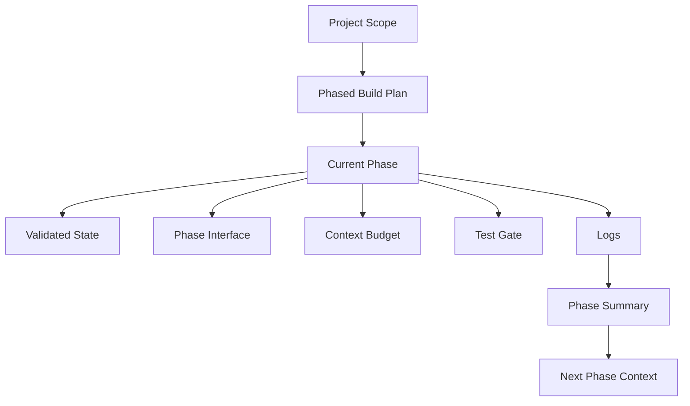
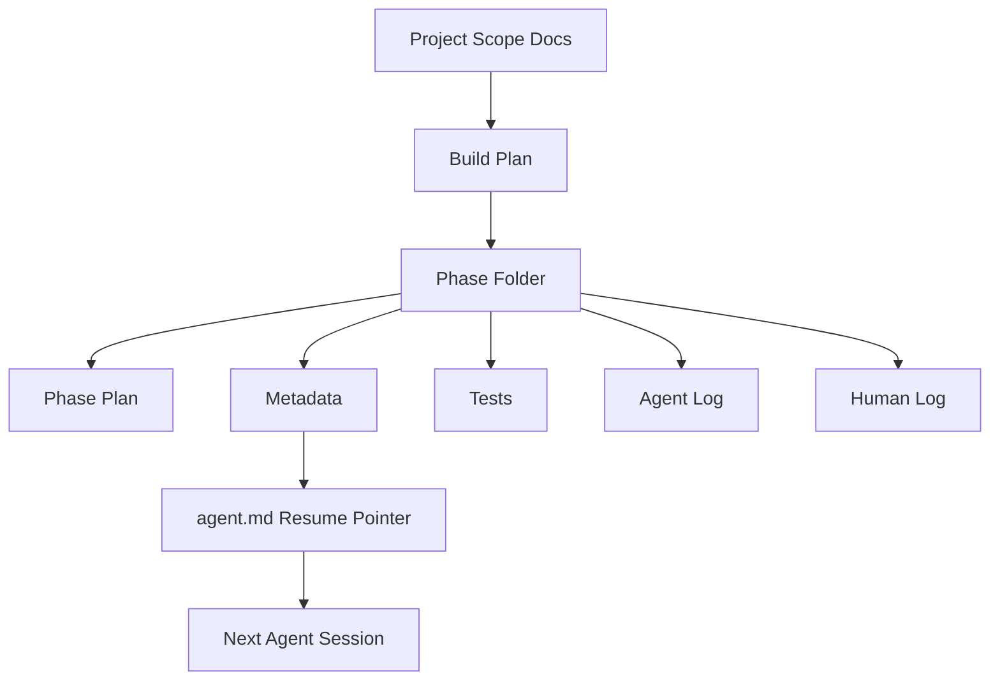
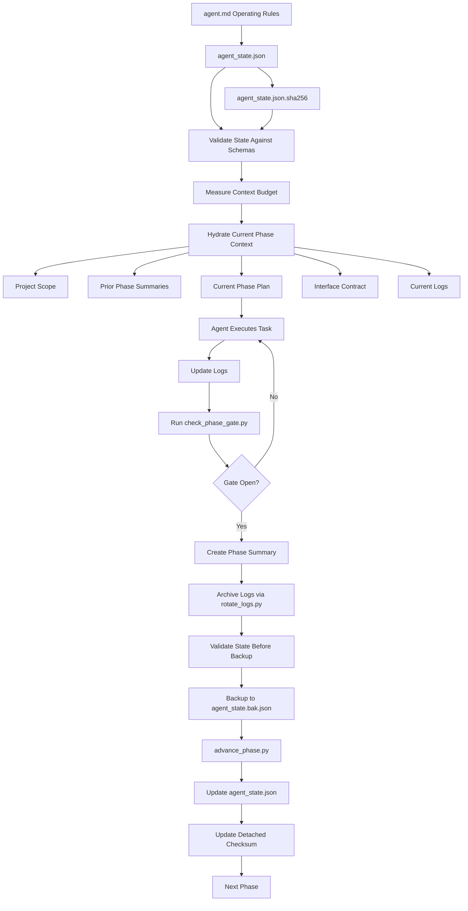
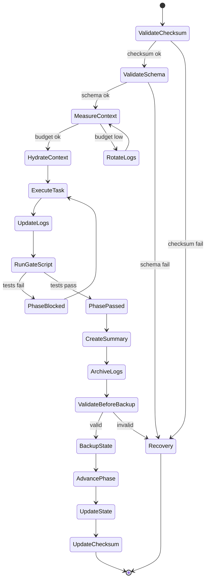

# Study Log: Context Engineering for Agentic Software Development

**Date:** 2026-06-06  
**Engineer:** Pujan Bajracharya  
**Review Mode:** Principal Engineer Architecture Review  
**Project:** Buildplan Context Control System  
**Status:** V1 Draft — Structural Review Corrections Applied, Ready for Prototype Implementation Review  

**Validation Note:**  
This is a reference architecture and implementation plan. The structure has been reviewed conceptually, and this revision fixes the implementation-layer gaps found in structural review. The scripts, schemas, recovery flow, phase-gate enforcement, and context measurement still need to be implemented, run against a real repository, and tested through failure cases before this can be considered production-grade.

---

## Introduction

This study log documents the design of a context engineering system for agentic software development.

The original problem was not only that an agentic coding tool had a 64k context window. The deeper issue was that the repository needed a controlled way to tell the agent what to load, what to ignore, what phase it was in, what tests had to pass, and what state was safe to resume from.

The first design used phased folders, agent.md, phase plans, metadata, logs, and tests. That was a good start, but review showed it was still too passive. The corrected V1 design turns the folder structure into a validated state machine with schemas, budgets, gates, summaries, backups, and checkpoints.



---

## Table of Contents

1. Problem Discovery  
2. Initial V0 Architecture  
3. Senior Engineer Review  
4. Structural Review Corrections  
5. V1 Design Direction  
6. V1 Implementation Scope  
7. V1.5 / V2 Deferred Scope  
8. Final V1 Architecture  
9. Core Design Principle  
10. Required Files  
11. Schema Contracts  
12. State Machine Flow  
13. Operational Scripts  
14. Context Budget Strategy  
15. Log Rotation and Backup Strategy  
16. Phase Gates  
17. Interface Contracts  
18. Recovery and Checkpoints  
19. Study Knowledge Separation  
20. Known Limitations  
21. Future Validation Plan  
22. OpenCode Scaffold Prompt  
23. Final Takeaway  

---

## 1. Problem Discovery

When using OpenCode or any agentic IDE with a 64k context window, the agent can easily attempt to reason over too much at once.

The failure was not that 64k context is unusable. The failure was that context was not structured enough.

| Failure Mode | What Happens |
|---|---|
| Context collapse | The agent loads too much old information and loses current task focus |
| Hallucinated state | The agent assumes something was completed when it was only planned |
| Cross-phase regression | A change in one phase silently breaks later phases |
| Constraint drift | Global requirements slowly disappear from the agent's working memory |
| Log overload | Agent and human logs grow until they become unusable as context |
| State corruption | Resume state becomes malformed or stale without detection |

The context window was being treated like storage. That is the wrong abstraction. A context window should be treated like working memory.

---

## 2. Initial V0 Architecture

The first version used a phased folder system.

```text
project/
  docs/
    project_scope.md

  buildplan/
    phases/
      phase_01/
        plan.md
        metadata
        agent_log.md
        human_log.md
        tests/

      phase_02/
        ...

  agent.md
```

The idea was strong:

- Keep the full project scope in docs
- Break the build into phases
- Give each phase its own plan
- Keep agent and human logs
- Use agent.md as the resume pointer
- Use tests before each phase



V0 organized files, but it did not yet guarantee that logs would stay small, state would remain valid, tests would block phase transitions, interfaces would be tracked, context usage would stay within budget, corrupted state could be detected, or recovery would use a valid backup.

---

## 3. Senior Engineer Review

| Severity | Finding | Location | Why It Matters |
|---|---|---|---|
| Critical | Unbounded log growth | agent_log.md, human_log.md | Eventually consumes the 64k context window |
| High | No phase interfaces | all phase folders | Cross-phase breakage becomes invisible |
| High | agent.md as state source | root agent.md | One malformed write can corrupt the session |
| High | No context budget telemetry | phase context | No way to measure whether 64k is enough |
| High | Test gates lack enforcement | phase transitions | Agent can move forward despite failing tests |
| Medium | Study knowledge mixed with logs | human_log.md | Learning becomes hard to query later |
| Medium | No rollback checkpoint | state management | Recovery requires manual git archaeology |
| Medium | Constraint drift | project_scope.md | Global rules may disappear from active context |
| Low | Manual hydration | pre-session workflow | Human copy-paste errors can corrupt context |

Core review insight:

> Logs are evidence. Summaries are context. Interfaces are contracts. Gates are enforcement. Checkpoints are recovery.

---

## 4. Structural Review Corrections

A second structural review found that the first rewritten study log was honest, but not yet implementation-complete.

| Issue | Correction |
|---|---|
| Schema files had no defined location | Added buildplan/schemas/ and placed all schemas there |
| checkpoint.json was discussed but absent | Added checkpoint.json to each V1 phase folder |
| agent_state.bak.json had no maintenance process | Added backup rule: validate before copy, never write both in same action |
| V1 scope missed required root files | Added constraints_checklist.md, context_budget.policy.json, and recovery_sop.md |
| Detached checksum was dropped | Added agent_state.json.sha256 with valid 64-char hex |
| Scripts section had no code | Added minimal runnable Python skeletons |
| session_id validation was too weak | Restored sess_YYYYMMDD_HHMMSS pattern |
| check_phase_gate.py was not explained | Added it to scripts and gate enforcement |
| Budget numbers were unmoored | Made context_budget.policy.json the source of truth |
| Recovery JSON had no file path | Labeled it as phase-level checkpoint.json |
| Scaffold created 12 phases upfront | Reduced V1 scaffold to 3 phases |
| Study index could rot | Kept index but marked manual update until V1.5 automation |
| npm test was hardcoded | Made test_runner_command configurable |
| Interface template was inconsistent | Replaced skeletal template with richer template |
| Missing advance_phase.py | Added safe phase transition script |
| rotate_logs.py corrupted backup | Added validate-before-copy rule |
| measure_context.py crashed on missing file | Added default budget creation |
| Missing 6 file templates | Added templates for recovery_sop.md, constraints_checklist.md, project_scope.md, tests, study_log/index.md |

---

## 5. V1 Design Direction

| V0 | V1 |
|---|---|
| agent.md stores state | agent.md becomes operating instructions only |
| metadata is ambiguous | state split into explicit JSON files |
| schemas are scattered or implied | all schemas live in buildplan/schemas/ |
| logs stay active forever | logs rotate into archive after summary |
| tests are policy | tests become phase gates through check_phase_gate.py |
| no token measurement | context budget is tracked through policy and phase budgets |
| no phase contracts | every phase has an interface file |
| manual recovery | checkpoint and backup strategy |
| no corruption detection | detached checksum for agent_state.json |
| study notes in human log | study notes move to study_log/ |
| no safe phase transition | advance_phase.py validates gate before state mutation |

---

## 6. V1 Implementation Scope

| File or Folder | Purpose |
|---|---|
| agent.md | Human-readable operating rules only |
| agent_state.json | Single source of truth for current phase/task |
| agent_state.json.sha256 | Detached checksum for state integrity |
| agent_state.bak.json | Last known good state backup |
| project_scope.md | Project-level scope and build goal |
| constraints_checklist.md | Global constraints that must be reaffirmed |
| context_budget.policy.json | Source of truth for context budget numbers |
| recovery_sop.md | Manual recovery instructions |
| schemas/ | Required schema location for validators |
| schemas/agent_state.schema.json | Schema for root state |
| schemas/phase_state.schema.json | Schema for phase state |
| schemas/phase_gate.schema.json | Schema for phase gate |
| schemas/context_budget.schema.json | Schema for budget files |
| schemas/checkpoint.schema.json | Schema for checkpoint files |
| phase_state.json | Current phase status |
| interface.md | Phase input/output contract |
| context_budget.json | Phase-level context budget tracking |
| phase_gate.json | Test gate and transition blocker |
| checkpoint.json | Phase-level rollback metadata |
| phase_summary.md | Compressed context after phase completion |
| agent_log.md | Agent execution evidence |
| human_log.md | Human decisions and corrections |
| validate_all_state.py | Validate JSON state files |
| measure_context.py | Estimate active context size |
| hydrate_context.py | Assemble context payload |
| rotate_logs.py | Archive logs and preserve summaries |
| check_phase_gate.py | Execute tests and update gate status |
| advance_phase.py | Safe phase transition after gate open |

V1 proves that the agent can resume correctly, schemas are discoverable, logs do not overload context, summaries are enough for memory, state validation catches errors, checksum validation catches mutation/corruption, phase gates prevent unsafe transitions, backup state is maintained before mutation, and 64k context remains usable.

---

## 7. V1.5 / V2 Deferred Scope

| Deferred Item | Why Deferred |
|---|---|
| dependency_graph.json | Useful after interfaces stabilize |
| update_dependencies.py | Needs real phase data first |
| update_study_index.py | Manual index is acceptable for V1 |
| Full recovery automation | Manual recovery should be tested first |
| Spaced-repetition study system | Valuable later, not needed to prove context control |
| Advanced checkpoint rollback | Start with simple checkpoints first |
| CI enforcement | Add after local scripts prove useful |
| File permission hardening | Add after protected files are finalized |
| Scaffold all 12 phases | Start with 3 phases for V1 validation |
| True gate enforcement (hooks/permissions) | Policy is instruction-only in V1 |

---

## 8. Final V1 Architecture

```text
buildplan/
├── agent.md
├── agent_state.json
├── agent_state.json.sha256
├── agent_state.bak.json
├── project_scope.md
├── constraints_checklist.md
├── context_budget.policy.json
├── recovery_sop.md
├── schemas/
│   ├── agent_state.schema.json
│   ├── phase_state.schema.json
│   ├── phase_gate.schema.json
│   ├── context_budget.schema.json
│   └── checkpoint.schema.json
├── phased_build/
│   └── phases/
│       ├── phase_01/
│       │   ├── phase_plan.md
│       │   ├── phase_state.json
│       │   ├── interface.md
│       │   ├── context_budget.json
│       │   ├── phase_gate.json
│       │   ├── checkpoint.json
│       │   ├── phase_summary.md
│       │   ├── agent_log.md
│       │   ├── human_log.md
│       │   └── tests/
│       │       ├── test_plan.md
│       │       └── test_report.md
│       ├── phase_02/
│       │   └── same structure as phase_01
│       └── phase_03/
│           └── same structure as phase_01
├── summaries/
├── logs/
│   └── archive/
├── study_log/
│   ├── concepts/
│   ├── mistakes/
│   ├── decisions/
│   └── index.md
└── scripts/
    ├── validate_all_state.py
    ├── measure_context.py
    ├── hydrate_context.py
    ├── rotate_logs.py
    ├── check_phase_gate.py
    └── advance_phase.py
```



---

## 9. Core Design Principle

> Do not let logs become memory. Let summaries become memory.

| Artifact | Role |
|---|---|
| Logs | Evidence of what happened |
| Summaries | Compressed memory for future phases |
| Interfaces | Contracts between phases |
| Gates | Enforcement before progression |
| Checkpoints | Recovery points |
| Context budget | Resource control |
| State files | Resume control |
| Detached checksum | Corruption detection |
| Backup state | Recovery baseline |

---

## 10. Required File Templates

<details>
<summary>agent.md</summary>

```markdown
# Agent Operating Rules

1. Read buildplan/agent_state.json first.
2. Validate agent_state.json against buildplan/agent_state.json.sha256 before loading.
3. Validate all state files against schemas in buildplan/schemas/.
4. Load only the current phase folder.
5. Load prior phase summaries, not old full logs.
6. Check context_budget.json before code generation.
7. Check phase_gate.json before phase transition.
8. Do not edit protected files directly:
   - phase_gate.json
   - checkpoint.json
   - agent_state.json.sha256
9. Before mutating agent_state.json, preserve the previous valid state in agent_state.bak.json.
10. Never write agent_state.json and agent_state.bak.json in the same action.
11. Update agent_log.md after execution.
12. Update human_log.md only when the human gives a decision.
13. Never advance phase unless the phase gate is open.
14. Use check_phase_gate.py to execute tests and update gate status.
15. Use rotate_logs.py after phase completion.
16. Use advance_phase.py to transition to the next phase after gate is open.
```

</details>

<details>
<summary>project_scope.md</summary>

```markdown
# Project Scope

## Objective
TBD — Define the overall project goal and success criteria.

## Build Plan
12 phases defined in buildplan/phased_build/phases/.

## Global Constraints
See buildplan/constraints_checklist.md.

## Context System
This project uses the Buildplan Context Control System.
See buildplan/agent.md for agent operating rules.
```

</details>

<details>
<summary>constraints_checklist.md</summary>

```markdown
# Active Constraints

- [ ] Must support PostgreSQL 14+ and SQLite 3.39+
- [ ] No blocking I/O in async handlers
- [ ] All secrets via env vars, no hardcoded keys
- [ ] P95 latency < 200ms for auth endpoints

## Phase Affirmation Template

Before generating code in any phase, affirm:

- [ ] PostgreSQL + SQLite compatibility verified
- [ ] No blocking I/O in async paths
- [ ] Secrets loaded via env vars only
- [ ] P95 latency benchmarked
```

</details>

<details>
<summary>recovery_sop.md</summary>

```markdown
# Recovery Standard Operating Procedure

## Detection
- validate_all_state.py reports schema or checksum mismatch
- hydrate_context.py detects unreadable agent_state.json
- agent_state.json.sha256 does not match agent_state.json

## Recovery Steps

1. Check agent_state.bak.json. If it exists and validate_all_state.py passes against it, restore it to agent_state.json and recompute the checksum.
2. If .bak is also corrupted or missing, load checkpoint.json from the last completed phase.
3. Reconstruct agent_state.json from checkpoint.last_known_good.agent_state_backup path.
4. If no checkpoint exists, use git log --oneline -5 and manual reconstruction.
5. Never allow the agent to write agent_state.json and agent_state.bak.json in the same action.
6. If all automated recovery fails, follow manual recovery in this SOP and update human_log.md with the incident.
```

</details>

<details>
<summary>agent_state.json</summary>

```json
{
  "current_phase": 1,
  "current_task": "Initialize Phase 1 context engineering structure",
  "last_completed_phase": 0,
  "last_updated": "2026-06-06T00:00:00Z",
  "current_phase_path": "buildplan/phased_build/phases/phase_01",
  "last_known_good_checkpoint": null,
  "session_id": "sess_20260606_000000"
}
```

</details>

<details>
<summary>agent_state.json.sha256</summary>

```text
e3b0c44298fc1c149afbf4c8996fb92427ae41e4649b934ca495991b7852b855  agent_state.json
```

This avoids circular hashing inside agent_state.json.

**Note:** After creating agent_state.json, compute the real SHA256 and replace this placeholder.

</details>

<details>
<summary>agent_state.bak.json</summary>

```json
{
  "current_phase": 1,
  "current_task": "Initialize Phase 1 context engineering structure",
  "last_completed_phase": 0,
  "last_updated": "2026-06-06T00:00:00Z",
  "current_phase_path": "buildplan/phased_build/phases/phase_01",
  "last_known_good_checkpoint": null,
  "session_id": "sess_20260606_000000"
}
```

**Maintenance rule:**

- After validation passes, but before mutating agent_state.json, copy the current valid agent_state.json to agent_state.bak.json.
- Never update agent_state.json and agent_state.bak.json in the same agent action.
- Recovery should prefer agent_state.bak.json only if checksum validation passes.
- If agent_state.json is corrupted, do not copy it to .bak. Preserve the last known good .bak instead.

</details>

<details>
<summary>context_budget.policy.json</summary>

```json
{
  "window_limit": 64000,
  "reserved_for_reasoning": 16000,
  "max_loaded_context": 48000,
  "minimum_available_for_code": 8000,
  "log_rotation_trigger": 12000
}
```

</details>

<details>
<summary>phase_state.json</summary>

```json
{
  "phase": 1,
  "status": "active",
  "current_task": "Complete Phase 1 setup",
  "allowed_files": ["*"],
  "blocked_files": [],
  "started_at": "2026-06-06T00:00:00Z",
  "completed_at": null
}
```

**Note:** `allowed_files: ["*"]` means unrestricted for greenfield phases. Explicit paths are required for refactor phases.

</details>

<details>
<summary>interface.md</summary>

```markdown
# Phase 1 Interface

## Exported to Downstream Phases

- TBD after implementation begins.

## Consumed From Upstream Phases

- buildplan/project_scope.md — project-level build scope
- buildplan/constraints_checklist.md — global constraints
- buildplan/context_budget.policy.json — context budget source of truth

## Impact Map

If this phase changes, affected phases:

- Phase 2
- Phase 3

## Compatibility Notes

- Do not change exported contracts without updating this file.
- Downstream phases must consume this interface rather than infer behavior from logs.
- Breaking changes require explicit downstream migration notes.
```

</details>

<details>
<summary>context_budget.json</summary>

```json
{
  "window_limit": 64000,
  "reserved_for_reasoning": 16000,
  "max_loaded_context": 48000,
  "current_estimated_context": 0,
  "minimum_available_for_code": 8000,
  "log_rotation_required": false,
  "last_measured": null,
  "measured_by": null
}
```

</details>

<details>
<summary>phase_gate.json</summary>

```json
{
  "phase": 1,
  "test_status": "not_run",
  "coverage": null,
  "threshold": 0.8,
  "gate_open": false,
  "block_reason": "Tests have not passed yet.",
  "last_test_run": null,
  "test_runner_command": "echo 'Update test_runner_command to match your project stack'"
}
```

</details>

<details>
<summary>checkpoint.json</summary>

Path:

```text
buildplan/phased_build/phases/phase_01/checkpoint.json
```

```json
{
  "phase": 1,
  "last_known_good": {
    "phase": 0,
    "commit": null,
    "agent_state_backup": "buildplan/agent_state.bak.json",
    "rollback_note": "Initial checkpoint. No completed prior phase yet."
  }
}
```

</details>

<details>
<summary>phase_summary.md</summary>

```markdown
# Phase 1 Summary

## Goal
TBD

## Completed
TBD

## Interfaces Added
TBD

## Decisions
TBD

## Known Defects
TBD

## Downstream Notes
TBD

## Archive Location
buildplan/logs/archive/phase_01/
```

</details>

<details>
<summary>tests/test_plan.md</summary>

```markdown
# Phase 1 Test Plan

## Unit Tests
- TBD

## Integration Tests
- TBD

## Performance Tests
- TBD
```

</details>

<details>
<summary>tests/test_report.md</summary>

```markdown
# Phase 1 Test Report

## Status
Not run

## Coverage
N/A

## Failures
None
```

</details>

<details>
<summary>study_log/index.md</summary>

```markdown
# Study Log Index

## Concepts
- TBD

## Mistakes
- TBD

## Decisions
- TBD

---

*Note: This index is manually updated in V1. Automation deferred to V1.5.*
```

</details>

---

## 11. Schema Contracts

All schema files live in:

```text
buildplan/schemas/
```

The validator must reference this directory directly.

<details>
<summary>buildplan/schemas/agent_state.schema.json</summary>

```json
{
  "$schema": "http://json-schema.org/draft-07/schema#",
  "type": "object",
  "required": [
    "current_phase",
    "current_task",
    "last_completed_phase",
    "last_updated",
    "current_phase_path",
    "session_id"
  ],
  "properties": {
    "current_phase": {
      "type": "integer",
      "minimum": 1,
      "maximum": 12
    },
    "current_task": {
      "type": "string",
      "minLength": 1
    },
    "last_completed_phase": {
      "type": "integer",
      "minimum": 0,
      "maximum": 12
    },
    "last_updated": {
      "type": "string",
      "format": "date-time"
    },
    "current_phase_path": {
      "type": "string",
      "pattern": "^buildplan/phased_build/phases/phase_\d{2}$"
    },
    "last_known_good_checkpoint": {
      "type": ["string", "null"]
    },
    "session_id": {
      "type": "string",
      "pattern": "^sess_\d{8}_\d{6}$"
    }
  }
}
```

</details>

<details>
<summary>buildplan/schemas/phase_state.schema.json</summary>

```json
{
  "$schema": "http://json-schema.org/draft-07/schema#",
  "type": "object",
  "required": [
    "phase",
    "status",
    "current_task",
    "allowed_files",
    "blocked_files",
    "started_at",
    "completed_at"
  ],
  "properties": {
    "phase": {
      "type": "integer",
      "minimum": 1,
      "maximum": 12
    },
    "status": {
      "type": "string",
      "enum": ["pending", "active", "blocked", "completed"]
    },
    "current_task": {
      "type": "string"
    },
    "allowed_files": {
      "type": "array",
      "items": {
        "type": "string"
      }
    },
    "blocked_files": {
      "type": "array",
      "items": {
        "type": "string"
      }
    },
    "started_at": {
      "type": ["string", "null"],
      "format": "date-time"
    },
    "completed_at": {
      "type": ["string", "null"],
      "format": "date-time"
    }
  }
}
```

</details>

<details>
<summary>buildplan/schemas/phase_gate.schema.json</summary>

```json
{
  "$schema": "http://json-schema.org/draft-07/schema#",
  "type": "object",
  "required": [
    "phase",
    "test_status",
    "threshold",
    "gate_open",
    "block_reason",
    "test_runner_command"
  ],
  "properties": {
    "phase": {
      "type": "integer"
    },
    "test_status": {
      "type": "string",
      "enum": ["not_run", "running", "passed", "failed"]
    },
    "coverage": {
      "type": ["number", "null"],
      "minimum": 0,
      "maximum": 1
    },
    "threshold": {
      "type": "number",
      "minimum": 0,
      "maximum": 1
    },
    "gate_open": {
      "type": "boolean"
    },
    "block_reason": {
      "type": "string"
    },
    "last_test_run": {
      "type": ["string", "null"],
      "format": "date-time"
    },
    "test_runner_command": {
      "type": "string",
      "minLength": 1
    }
  }
}
```

</details>

<details>
<summary>buildplan/schemas/context_budget.schema.json</summary>

```json
{
  "$schema": "http://json-schema.org/draft-07/schema#",
  "type": "object",
  "required": [
    "window_limit",
    "reserved_for_reasoning",
    "max_loaded_context",
    "current_estimated_context",
    "minimum_available_for_code",
    "log_rotation_required"
  ],
  "properties": {
    "window_limit": {
      "type": "integer",
      "minimum": 1
    },
    "reserved_for_reasoning": {
      "type": "integer",
      "minimum": 0
    },
    "max_loaded_context": {
      "type": "integer",
      "minimum": 0
    },
    "current_estimated_context": {
      "type": "integer",
      "minimum": 0
    },
    "minimum_available_for_code": {
      "type": "integer",
      "minimum": 0
    },
    "log_rotation_required": {
      "type": "boolean"
    },
    "last_measured": {
      "type": ["string", "null"],
      "format": "date-time"
    },
    "measured_by": {
      "type": ["string", "null"]
    }
  }
}
```

</details>

<details>
<summary>buildplan/schemas/checkpoint.schema.json</summary>

```json
{
  "$schema": "http://json-schema.org/draft-07/schema#",
  "type": "object",
  "required": [
    "phase",
    "last_known_good"
  ],
  "properties": {
    "phase": {
      "type": "integer"
    },
    "last_known_good": {
      "type": "object",
      "required": [
        "phase",
        "commit",
        "agent_state_backup",
        "rollback_note"
      ],
      "properties": {
        "phase": {
          "type": "integer"
        },
        "commit": {
          "type": ["string", "null"]
        },
        "agent_state_backup": {
          "type": "string"
        },
        "rollback_note": {
          "type": "string"
        }
      }
    }
  }
}
```

</details>

---

## 12. State Machine Flow



---

## 13. Operational Scripts

These are minimal runnable V1 scripts. They are intentionally simple and should be hardened after prototype validation.

<details>
<summary>validate_all_state.py</summary>

```python
#!/usr/bin/env python3
import hashlib
import json
import re
import sys
from pathlib import Path

ROOT = Path("buildplan")
SCHEMAS = ROOT / "schemas"

REQUIRED_ROOT = [
    "agent.md",
    "agent_state.json",
    "agent_state.json.sha256",
    "agent_state.bak.json",
    "project_scope.md",
    "constraints_checklist.md",
    "context_budget.policy.json",
    "recovery_sop.md",
]

REQUIRED_PHASE = [
    "phase_plan.md",
    "phase_state.json",
    "interface.md",
    "context_budget.json",
    "phase_gate.json",
    "checkpoint.json",
    "phase_summary.md",
    "agent_log.md",
    "human_log.md",
]

REQUIRED_SCHEMAS = [
    "agent_state.schema.json",
    "phase_state.schema.json",
    "phase_gate.schema.json",
    "context_budget.schema.json",
    "checkpoint.schema.json",
]


def read_json(path):
    return json.loads(path.read_text(encoding="utf-8"))


def sha256(path):
    return hashlib.sha256(path.read_bytes()).hexdigest()


def validate_required_keys(data, schema, label):
    return [f"{label}: missing required key '{key}'" for key in schema.get("required", []) if key not in data]


def validate_checksum():
    state_path = ROOT / "agent_state.json"
    checksum_path = ROOT / "agent_state.json.sha256"
    if not state_path.exists() or not checksum_path.exists():
        return ["agent_state.json or agent_state.json.sha256 missing"]
    actual = sha256(state_path)
    stored = checksum_path.read_text(encoding="utf-8").strip().split()[0]
    if actual != stored:
        return [f"agent_state checksum mismatch: expected {stored}, got {actual}"]
    return []


def validate_agent_state(data):
    errors = []
    if not re.match(r"^sess_\d{8}_\d{6}$", data.get("session_id", "")):
        errors.append("agent_state.json: session_id must match sess_YYYYMMDD_HHMMSS")
    phase = data.get("current_phase")
    if not isinstance(phase, int) or phase < 1 or phase > 12:
        errors.append("agent_state.json: current_phase must be integer 1..12")
    if not re.match(r"^buildplan/phased_build/phases/phase_\d{2}$", data.get("current_phase_path", "")):
        errors.append("agent_state.json: invalid current_phase_path")
    expected_path = f"buildplan/phased_build/phases/phase_{phase:02d}"
    if data.get("current_phase_path") != expected_path:
        errors.append(f"agent_state.json: current_phase_path mismatch (expected {expected_path})")
    last_completed = data.get("last_completed_phase")
    if not isinstance(last_completed, int) or last_completed < 0 or last_completed >= phase:
        errors.append("agent_state.json: last_completed_phase must be < current_phase")
    return errors


def validate_phase(phase_dir):
    errors = []
    for name in REQUIRED_PHASE:
        if not (phase_dir / name).exists():
            errors.append(f"{phase_dir}: missing {name}")
    schema_map = {
        "phase_state.json": "phase_state.schema.json",
        "phase_gate.json": "phase_gate.schema.json",
        "context_budget.json": "context_budget.schema.json",
        "checkpoint.json": "checkpoint.schema.json",
    }
    for file_name, schema_name in schema_map.items():
        path = phase_dir / file_name
        schema_path = SCHEMAS / schema_name
        if not schema_path.exists():
            errors.append(f"Schema missing: {schema_name}")
            continue
        if path.exists():
            errors.extend(validate_required_keys(read_json(path), read_json(schema_path), str(path)))
    return errors


def main():
    errors = []
    if not ROOT.exists():
        print("VALIDATION FAILED: buildplan/ missing")
        sys.exit(1)

    for name in REQUIRED_ROOT:
        if not (ROOT / name).exists():
            errors.append(f"buildplan/: missing {name}")

    for schema in REQUIRED_SCHEMAS:
        if not (SCHEMAS / schema).exists():
            errors.append(f"buildplan/schemas/: missing {schema}")

    errors.extend(validate_checksum())

    if (ROOT / "agent_state.json").exists() and (SCHEMAS / "agent_state.schema.json").exists():
        state = read_json(ROOT / "agent_state.json")
        errors.extend(validate_required_keys(state, read_json(SCHEMAS / "agent_state.schema.json"), "agent_state.json"))
        errors.extend(validate_agent_state(state))

    phases_dir = ROOT / "phased_build" / "phases"
    if phases_dir.exists():
        for phase_dir in sorted(p for p in phases_dir.iterdir() if p.is_dir()):
            errors.extend(validate_phase(phase_dir))
    else:
        errors.append("buildplan/phased_build/phases missing")

    if errors:
        print("VALIDATION FAILED")
        for error in errors:
            print(f"- {error}")
        sys.exit(1)

    print("VALIDATION PASSED")


if __name__ == "__main__":
    main()
```

</details>

<details>
<summary>measure_context.py</summary>

```python
#!/usr/bin/env python3
import json
import sys
from datetime import datetime, timezone
from pathlib import Path

ROOT = Path("buildplan")


def read_text(path):
    return path.read_text(encoding="utf-8") if path.exists() else ""


def estimate_tokens(text):
    return max(1, len(text) // 4) if text else 0


def main():
    state = json.loads(read_text(ROOT / "agent_state.json"))
    policy = json.loads(read_text(ROOT / "context_budget.policy.json"))
    phase_path = Path(state["current_phase_path"])
    budget_path = phase_path / "context_budget.json"

    files = [
        ROOT / "project_scope.md",
        ROOT / "constraints_checklist.md",
        phase_path / "phase_plan.md",
        phase_path / "interface.md",
        phase_path / "phase_state.json",
        phase_path / "phase_gate.json",
        phase_path / "agent_log.md",
        phase_path / "human_log.md",
    ]

    summaries_dir = ROOT / "summaries"
    if summaries_dir.exists():
        files.extend(sorted(summaries_dir.glob("phase_*_summary.md")))

    estimated = estimate_tokens("

".join(read_text(path) for path in files))
    available_for_code = policy["max_loaded_context"] - estimated - policy["reserved_for_reasoning"]

    if budget_path.exists():
        budget = json.loads(read_text(budget_path))
    else:
        budget = {}

    budget.update({
        "current_estimated_context": estimated,
        "log_rotation_required": available_for_code < policy["log_rotation_trigger"],
        "last_measured": datetime.now(timezone.utc).isoformat(),
        "measured_by": "measure_context.py"
    })
    budget_path.write_text(json.dumps(budget, indent=2) + "
", encoding="utf-8")

    print(f"estimated_context_tokens={estimated}")
    print(f"available_for_code_tokens={available_for_code}")
    print(f"log_rotation_required={budget['log_rotation_required']}")

    if available_for_code < policy["minimum_available_for_code"]:
        sys.exit(1)


if __name__ == "__main__":
    main()
```

</details>

<details>
<summary>hydrate_context.py</summary>

```python
#!/usr/bin/env python3
import json
import sys
from pathlib import Path

ROOT = Path("buildplan")


def read_text(path):
    return path.read_text(encoding="utf-8") if path.exists() else ""


def estimate_tokens(text):
    return max(1, len(text) // 4) if text else 0


def main():
    state = json.loads(read_text(ROOT / "agent_state.json"))
    phase_path = Path(state["current_phase_path"])
    budget = json.loads(read_text(phase_path / "context_budget.json"))

    payload = {
        "agent_state": state,
        "project_scope": read_text(ROOT / "project_scope.md"),
        "constraints": read_text(ROOT / "constraints_checklist.md"),
        "phase_plan": read_text(phase_path / "phase_plan.md"),
        "phase_interface": read_text(phase_path / "interface.md"),
        "phase_state": read_text(phase_path / "phase_state.json"),
        "phase_gate": read_text(phase_path / "phase_gate.json"),
        "agent_log": read_text(phase_path / "agent_log.md"),
        "human_log": read_text(phase_path / "human_log.md"),
        "summaries": {},
    }

    summaries_dir = ROOT / "summaries"
    if summaries_dir.exists():
        for summary in sorted(summaries_dir.glob("phase_*_summary.md")):
            payload["summaries"][summary.name] = read_text(summary)

    serialized = json.dumps(payload, indent=2)
    estimated = estimate_tokens(serialized)

    if estimated > budget["max_loaded_context"]:
        print(f"ABORT: hydrated context {estimated} exceeds max_loaded_context {budget['max_loaded_context']}", file=sys.stderr)
        sys.exit(1)

    print(json.dumps({
        "estimated_tokens": estimated,
        "max_allowed": budget["max_loaded_context"],
        "payload": payload
    }, indent=2))


if __name__ == "__main__":
    main()
```

</details>

<details>
<summary>rotate_logs.py</summary>

```python
#!/usr/bin/env python3
import json
import shutil
from datetime import datetime, timezone
from pathlib import Path

ROOT = Path("buildplan")


def main():
    state = json.loads((ROOT / "agent_state.json").read_text(encoding="utf-8"))
    phase_name = f"phase_{state['current_phase']:02d}"
    phase_path = Path(state["current_phase_path"])

    archive_dir = ROOT / "logs" / "archive" / phase_name
    archive_dir.mkdir(parents=True, exist_ok=True)

    summary_src = phase_path / "phase_summary.md"
    summary_dest = ROOT / "summaries" / f"{phase_name}_summary.md"
    summary_dest.parent.mkdir(parents=True, exist_ok=True)
    if summary_src.exists():
        shutil.copy2(summary_src, summary_dest)

    for log_name in ["agent_log.md", "human_log.md"]:
        src = phase_path / log_name
        if src.exists():
            shutil.copy2(src, archive_dir / log_name)
            src.write_text(
                f"# {log_name}

Archived at {datetime.now(timezone.utc).isoformat()}.

See {archive_dir / log_name}.
",
                encoding="utf-8",
            )

    print(f"Rotated logs for {phase_name}")


if __name__ == "__main__":
    main()
```

</details>

<details>
<summary>check_phase_gate.py</summary>

```python
#!/usr/bin/env python3
import json
import subprocess
import sys
from datetime import datetime, timezone
from pathlib import Path

ROOT = Path("buildplan")


def validate_gate(data):
    schema = json.loads((ROOT / "schemas" / "phase_gate.schema.json").read_text(encoding="utf-8"))
    for key in schema.get("required", []):
        if key not in data:
            raise ValueError(f"Missing required key: {key}")


def main():
    state = json.loads((ROOT / "agent_state.json").read_text(encoding="utf-8"))
    phase_path = Path(state["current_phase_path"])
    gate_path = phase_path / "phase_gate.json"

    gate = json.loads(gate_path.read_text(encoding="utf-8"))
    command = gate["test_runner_command"]

    gate["test_status"] = "running"
    gate["last_test_run"] = datetime.now(timezone.utc).isoformat()

    result = subprocess.run(command, shell=True, text=True, capture_output=True)

    if result.returncode == 0:
        gate["test_status"] = "passed"
        gate["gate_open"] = True
        gate["block_reason"] = ""
    else:
        gate["test_status"] = "failed"
        gate["gate_open"] = False
        gate["block_reason"] = (result.stderr or result.stdout or "Tests failed")[:500]

    gate["last_test_run"] = datetime.now(timezone.utc).isoformat()

    validate_gate(gate)
    gate_path.write_text(json.dumps(gate, indent=2) + "
", encoding="utf-8")

    print(result.stdout)
    if result.stderr:
        print(result.stderr, file=sys.stderr)

    print(f"gate_open={gate['gate_open']}")
    sys.exit(0 if gate["gate_open"] else 1)


if __name__ == "__main__":
    main()
```

</details>

<details>
<summary>advance_phase.py</summary>

```python
#!/usr/bin/env python3
import hashlib
import json
import shutil
import sys
from datetime import datetime, timezone
from pathlib import Path

ROOT = Path("buildplan")


def sha256(path):
    return hashlib.sha256(path.read_bytes()).hexdigest()


def validate_state():
    state = json.loads((ROOT / "agent_state.json").read_text(encoding="utf-8"))
    schema = json.loads((ROOT / "schemas" / "agent_state.schema.json").read_text(encoding="utf-8"))
    for key in schema.get("required", []):
        if key not in state:
            raise ValueError(f"Missing required key: {key}")
    return state


def main():
    state = validate_state()
    phase_path = Path(state["current_phase_path"])
    gate = json.loads((phase_path / "phase_gate.json").read_text(encoding="utf-8"))

    if not gate["gate_open"]:
        print("ABORT: phase_gate.json is not open. Run check_phase_gate.py first.")
        sys.exit(1)

    next_phase = state["current_phase"] + 1
    next_path = f"buildplan/phased_build/phases/phase_{next_phase:02d}"

    # Backup before mutation
    shutil.copy2(ROOT / "agent_state.json", ROOT / "agent_state.bak.json")

    state.update({
        "current_phase": next_phase,
        "current_task": f"Initialize phase {next_phase}",
        "last_completed_phase": state["current_phase"],
        "last_updated": datetime.now(timezone.utc).isoformat(),
        "current_phase_path": next_path,
        "session_id": f"sess_{datetime.now(timezone.utc).strftime('%Y%m%d_%H%M%S')}"
    })

    (ROOT / "agent_state.json").write_text(json.dumps(state, indent=2) + "
", encoding="utf-8")
    (ROOT / "agent_state.json.sha256").write_text(f"{sha256(ROOT / 'agent_state.json')}  agent_state.json
", encoding="utf-8")

    print(f"Advanced to {next_path}")


if __name__ == "__main__":
    main()
```

</details>

---

## 14. Context Budget Strategy

Per context_budget.policy.json, the global allocation is:

| Budget Area | Tokens |
|---|---:|
| Total window | 64,000 |
| Reserved for reasoning/output | 16,000 |
| Max loaded context | 48,000 |
| Minimum available for code | 8,000 |
| Rotation trigger | 12,000 |

V1 uses a rough character heuristic. Later versions should use the active model tokenizer.

---

## 15. Log Rotation and Backup Strategy

Before phase completion, the current phase can use agent_log.md, human_log.md, phase_plan.md, interface.md, context_budget.json, phase_gate.json, and checkpoint.json.

After phase completion:

1. Generate or update phase_summary.md
2. Copy summary to summaries/
3. Move full logs to logs/archive/phase_xx/
4. Keep only summaries active for future phases
5. Validate agent_state.json before backup
6. Copy valid agent_state.json to agent_state.bak.json before state mutation
7. Update agent_state.json via advance_phase.py
8. Recompute agent_state.json.sha256

Backup rule:

> After every successful validation of agent_state.json, copy it to agent_state.bak.json before any mutation. The agent must never write both files in the same action. If agent_state.json is corrupted, do not overwrite .bak with the corruption.

---

## 16. Phase Gates

A phase gate prevents the agent from moving forward too early.

The check_phase_gate.py script executes test_runner_command, parses the result, validates the output against phase_gate.schema.json, and writes phase_gate.json.

The agent is instructed not to edit this file directly.

## Enforcement Reality

The current V1 design relies on instruction, not technical enforcement.

The agent runs check_phase_gate.py, which mutates phase_gate.json. Therefore, the agent can mutate the gate file by running the script.

True enforcement requires:

- Running check_phase_gate.py in CI or pre-commit hooks, not inside the agent session
- Marking phase_gate.json read-only after script execution
- Using git hooks to reject commits where phase_gate.json was modified by anything other than the script

Add this to V1.5 scope.

---

## 17. Interface Contracts

Every phase should declare what it exports and consumes.

```markdown
# Phase N Interface

## Exported to Downstream Phases

- path/to/file — contract description

## Consumed From Upstream Phases

- path/to/file — dependency description

## Impact Map

If this phase changes, affected phases:

- Phase X
- Phase Y

## Compatibility Notes

- List stability rules here.
- List downstream assumptions here.
- List migration notes here.
```

Interfaces turn phase boundaries into contracts.

---

## 18. Recovery and Checkpoints

V1 includes simple checkpoint artifacts.

Path:

```text
buildplan/phased_build/phases/phase_01/checkpoint.json
```

Example:

```json
{
  "phase": 1,
  "last_known_good": {
    "phase": 0,
    "commit": null,
    "agent_state_backup": "buildplan/agent_state.bak.json",
    "rollback_note": "Initial checkpoint. No completed prior phase yet."
  }
}
```

Full recovery automation is deferred to V1.5/V2.

---

## 19. Study Knowledge Separation

Study knowledge should not live inside operational phase logs.

```text
study_log/
├── concepts/
│   └── context_budgeting.md
├── mistakes/
│   └── unbounded_logs_context_collapse.md
├── decisions/
│   └── 001_agent_state_not_agent_md.md
└── index.md
```

For V1, study_log/index.md is manually updated. Automation is deferred to V1.5.

---

## 20. Known Limitations

- Token counts are estimated with a character heuristic and should later use the active model tokenizer.
- Phase gate enforcement depends on scripts being run consistently.
- OpenCode may still edit protected files unless permissions, hooks, or CI checks are added.
- The recovery flow is currently a design pattern, not a proven operational process.
- The architecture has not yet been tested against intentional state corruption.
- Too many files may create process overhead if V1 is not kept small.
- Context hydration still needs to be tested with real OpenCode behavior.
- Phase summaries need quality review, or they can compress away important details.
- study_log/index.md can drift until automation is added.
- Minimal Python scripts should be hardened before production use.
- The agent can indirectly mutate phase_gate.json by running check_phase_gate.py.

---

## 21. Future Validation Plan

| Task | Goal |
|---|---|
| Implement V1 file structure | Prove scaffold can be created |
| Run through 2–3 real phases | Prove normal use |
| Grow logs intentionally | Test rotation |
| Break agent_state.json | Test validation failure |
| Break agent_state.json.sha256 | Test checksum failure |
| Create invalid phase path | Test schema guard |
| Fail tests intentionally | Test phase gate |
| Archive completed logs | Test summary-based memory |
| Measure active context | Verify budget stays under limit |
| Restore from backup | Test recovery baseline |
| Attempt phase advance with closed gate | Test advance_phase.py abort |

Success means OpenCode can resume from agent_state.json, schemas are found in buildplan/schemas/, current phase context loads instead of old logs, invalid state blocks execution, checksum mismatch blocks execution, failed tests block phase transition, log rotation prevents context growth, and backup state is maintained before mutation.

---

## 22. OpenCode Scaffold Prompt

```text
You are helping me scaffold a V1 context engineering system for agentic software development.

Goal:
Create the minimum viable Buildplan Context Control System.

Do not overbuild.
Do not implement V1.5 or V2 features yet.
Do not delete existing files.
Do not rewrite unrelated project architecture.
Create only phase_01 through phase_03 for V1 validation. Do not create all 12 phases yet.

Create this structure:

buildplan/
- agent.md
- agent_state.json
- agent_state.json.sha256
- agent_state.bak.json
- project_scope.md if missing
- constraints_checklist.md
- context_budget.policy.json
- recovery_sop.md

buildplan/schemas/
- agent_state.schema.json
- phase_state.schema.json
- phase_gate.schema.json
- context_budget.schema.json
- checkpoint.schema.json

buildplan/phased_build/phases/
- phase_01
- phase_02
- phase_03

Each phase folder should contain:
- phase_plan.md
- phase_state.json
- interface.md
- context_budget.json
- phase_gate.json
- checkpoint.json
- phase_summary.md
- agent_log.md
- human_log.md
- tests/test_plan.md
- tests/test_report.md

Also create:
- buildplan/summaries/
- buildplan/logs/archive/
- buildplan/study_log/concepts/
- buildplan/study_log/mistakes/
- buildplan/study_log/decisions/
- buildplan/study_log/index.md
- buildplan/scripts/validate_all_state.py
- buildplan/scripts/measure_context.py
- buildplan/scripts/hydrate_context.py
- buildplan/scripts/rotate_logs.py
- buildplan/scripts/check_phase_gate.py
- buildplan/scripts/advance_phase.py

Important rules:
1. agent.md must be operating rules only, not mutable state.
2. agent_state.json is the source of truth for current phase and current task.
3. agent_state.json.sha256 is a detached checksum and must validate before loading state.
4. agent_state.bak.json must be maintained before state mutation.
5. Logs are evidence. Summaries are context.
6. Interfaces are contracts between phases.
7. Phase gates block phase transitions.
8. check_phase_gate.py is the only V1 script that should write phase_gate.json.
9. advance_phase.py is the only V1 script that should increment current_phase.
10. context_budget.policy.json is the source of truth for context numbers.
11. Use a 64k window, 16k reserved for reasoning, 48k max loaded context, and 8k minimum available for code.
12. test_runner_command must be configurable. Do not hardcode npm test as the only option.
13. Use simple JSON and Markdown templates.
14. Scripts should be minimal runnable Python, not pseudocode.
15. Before editing, show me the file tree you plan to create.
16. After editing, show me changed files and how to validate the scaffold.

Start by inspecting the repo structure, then propose the smallest safe implementation plan.
```

---

## 23. Final Takeaway

This document captures the architecture review cycle: problem discovery, failure analysis, proposed controls, structural review failure, corrections applied, schema design, and implementation plan.

The system is not production-proven yet.

The next step is prototype validation:

1. Implement the corrected V1 subset.
2. Run it through several real phases.
3. Intentionally break state files.
4. Intentionally break checksums.
5. Test recovery from backup.
6. Test phase gate failure.
7. Test advance_phase.py abort on closed gate.
8. Measure whether context usage stays below budget.
9. Confirm OpenCode behaves better with structured context.

The main lesson:

Context engineering is not just writing better prompts.

It is designing the environment around the agent so it can recover state, respect constraints, avoid stale memory, detect corrupted state, and continue work safely across long-running software projects.
