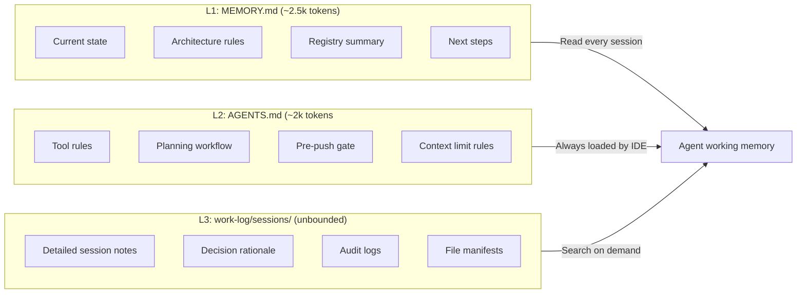
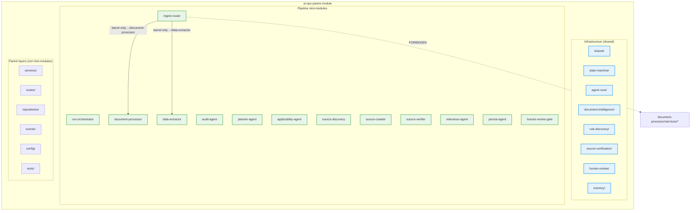
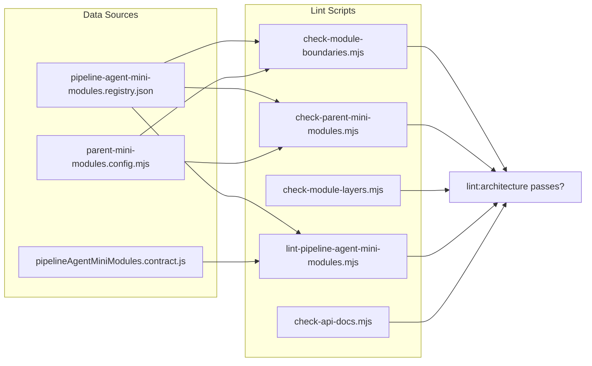
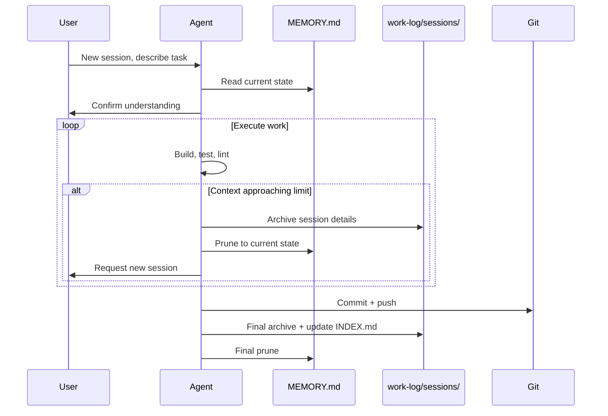

# Context Engineering for LLM Agents — Study Log

**Date:** 2026-06-06
**Author:** Teres + AI agent pair
**Project:** `create-modular-monolith` — generic modular monolith scaffold
**Branch:** `architecture/pipeline-agent-mini-modules-v001`

---

## The Problem

LLM coding agents have a finite context window (~32k-128k tokens depending on model). When working on a large codebase across multiple sessions, the agent loses context between sessions. Without a persistence strategy, each new session starts from zero and wastes tokens re-learning what was already decided.

We needed a system that lets an AI agent work on a 100+ file scaffold across multiple sessions without blowing the context window.

---

## The Architecture We Built

```mermaid
graph TB
    subgraph Session["Each Session Lifecycle"]
        Start[Start] --> Read[Read MEMORY.md]
        Read --> Work[Execute task(s)]
        Work --> Check{Context <br/>approaching limit?}
        Check -- No --> Done[Done]
        Check -- Yes --> Compact[Compact immediately]
        Compact --> Archive
        Done --> Archive[Archive to<br/>work-log/sessions/]
        Archive --> Prune[Prune MEMORY.md<br/>to current state only]
        Prune --> End[End session]
    end

    subgraph Persistence["Cross-Session Persistence"]
        MEMORY[template/MEMORY.md<br/>~96 lines, current state only]
        Sessions[work-log/sessions/*.md<br/>detailed history, searchable]
        Index[work-log/sessions/INDEX.md<br/>table of contents]
        MEMORY --- Sessions
        MEMORY --- Index
    end

    subgraph Guardrails["Enforced via Lint Scripts"]
        Boundaries[lint:boundaries<br/>cross-module imports]
        MiniMods[lint:mini-modules<br/>barrel-only sibling imports]
        Layers[lint:layers<br/>intra-module layer rules]
        Registry[lint:pipeline-agent<br/>registry ↔ folder alignment]
    end

    Session --> Persistence
    Guardrails --> Session
```

---

## Context Window Strategy

### The Three-Layer Memory System



### Token Budget Breakdown

<details>
<summary><b>Click to expand: token budget analysis</b></summary>

| Layer | File | Lines | Est. tokens | Loaded when? |
|-------|------|-------|-------------|--------------|
| L1 | `template/MEMORY.md` | 96 | ~2,400 | Every session start |
| L2 | `template/AGENTS.md` | 95 | ~2,300 | Always (IDE rule) |
| L3 | Session archives | varies | ~800/session | On-demand search |
| L3 | `INDEX.md` | 6 | ~150 | Session archive update |
| **Total active** | — | — | **~5,000** | Working context baseline |

**Remaining budget per session:** ~24,000 tokens for actual work (on a 32k model).

The key insight: MEMORY.md stays under 3k tokens by design. It stores only current state, not history. History lives in Layer 3 where it's searchable but not loaded automatically.
</details>

---

## Mini-Module Architecture

### Why Mini-Modules?

Pipeline agents need strict isolation. Each agent should only talk to siblings via barrel exports, never deep imports. This prevents hidden coupling and makes it safe to refactor any single agent without touching others.



### Module Hierarchy Stats

<details>
<summary><b>Click to expand: module directory breakdown</b></summary>

| Category | Backend dirs | Frontend dirs | Files (backend) | Files (frontend) |
|----------|-------------|---------------|-----------------|------------------|
| Infrastructure mini-modules | — | 8 | — | — |
| Pipeline mini-modules | 12 | 12 | 24 | 24 |
| Parent layers (backend) | 9 | — | 6 | — |
| Legacy redirect (ocr) | — | 1 | — | 1 |
| **Total** | **23** | **21** | **30** | **42** |

Each mini-module has at minimum:
- `index.js` (backend) / `index.jsx` (frontend)
- `manifest.json` (backend) declaring slug, parent, version, status
</details>

---

## Enforcement System

### What Gets Enforced (and How)



### Enforcement Test Results

We created a deliberate violation to verify the system catches it:

<details>
<summary><b>Click to expand: violation test details</b></summary>

**Test file created:** `backend/src/modules/ai-ops/ingest-router/services/violation-test.js`

```js
// VIOLATION TEST — deep import from sibling (should fail lint)
import { processDocument } from "../document-processor/services/processor.service.js";

export function routeDocument(file) {
  return processDocument(file);
}
```

**Result from `npm run lint:mini-modules`:**
```
Parent mini-module boundary violations found:

- backend/src/modules/ai-ops/ingest-router/services/violation-test.js
  deep-imports document-processor via
  "../document-processor/services/processor.service.js"
  (use ../document-processor or ../document-processor/index.js)
```

**Verdict:** ✅ Enforcement works. The script correctly identified the deep import into a sibling mini-module's internal `services/` folder and pointed to the correct barrel import pattern.

**Rollback:** Removed test file, all lints passed green.
</details>

### Internal Directory Allowlist

The linter knows which subdirectories count as "internal" and forbidden for cross-mini-module imports:

| Directory | Frontend | Backend |
|-----------|----------|---------|
| `components/` | ✅ | ✅ |
| `services/` | ✅ | ✅ |
| `data/` | ✅ | ✅ |
| `pages/` | ✅ | ✅ |
| `hooks/` | ✅ | ✅ |
| `utils/` | ✅ | ✅ |
| `agents/` | ❌ | ✅ |
| `routes/` | ❌ | ✅ |
| `schemas/` | ❌ | ✅ |
| `prompts/` | ❌ | ✅ |
| `evals/` | ❌ | ✅ |
| `repositories/` | ❌ | ✅ |
| `adapters/` | ❌ | ✅ |
| `domain/` | ❌ | ✅ |
| `events/` | ❌ | ✅ |
| `config/` | ❌ | ✅ |

---

## Session Workflow

### How We Work



### Key Rules That Make This Work

<details>
<summary><b>Click to expand: agent discipline rules</b></summary>

1. **Hard ~24k token working limit** — 32k model, ~8k reserved for system prompt + MEMORY.md + AGENTS.md. At 24k of working context, stop and compact.

2. **Read discipline** — Never read large files or multiple files if not strictly necessary. Prefer `grep`/`glob` over `read`. Minimize tool calls that consume context.

3. **One task per session** — Scope each session to a single, bounded task. Don't start two independent threads in one session.

4. **Archive before prune** — Always write the detailed session note to `work-log/sessions/` first, then prune `MEMORY.md`. Never delete before archiving.

5. **MEMORY.md is current state only** — No completed items, no history, no "we decided X because Y." That belongs in Layer 3. MEMORY.md stores: what's true now, what's next, and the rules.

6. **Generic scaffold** — The template is domain-agnostic. Pipeline agent slugs are generic (`ingest-router`, `document-processor`, `audit-agent`), not tied to any specific domain. Swap the slugs for any project.

7. **Verification before commit** — Always run `npm run lint:architecture` before committing. Never push first — write dev logs, verify, commit, then push.
</details>

---

## Files Created This Session

<details>
<summary><b>Click to expand: full file manifest</b></summary>

### Context Engineering Files
| File | Purpose |
|------|---------|
| `template/MEMORY.md` | Persistent cross-session context (pruned to current state) |
| `template/AGENTS.md` | Agent rules, context limits, session memory protocol |
| `template/work-log/sessions/INDEX.md` | Session archive table of contents |
| `template/work-log/sessions/README.md` | Session archive documentation |

### Session Archives
| File | Summary |
|------|---------|
| `work-log/sessions/2026-06-06-audit-and-memory-setup.md` | Registry audit, MEMORY.md creation, context engineering |
| `work-log/sessions/2026-06-06-fsm-template-audit.md` | FSM template audit against internal contract |
| `work-log/sessions/2026-06-06-generic-rename-and-enforcement-test.md` | Generic rename + boundary enforcement test |

### Registry + Contracts
| File | Purpose |
|------|---------|
| `backend/src/shared/contracts/pipeline-agent-mini-modules.registry.json` | Source of truth for all mini-modules |
| `frontend/src/modules/ai-ops/shared/data/pipeline-agent-mini-modules.registry.json` | Frontend mirror |
| `backend/src/shared/contracts/pipelineAgentMiniModules.contract.js` | Registry loading functions |

### Lint Scripts
| File | What it checks |
|------|----------------|
| `backend/scripts/check-module-boundaries.mjs` | Cross-module imports |
| `backend/scripts/check-parent-mini-modules.mjs` | Barrel-only sibling imports |
| `backend/scripts/check-module-layers.mjs` | Intra-module layer rules |
| `scripts/lint-pipeline-agent-mini-modules.mjs` | Registry ↔ folder ↔ manifest alignment |
| `scripts/check-api-docs.mjs` | Express routes documented in API docs |
| `scripts/lib/parent-mini-modules.config.mjs` | Mini-module config derived from registry |

### Documentation
| File | Purpose |
|------|---------|
| `docs/ai-ops/API.md` | Module API documentation with mini-module status table |
| `docs/API.md` | Root endpoint registry |

### Mini-Module Stubs (72 total)
- 12 backend mini-modules (each with `index.js` + `manifest.json`)
- 12 frontend pipeline mini-modules (each with `index.js` + `index.jsx`)
- 8 frontend infrastructure mini-modules
- 1 legacy `ocr/` redirect to `document-processor`
- 9 backend parent layer directories
</details>

---

## Lessons Learned

### What Worked

- **Three-layer memory** separated current state (L1) from history (L3) with rules in between (L2). This kept the active context under 5k tokens while preserving full history.
- **Pruning MEMORY.md aggressively** was the right call. Keeping only "what's true now" made each session start fast.
- **Registry-driven architecture** — the JSON registry is the single source of truth. Lint scripts derive everything from it, so adding a new mini-module is one JSON edit plus one folder creation.
- **Enforcement test** — creating a deliberate violation proved the lints work before relying on them. Worth the 5 minutes.

### What Would Be Different Next Time

- **Start with generic names** — we scaffolded with legal-tech names (`parser-agent`, `ocr-agent`) then renamed. Starting generic saves a commit and avoids stale references.
- **Automate the mirror** — the frontend registry mirror is a manual `cp` today. A post-lint hook or pre-commit script would be better.
- **Bigger context model** — the ~24k working limit forced aggressive scoping. With a 128k model, we could load more context and do bigger tasks per session, but the three-layer pattern still applies.

---

## Commit History

| Commit | Message |
|--------|---------|
| `c7ac6fb` | chore(memory): update MEMORY.md to generic state, archive session |
| `73ca5c8` | feat(architecture): rename pipeline agents to generic slugs, add enforcement test |
| `79e3fa6` | feat(architecture): scaffold ai-ops parent module and pipeline agent mini-modules v001 |
| `c6e428e` | chore(architecture): sync platform starter with pipeline agent mini-modules v001 |

---

## Quick Reference

<details>
<summary><b>Click to expand: useful commands cheat sheet</b></summary>

```bash
# Architecture checks
npm run lint:architecture          # All checks combined
npm run lint:boundaries            # Cross-module imports only
npm run lint:mini-modules          # Barrel-only sibling imports
npm run lint:layers                # Intra-module layer rules
npm run lint:pipeline-agent-mini-modules  # Registry alignment

# Planning
npm run plan:finalize -- --slug <slug>
npm run plan:gate -- --slug <slug>

# Pre-push
npm run dev-log:pre-push -- --slug <topic> --program <NNN>
npm run dev-log:verify
npm run dev-log:sync-head -- --latest

# File exchange
npm run import:file-exchange -- "/path/to/bundle"
```
</details>

<details>
<summary><b>Click to expand: mini-module slug reference</b></summary>

| Slug | Kind | Status |
|------|------|--------|
| `run-orchestrator` | orchestrator | implemented |
| `ingest-router` | assigner | implemented |
| `document-processor` | worker | implemented |
| `data-extractor` | worker | implemented |
| `audit-agent` | worker | implemented |
| `planner-agent` | worker | planned |
| `applicability-agent` | worker | implemented |
| `source-discovery` | worker | implemented |
| `source-crawler` | worker | implemented |
| `source-verifier` | worker | implemented |
| `relevance-agent` | worker | planned |
| `persist-agent` | worker | planned |
| `human-review` | gate | orchestrated |
</details>

---

*End of study log. This file is user-owned and not subject to agent auto-pruning.*
