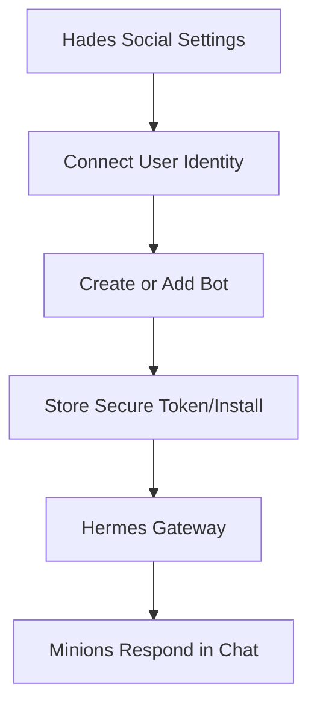
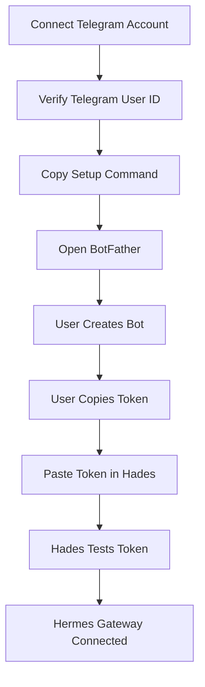
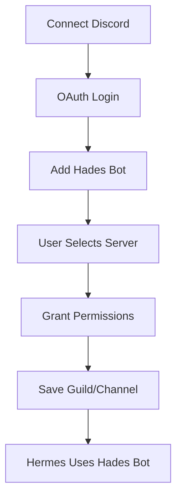

# Study Log: Social Messaging Setup for Hades OS

**Date:** June 13, 2026
**Topic:** Telegram/Discord authentication, bot setup, and Hermes gateway naming
**Focus:** Figuring out what can be automated, what still needs manual user action, and how Hades should present the setup.

## Context

I wanted Hades to support messaging integrations where users can connect Telegram or Discord and then talk to their agents/minions from chat.

The first idea was to use OAuth so the user could connect Telegram and have Hades automatically create or configure the bot. After checking the actual platform constraints, the better product model became:



## Table of Contents

1. [What I Wanted](#1-what-i-wanted)
2. [What I Learned About Telegram](#2-what-i-learned-about-telegram)
3. [What I Learned About Discord](#3-what-i-learned-about-discord)
4. [Naming Decision](#4-naming-decision)
5. [Current Product Flow](#5-current-product-flow)
6. [Security Notes](#6-security-notes)
7. [Current Working Note](#7-current-working-note)

---

## 1. What I Wanted

The original goal was simple:

* User opens Hades
* Clicks “Connect Telegram”
* OAuth handles everything
* Hades gets the token automatically
* Hermes starts working through Telegram

This would have been the smoothest onboarding.

The issue is that Telegram does not provide an OAuth flow for creating a bot or issuing a BotFather token.

---

## 2. What I Learned About Telegram

Telegram has two separate concepts:

### Telegram Login / OIDC

Used for:

* Verifying the user’s Telegram identity
* Getting the user’s Telegram ID
* Connecting a Telegram account to a Hades account

Not used for:

* Creating bots
* Reading BotFather replies
* Issuing bot tokens
* Controlling a user’s Telegram account

### BotFather Token

Used for:

* Creating a Telegram bot
* Getting the bot API token
* Allowing Hermes to send/receive Telegram messages

This step cannot be fully automated through OAuth.

Best Telegram flow:



The app can reduce friction by copying BotFather instructions to the clipboard before opening Telegram.

Example button:

```txt
Copy setup command & open BotFather
```

Example copied text:

```txt
/newbot
Hades Minion
hades_pujan_minion_bot
```

The user still needs to paste/send it manually in Telegram, then copy the token back into Hades.

---

## 3. What I Learned About Discord

Discord is better for automation.

Discord supports OAuth2 flows for:

* Connecting a Discord user identity
* Installing a bot/app into a server
* Selecting a server
* Granting bot permissions

For Discord, Hades can use one official Hades bot instead of asking each user to create their own bot token.

Best Discord flow:



This means Discord can feel much closer to a one-click setup.

Telegram requires a pasted token.
Discord can use an official Hades bot install flow.

---

## 4. Naming Decision

User-facing naming should stay simple.

```txt
Hades = product / app / OS
Hermes = internal messaging gateway
Minions = user-facing agents/workers
```

UI should say:

```txt
Connect Telegram to Hades
Add Hades Bot to Discord
Hades will message you through Telegram
```

Backend can still use names like:

```txt
hermes_gateway
hermes_telegram_connector
hermes_discord_connector
```

This keeps the product understandable without exposing too much internal mythology.

---

## 5. Current Product Flow

### Telegram Setup in Hades

```txt
1. Connect Telegram Account
   - Uses Telegram Login/OIDC
   - Saves telegram_user_id

2. Get Bot Token
   - Copies setup instructions
   - Opens BotFather

3. Paste Bot Token
   - User pastes token into Hades

4. Auto-Test
   - Hades calls Telegram getMe
   - Confirms bot is valid

5. Secure Save
   - Encrypt token
   - Store token_last4 only for display

6. Start Hermes Gateway
   - Inject token into gateway config
   - Bind bot to allowed Telegram user ID
```

### Discord Setup in Hades

```txt
1. Connect Discord Account
   - OAuth login
   - Save discord_user_id

2. Add Hades Bot
   - OAuth bot invite
   - User selects server

3. Save Server/Channel
   - Store guild_id
   - Store channel_id

4. Start Hermes Gateway
   - Use official Hades bot token
   - Route messages to the correct user/minion
```

---

## 6. Security Notes

Telegram bot tokens should be treated like passwords.

Hades should:

* Encrypt tokens at rest
* Never show the full token after saving
* Show only token_last4
* Let users disconnect
* Tell users to revoke the token in BotFather if needed
* Bind each Telegram bot to the verified Telegram user ID
* Make Hermes ignore messages from unauthorized Telegram users

Suggested storage shape:

```txt
telegram_connections
- id
- user_id
- telegram_user_id
- telegram_username
- bot_id
- bot_username
- encrypted_bot_token
- token_last4
- status
- created_at
- revoked_at
```

---

## 7. Current Working Note

Telegram cannot be fully automated in the clean official way because BotFather still controls bot-token creation.

The best Hades UX is semi-automated:

```txt
Connect Telegram → Copy BotFather command → Open BotFather → Paste token → Auto-test → Done
```

Discord can be more automated:

```txt
Connect Discord → Add Hades Bot → Select server → Done
```

Current product decision:

* Use **Hades** as the user-facing product name.
* Use **Hermes** as the internal messaging gateway.
* Use **Minions** for the user-facing agents/workers.
* Do not expose “Hermes” heavily in onboarding unless needed for technical settings.
