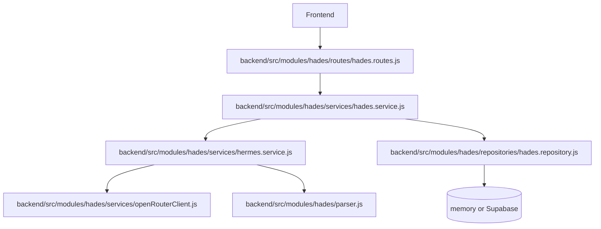
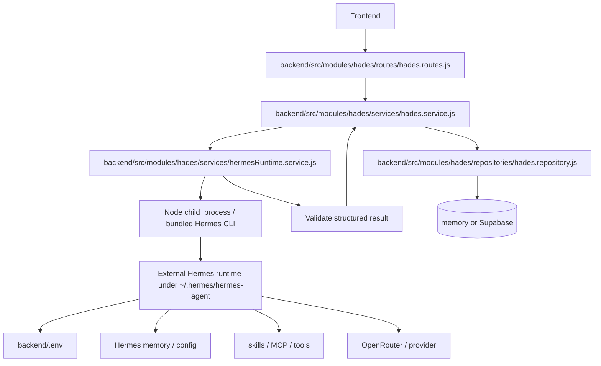
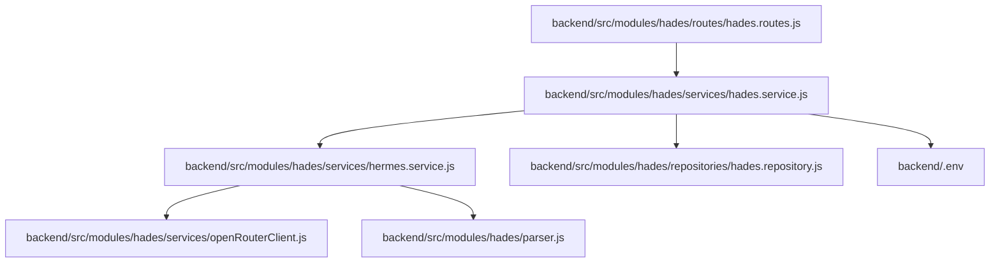
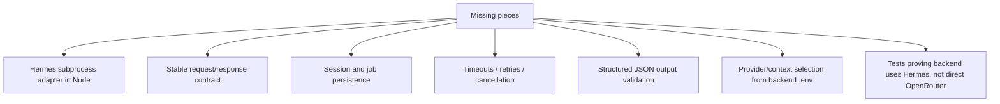
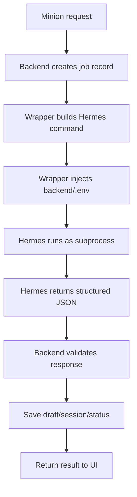
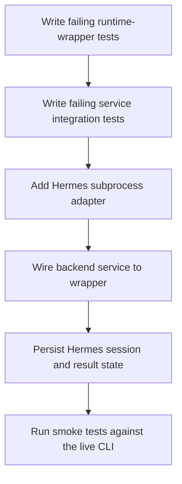

# Study Log: Hermes as an Agent Runtime Layer

**Date:** June 11, 2026  
**Topic:** Whether Hades OS is currently using Hermes as a true runtime agent layer inside the Node backend, or only as a service abstraction around model calls.  
**Repo:** `hades-os-monorepo`  
**Focus:** Backend runtime architecture, agent boundary, and the next TDD migration slice.

## Question Being Studied

The core question was:

Can Hades OS use Hermes as the runtime layer for agent execution, while the backend still owns product state, routes, persistence, and workflow records?

The answer is yes in architecture, but not yet in full implementation.

## Current Reading Of The System

Right now, the repo has a `Hermes`-named service, but it still behaves mostly like an internal backend abstraction:

- it can call OpenRouter directly
- it can fall back to the local parser
- it does not yet act as a subprocess wrapper around the external Hermes install

That means the backend is still doing the orchestration work itself.

## Current State Diagram

This is the current shape:

- the backend owns the flow
- `hermes.service.js` is a service boundary, not a runtime boundary
- OpenRouter is still called directly from backend code
- the local parser is still the fallback path

## What The Study Log Is Pointing Toward

The desired architecture is different:

- the backend becomes a control plane
- Hermes becomes the execution engine
- Node wraps Hermes instead of pretending to be Hermes
- the result is persisted back into the product store

## Target Runtime Diagram

## What This Changes

The important shift is this:

- today, the backend performs the agent work directly
- tomorrow, the backend should hand work to Hermes and store the result

That makes Hermes an actual runtime layer instead of just a named abstraction.

## File-Level Map

This is the repo-specific path the runtime refactor would likely follow:

1. keep routes thin
2. move runtime execution behind a Hermes wrapper service
3. persist Hermes execution metadata
4. preserve the local parser as fallback only
5. keep backend `.env` as the shared config source

## What Is Missing

The missing pieces are mostly boundary and contract work, not UI work.

## Runtime Flow We Want

This is the practical behavior we want:

- backend creates the request and owns the record
- Hermes performs the agent step
- Node handles validation and persistence

## TDD Plan

The next implementation slice should be test-driven.

### Suggested test order

1. add a Node wrapper test for spawning Hermes
2. add a service test proving `hades.service.js` calls the wrapper
3. add a repository test for saving session/result metadata
4. add an integration test for the chat route
5. verify the live Hermes smoke still passes

## Bottom Line

The study log points to the correct architecture for Hades OS:

- Hades backend owns product state and routes
- Hermes owns agent execution
- OpenRouter becomes a provider behind Hermes, not a direct backend dependency

That architecture is not fully implemented yet, but the repo is now close enough to start the runtime-wrapper slice cleanly.
