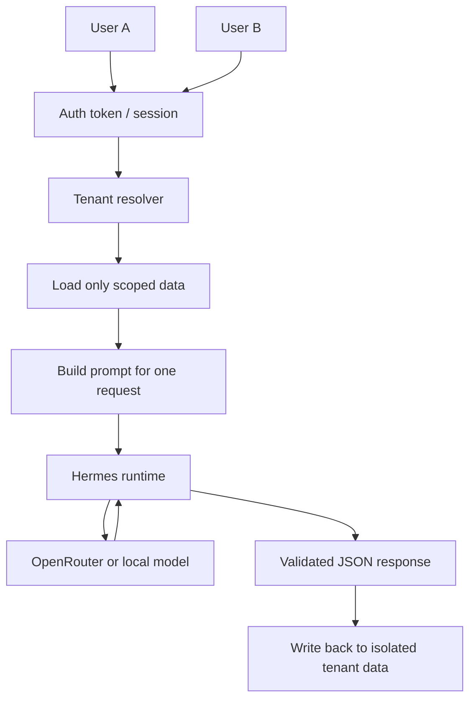
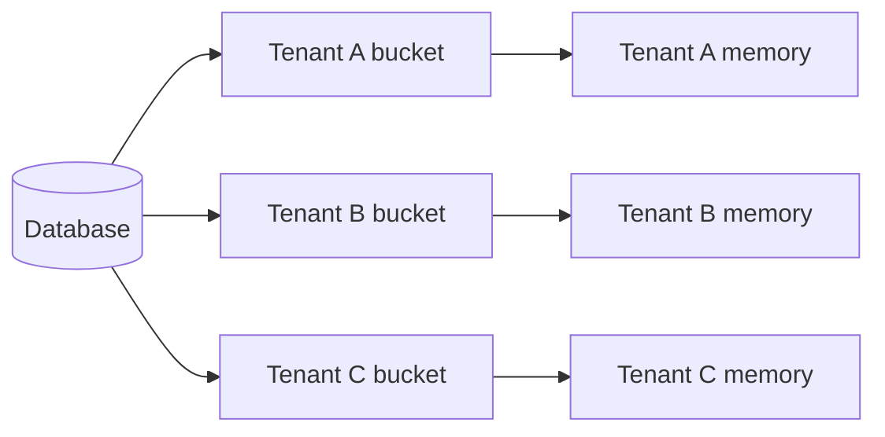
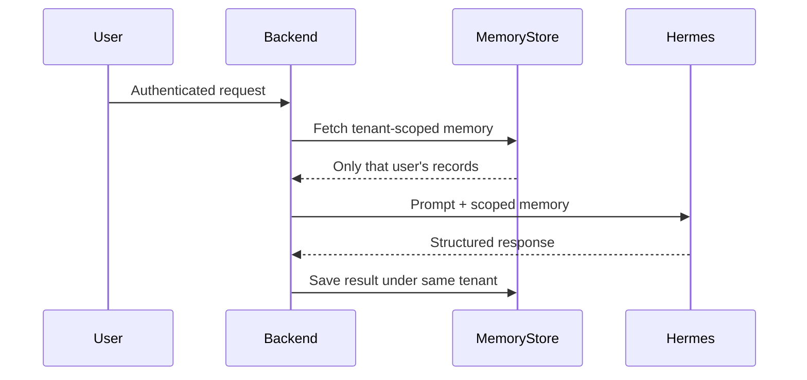
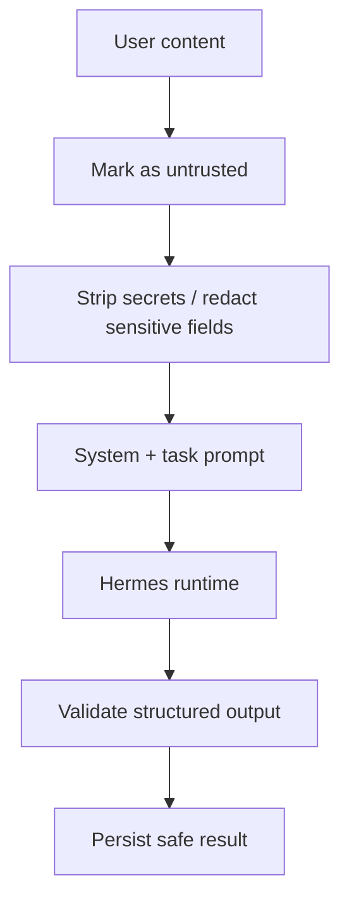
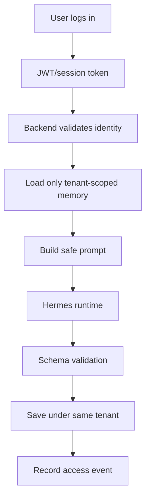

# Study Log: Hermes Isolation, Tenant Safety, and Shared Runtime Risk

**Date:** June 11, 2026  
**Topic:** How Hades OS should keep user data isolated when multiple people share the same Hermes service, the same OpenRouter provider, or the same local model server.  
**Repo:** `hades-os-monorepo`  
**Focus:** database isolation, request isolation, prompt-injection resistance, auth, and multi-user safety.

## Question Being Studied

The core question is:

How do we let 2, 3, 10, or 20 people use the same Hermes-backed system at the same time without mixing data, leaking private context, or letting one user's prompt injection affect another user's memory or output?

The short answer is:

- the backend must own tenant boundaries
- Hermes must be treated as a stateless execution layer
- memory must be stored and fetched per user or per tenant
- OpenRouter or a local model server must never see unscoped private data

## The Main Design Principle

Hermes should not be the source of truth for user data.

Instead:

- the app backend owns identity
- the app backend owns isolation
- the app backend owns memory retrieval
- Hermes only receives a small, scoped prompt for one request

That means shared infrastructure is acceptable as long as each request is isolated before it reaches Hermes.

## Target Isolation Model



## What Must Stay Isolated

The following must never be mixed across users:

- memory records
- drafts
- minion inventories
- session summaries
- tool results
- social assignment data
- prompt history used for retrieval
- error logs that contain sensitive payloads

The tenant boundary should be applied before prompt construction, not after the model responds.

## Recommended Data Separation



Practical rule:

- one user should only read their own records unless explicitly shared
- a shared Hermes process is fine
- a shared database is fine
- shared data must be tenant-scoped at query time

## How Hermes Should Interact With Memory

Hermes itself should not decide which user's memory to load.

The backend should do this:

1. authenticate the request
2. resolve tenant and user id
3. fetch only that user's relevant memory slice
4. optionally summarize old memory
5. build the Hermes prompt
6. send the scoped prompt to Hermes
7. save the result back under the same tenant



## Why A Shared Hermes Service Can Still Be Safe

Multiple users can hit the same Hermes service safely if:

- each request is independent
- prompts are built from tenant-scoped data only
- no raw global memory bucket is injected
- no request reuses another request's private context
- the backend verifies the response before persistence

That is how 20 users can share one Hermes runtime without sharing one another's data.

## Authentication Model

Your instinct is correct: token-based authentication should be required.

Recommended structure:

- short-lived auth token or session cookie for the frontend
- backend validates the token
- backend derives `userId` and `tenantId`
- every database query includes the tenant filter
- every Hermes prompt is built from the resolved tenant only

Important nuance:

- auth is for the backend boundary
- Hermes does not need to trust users directly
- Hermes only trusts the backend's filtered request

## Prompt Injection Risk

Prompt injection is still a real risk, even with tenant isolation.

The main defense is to treat all user-provided text as untrusted content, not instructions.



Recommended defenses:

- prefix user data in prompts as quoted or fenced input
- keep system instructions separate from user text
- never let retrieved memory override current system policy
- do not inject secrets into prompts unless absolutely necessary
- validate Hermes output against an allowlist schema
- reject unexpected fields, tool calls, or free-form command execution

## Shared Model Server Risk

If 20 users hit the same OpenRouter or local model server at once, the risk is not that the model magically merges databases.

The real risks are:

- the backend sends the wrong user's memory
- caching is shared across tenants incorrectly
- request IDs get mixed up
- logs contain unredacted private context
- retries replay stale payloads

So the real safety layer is not the provider.

It is the backend boundary.

## Encryption And Storage

Encryption is still important, but it is not enough by itself.

Recommended layers:

- TLS in transit
- encrypted storage at rest
- encrypted secrets in env/config
- tenant-scoped database access
- audit logging for memory reads and writes

Encryption helps if storage is compromised.

It does not replace scoping, auth, or prompt hygiene.

## Risk / Tradeoff Summary

| Choice | Benefit | Tradeoff |
|---|---|---|
| Shared Hermes runtime | Easier to operate, cheaper, simpler deployment | Must enforce strict tenant boundaries in backend |
| Per-user isolated Hermes instance | Stronger process separation | Harder to scale, more expensive, more ops burden |
| Shared database with tenant filters | Practical and fast for MVP | Requires careful query discipline and tests |
| Per-tenant database | Stronger isolation | More infrastructure and migration overhead |
| Backend-owned memory retrieval | Full control over what Hermes sees | More backend logic to maintain |
| Hermes-owned persistent memory | Less backend logic | Harder to trust, harder to isolate, harder to audit |

## Recommended MVP Path

For Hades OS MVP, the safest practical approach is:

1. one shared Hermes runtime
2. one backend-authenticated request pipeline
3. tenant-scoped memory buckets
4. isolated database queries
5. strict response validation
6. prompt-injection-safe prompt construction
7. no raw cross-tenant memory sharing

## MVP Security Flow



## Final Answer To The Core Question

Yes, multiple people can safely use the same Hermes service or the same OpenRouter/local model server at the same time.

The data stays safe if:

- the backend authenticates each request
- tenant boundaries are enforced in queries
- only scoped memory is injected into each prompt
- Hermes is treated as stateless
- output is validated before storage
- logs and caches do not cross tenants

So the safest answer is not “give Hermes everyone’s memory.”

The safest answer is:

```txt
give Hermes only the current user's scoped context, one request at a time, and keep all long-term memory in the backend with tenant filtering and audit trails.
```
