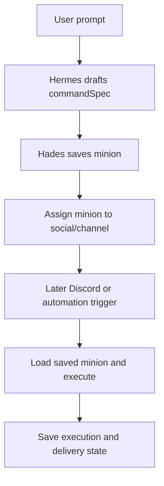

# Study Log: Hermes Discord Minion Runtime

This study captures the architectural shift we converged on for Hades OS: Hermes should draft the command behavior, while Hades stores and reuses the result as a minion.

## What We Studied

- `backend/src/modules/hades/services/hermes.service.js`
- `backend/src/modules/hades/services/hermesRuntime.service.js`
- `backend/src/modules/hades/repositories/hades.repository.js`
- `backend/src/modules/auth/services/createHermesJobFromRequest.js`
- `backend/src/modules/auth/tests/unit/auth.hermes.context.test.js`
- the new Discord/GIF/minion contract tests in the Hades repo

## What We Learned

### Hermes is not the database

Hermes returns a structured response. Hades owns persistence, reuse, and assignment scope.

### A minion is the reusable unit

A Hermes command draft becomes a Hades minion once it is saved.

### Assignments make commands reusable

The same command name should not create a new object every time. Instead:

- save the minion once
- assign it to Discord or another social
- resolve the assignment later
- execute the saved minion again

### The app login is not the delivery path

Discord OAuth inside the app proves the user identity. It does not mean a Discord message can already be sent from Hermes.

### GIF delivery still needs a provider adapter

The current repo has simulated cat meme behavior, but real GIF sending requires a provider plus a Discord send client.

## Exact Handoff Summary

The implementation handoff we wrote for the next phase says:

- build an authenticated Discord command flow
- save Hermes command output as a Hades minion
- assign the minion to a social/channel
- resolve later `!command` usage from the assignment
- keep cross-user collisions blocked
- keep secrets out of Hermes input

## Plan Summary

The TDD plan now has two red gates:

1. Discord command to GIF delivery
2. reusable minion assignment runtime

After those are red, the implementation path is:

- make the Discord command flow green
- make the minion assignment runtime green
- wire Supabase persistence
- add GIF provider support
- add runtime smoke tests

## Study Outcome

We now have a clear product model:

- Hermes drafts the behavior
- Hades saves the behavior
- assignments make it reusable
- Discord delivers it
- automation reuses the same runtime shape later

