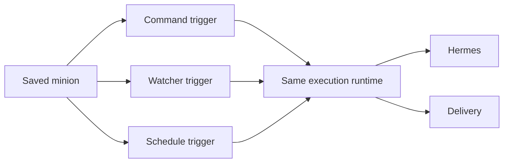

# Study Log: Hermes Assignment Reuse, GIF Delivery, and Runtime Safety

This study focuses on the runtime layer that sits after the minion is saved.

## The Core Questions

- How does a saved Hermes command become reusable?
- How do we attach it to Discord or another social?
- How do we keep one user from reaching another user's command?
- How do we make GIF delivery real instead of simulated?

## Findings

### 1. Assignment lookup is the missing runtime step

The next runtime slice is not just "save the command." It is:

1. verify the social account
2. find the active assignment
3. load the saved minion
4. execute the minion through Hermes
5. send the result
6. persist the delivery

### 2. Cross-user collisions must fail closed

If two users both have `!catgif`, the runtime must scope by:

- verified user ID
- tenant ID
- provider
- channel
- command name

That is what prevents the wrong minion from firing.

### 3. Automation should reuse the same runtime shape

The same minion model should work for:

- `triggerType: "command"`
- `triggerType: "schedule"`
- `triggerType: "watcher"`

### 4. GIFs need a real provider

If Hermes says "send a cat meme GIF," the backend still needs to:

- search a provider
- choose a URL
- send it through Discord
- record success or failure

### 5. Safety is mostly in the backend boundary

The backend must keep:

- auth tokens
- provider secrets
- other users' minions
- raw sessions

out of Hermes context unless they are intentionally scoped and safe.

## Handoff Alignment

The handoff and issue we created are aligned on the same next phase:

- reusable minion runtime
- assignment resolution
- GIF delivery
- Supabase persistence
- TDD gates before implementation

## Practical Conclusion

Hermes is the brain.
Hades is the owner.
Assignments are the reuse mechanism.
Discord and automation are delivery surfaces.

