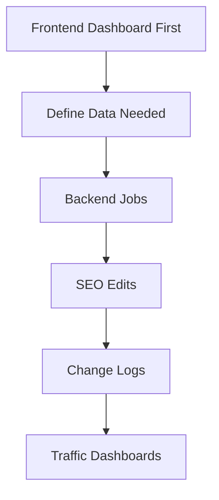

# Study Log: Auto SEO and Content Editor

**Project Name:** Auto SEO and Content Editor  
**Project Type:** Expert-operated SEO workflow automation tool  
**Current Build Focus:** Frontend-first dashboard prototype  
**Status:** Planning and frontend design phase  

## Context

This project is an SEO workflow automation tool for an SEO expert who already knows the workflow.

The goal is not to build an autonomous SEO strategy agent or a generic AI content spam system. The goal is to automate repetitive execution steps inside an existing expert workflow.

The expert still owns the strategy. The system helps with fetching blog data, collecting search data, generating SEO edit drafts, logging changes, and tracking traffic impact.

For the first build, I am starting with the **frontend dashboard first**. The frontend helps define what the backend needs to produce, what data needs to be stored, and what the expert needs to see every day.



---

## Table of Contents

1. Project Purpose  
2. Why Frontend First  
3. Core Framing  
4. What the Tool Is Not  
5. Main Value Proposition  
6. Full Product Surface  
7. Site Admin and Credentials Flow  
8. Blog Sites and Blog Inventory  
9. Daily Backend SEO Job Pipeline  
10. SERP / Search API Extraction  
11. Blog Detail and Current vs Past Changes  
12. Change Logs  
13. Traffic Dashboards  
14. Google Search Console and Google Analytics  
15. Reports  
16. Prompt Versioning  
17. Quality Checks  
18. MVP Scope  
19. Out of Scope for First Version  
20. Data Model  
21. Success Criteria  
22. Long-Term Vision  
23. Current Frontend Pages  
24. Final Summary  

---

# 1. Project Purpose

The purpose of this project is to automate a daily SEO content optimization workflow that is already being done manually by an SEO expert.

The system helps with:

```text
- connecting to a site admin panel or CMS
- storing login/auth credentials
- fetching blog sites and blog posts
- letting the user choose which sites/blogs are active for daily updates
- collecting SERP/search data
- extracting keywords, tags, slugs, headings, and content patterns
- fetching current blog content
- generating SEO edit drafts
- saving or publishing updates
- logging everything changed by backend jobs
- pulling Google Search Console data
- pulling Google Analytics data
- showing traffic dashboards
- creating daily reports
```

The expert remains the operator and decision-maker.

---

# 2. Why Frontend First

I am building the frontend first because the dashboard defines the actual workflow.

The backend will mostly run automated jobs, but the expert still needs a place to see:

```text
- which sites are connected
- which blogs are active for daily updates
- what backend jobs ran today
- what changed in each blog
- what the current blog content looks like
- what previous versions looked like
- what traffic changed after edits
- what Google Search Console and Analytics show
- what failed
- what needs attention
```

The frontend is not just a review screen.

It is the operational control surface for the SEO workflow.

```text
Frontend first
   ↓
Define dashboard needs
   ↓
Define backend job outputs
   ↓
Define database tables
   ↓
Build automation around the real workflow
```

---

# 3. Core Framing

```text
SEO expert owns the strategy
        ↓
System automates repetitive execution
        ↓
Frontend shows sites, blogs, jobs, edits, logs, and traffic
        ↓
Expert saves, publishes, or adjusts workflow
        ↓
System logs changes and tracks impact
```

The system is meant to reduce repetitive manual work, not replace SEO judgment.

---

# 4. What the Tool Is Not

This is not:

```text
- an autonomous SEO strategy agent
- a generic AI content spam system
- a fully automatic blog rewriting machine
- a replacement for expert SEO judgment
- a large multi-client SaaS dashboard in the first version
- a black-box publishing bot
```

The tool should stay focused on expert workflow automation.

---

# 5. Main Value Proposition

An SEO expert may already spend hours each day doing:

```text
- checking search results
- comparing top-ranking posts
- collecting keywords and tags
- reviewing old blog posts
- rewriting titles, headings, and metadata
- updating content
- checking Search Console and Analytics
- tracking performance changes
- repeating the process daily
```

This project automates the repetitive parts of that workflow so the expert can work faster and track changes more consistently.

The immediate value is operational:

```text
- less manual SERP research
- faster blog review
- faster metadata and tag cleanup
- clearer before/after logging
- easier traffic tracking
- better daily reporting
```

Traffic lift matters, but it is a lagging metric.

The first value is whether the expert can complete the same workflow faster without losing control.

---

# 6. Full Product Surface

The project has three main layers:

```text
1. Admin / connection layer
2. Backend automation layer
3. Dashboard / traffic tracking layer
```

The full frontend should include:

```text
Dashboard
Blog Sites
Credentials
Blog Inventory
Blog Detail
Daily Jobs
SERP Extraction
Change Logs
Traffic Dashboards
Analytics
Reports
Prompt Versions
```

The dashboard is not only for generated edits. It also needs to show site connections, blog lists, daily backend jobs, current vs past blog changes, and traffic movement.

---

# 7. Site Admin and Credentials Flow

The pipeline starts with the site admin panel or CMS connection.

```text
Site admin panel / CMS
   ↓
Login auths / credentials
   ↓
Fetch all blog sites or blog sources
   ↓
Show blog sites in frontend
   ↓
User chooses which sites are active for daily updates
   ↓
Backend stores selected sites
   ↓
Daily cron only runs on selected sites
```

The credentials panel should include:

```text
CMS Credentials
- site name
- admin URL
- CMS type
- username
- password
- API token
- test connection
- save credentials

Search API Credentials
- provider
- API key
- daily query limit
- test search API

Google Analytics
- GA property ID
- connection status
- test GA pull

Google Search Console
- property URL
- connection status
- test GSC pull
```

This is part of the frontend because the expert needs to configure and verify the data sources.

---

# 8. Blog Sites and Blog Inventory

After the system connects to the site admin panel or CMS, it fetches available blog sites and posts.

The frontend should show a list of connected blog sites.

Each blog site should show:

```text
- site name
- base URL
- admin URL
- CMS type
- connection status
- total posts
- last synced time
- daily update enabled / disabled
```

Then the blog inventory page should show all blog posts/slugs for a selected site.

Each blog/post row should show:

```text
- blog title
- slug
- publish status
- last edited date
- last optimized date
- tags
- clicks
- impressions
- CTR
- average position
- active for daily updates toggle
```

The expert can choose or unchoose blogs for daily optimization.

```text
Blog Sites
   ↓
Choose active site
   ↓
Blog Inventory
   ↓
Choose active posts/slugs
   ↓
Daily job queue
```

---

# 9. Daily Backend SEO Job Pipeline

The backend job runs against selected sites and selected blogs.

Core pipeline:

```text
Daily cron job
   ↓
Pick selected site
   ↓
Pick selected blog / slug
   ↓
Collect search data from Google / Brave / SERP source
   ↓
Extract tags, keywords, related slugs, headings, and content patterns
   ↓
Fetch existing blog content from admin dashboard / CMS
   ↓
Generate SEO edit draft
   ↓
Run quality and formatting checks
   ↓
Save draft or publish update
   ↓
Log every field changed
   ↓
Pull Google Search Console and Analytics data
   ↓
Track before/after performance
   ↓
Generate daily report
   ↓
Store results for prompt/version comparison
```

The frontend should show where each job is in the pipeline.

Example job status:

```text
Blog selected: done
SERP collected: done
Keywords extracted: done
Current blog fetched: done
SEO draft generated: done
Checks completed: done
Draft saved: done
Analytics sync: pending
```

---

# 10. SERP / Search API Extraction

The system needs a SERP/search extraction panel.

This panel shows what the backend searched and what it extracted.

Search queries are generated from:

```text
- blog title
- current slug
- current tags
- current primary keyword
- location if available
- category
- existing headings
- Google Search Console queries
```

Example for:

```text
Title: Best Cafes in Hoboken
Slug: /best-cafes-hoboken
Tags: coffee, food, hoboken
```

Generated search API queries:

```text
best cafes in Hoboken
best coffee shops Hoboken
Hoboken coffee guide
brunch cafes Hoboken
laptop friendly cafes Hoboken
cafes near Hoboken PATH
```

The extraction should collect:

```text
- page title
- meta description
- URL
- slug pattern
- H1
- H2 headings
- repeated keywords
- related entities
- content format
- internal topic structure
- FAQ questions
- schema hints
- date freshness
- word count estimate
```

The frontend should show:

```text
Search Queries Used Today

1. best cafes in Hoboken
2. best coffee shops Hoboken
3. Hoboken coffee guide
4. brunch cafes Hoboken
5. laptop friendly cafes Hoboken

Results collected:
Top 10 per query

Extraction status:
Complete

Data used for:
Keyword extraction
Tag generation
Heading suggestions
Meta description draft
```

---

# 11. Blog Detail and Current vs Past Changes

Each blog/slug needs its own detail page.

The blog detail page should show:

```text
Current Blog
- title
- slug
- meta title
- meta description
- tags
- headings
- publish status
- last synced
- last optimized

Generated Changes
- old title → new title
- old meta → new meta
- old tags → new tags
- old heading → new heading
- old intro → new intro
- old internal links → new internal links

Job History
- backend job ID
- run date
- prompt version
- fields changed
- saved/published status

Analytics Impact
- day 1
- day 3
- day 7
- day 14
- day 30
```

The useful structure is:

```text
Blog Inventory
  ↓ click one blog
Blog Detail
  ├── Current Snapshot
  ├── Generated Changes
  ├── Job History
  ├── Field Change Log
  └── Analytics Impact
```

This lets the expert answer:

```text
What does the blog look like now?
What did the backend change?
When did it change?
Which prompt changed it?
Was it saved or published?
What happened to traffic after?
```

---

# 12. Change Logs

Change logs are a core part of the project.

Each backend job should log every field changed.

For each change, store:

```text
- date
- time
- site ID
- blog ID
- slug
- backend job ID
- field name
- old value
- new value
- change reason
- prompt version
- saved/published status
```

Example daily change log:

```text
Date: June 8, 2026

Blog:
Best Cafes in Hoboken

Slug:
/best-cafes-hoboken

Changes:
- Title changed
- Meta description changed
- Tags added
- H2 heading updated
- Intro lightly edited
- Internal link added

Prompt version:
seo_editor_v1.1

Backend job:
daily_seo_job_2026_06_08

Status:
Saved draft
```

The frontend needs a daily change log dashboard.

Columns:

```text
Time
Site
Slug
Field
Old Value
New Value
Prompt Version
Status
```

This is one of the most important parts of the frontend.

---

# 13. Traffic Dashboards

Traffic dashboards are now part of the product scope.

The dashboard should show whether backend SEO edits are helping over time.

Traffic dashboards should include:

```text
Site-level traffic
Blog-level traffic
Changed blogs performance
Keyword/query movement
Before/after impact tracking
GA + GSC comparison
```

Main traffic dashboard pages:

```text
1. Site Traffic Dashboard
2. Blog Traffic Dashboard
3. Changed Blogs Performance
4. Keyword / Query Dashboard
5. Before vs After Impact Dashboard
```

Site-level traffic should show:

```text
- total clicks
- total impressions
- CTR
- average position
- pageviews
- users
- sessions
- engagement time
- top gaining blogs
- top declining blogs
- blogs updated recently
```

Blog-level traffic should show:

```text
- clicks
- impressions
- CTR
- average position
- pageviews
- users
- engagement time
- top queries
- query movement
- before/after edit comparison
- traffic trend after backend job
```

Changed-blog performance should show:

```text
- job ID
- edit date
- blog slug
- fields changed
- prompt version
- day 1 traffic
- day 3 traffic
- day 7 traffic
- day 14 traffic
- day 30 traffic
```

The traffic dashboard is where the expert sees whether backend changes are actually helping.

---

# 14. Google Search Console and Google Analytics

The system should pull both Google Search Console and Google Analytics data.

Google Search Console metrics:

```text
- clicks
- impressions
- CTR
- average position
- query
- page / slug
```

Google Analytics metrics:

```text
- pageviews
- users
- sessions
- engagement time
- traffic source
```

The dashboard should separate the two because they answer different questions.

```text
Google Search Console
   ↓
How the blog performs in search

Google Analytics
   ↓
What users do after landing on the page
```

Before/after comparison windows:

```text
- day 1
- day 3
- day 7
- day 14
- day 30
```

Each analytics record should connect back to:

```text
- site
- blog slug
- edit date
- backend job ID
- fields changed
- prompt version
- save/publish status
```

---

# 15. Reports

The system should generate daily reports.

Daily report should include:

```text
- backend jobs run today
- selected sites
- blogs edited today
- keywords used
- tags added
- title/meta changes
- quality check result
- save/publish status
- analytics sync status
- notes for follow-up
```

Example report:

```text
Daily SEO Report — June 8, 2026

Backend jobs run:
- 4 total jobs
- 3 completed
- 1 running

Main blog updated:
Best Cafes in Hoboken
Slug: /best-cafes-hoboken

Changes generated:
- Title updated
- Meta description updated
- Tags expanded
- H2 heading improved
- Intro lightly edited
- Internal link suggested

Prompt versions used:
- seo_editor_v1.1
- meta_writer_v1.0
- heading_optimizer_v1.0
- tag_generator_v1.0

Publishing status:
- /best-cafes-hoboken: saved draft
- /weekend-jersey-city: published
- /nyc-coffee-shops-remote-work: running

Analytics tracking:
- Day 1, day 3, day 7, day 14, and day 30 comparison windows active
```

Reports should help replace manual daily tracking.

---

# 16. Prompt Versioning

Prompt versioning is included because different edit prompts may perform differently over time.

Track:

```text
- prompt name
- prompt version
- blog slug
- output generated
- changed fields
- save/publish status
- analytics outcome
```

Example prompt versions:

```text
seo_editor_v1.0
seo_editor_v1.1
meta_writer_v1.0
heading_optimizer_v1.0
tag_generator_v1.0
internal_link_v1.0
```

Prompt versioning should support later comparison, but it should not make the first build overly complex.

The first version only needs to log which prompt created which output.

---

# 17. Quality Checks

Before saving or publishing, the system runs quality and formatting checks.

Checks include:

```text
- title exists
- meta description exists
- primary keyword is used naturally
- headings are valid
- tags are present
- content is not keyword stuffed
- original meaning is preserved
- formatting is valid
- links are not broken
- new factual phrases are detected and logged
- output is save-ready or publish-ready
```

Each check should return:

```text
pass / fail / warning
score
failure reason
review note
```

Current frontend does not need risk scoring or approval workflow UI.

The quality checks are for visibility and logging.

---

# 18. MVP Scope

The MVP scope stays the same.

The first working version should focus on one narrow expert-operated pipeline:

```text
1. Connect site admin / CMS credentials
2. Fetch blog sites
3. Show blog sites in frontend
4. Let user choose/unchoose sites for daily updates
5. Fetch blog inventory from selected sites
6. Let user choose/unchoose blogs for daily updates
7. Run backend SEO job on selected blog/slug
8. Collect SERP/search data
9. Extract keywords, tags, slugs, and headings
10. Fetch current blog content
11. Generate SEO edit draft
12. Run basic quality checks
13. Save or publish generated output
14. Log every field changed
15. Pull Google Search Console data
16. Pull Google Analytics data
17. Show before/after analytics
18. Generate daily dashboard/report
```

The current implementation focus is the frontend first.

The frontend should make the backend requirements obvious.

---

# 19. Out of Scope for First Version

Out of scope for the first version:

```text
- full autonomous strategy decisions
- large-scale multi-blog batching
- fully automated prompt A/B testing
- advanced pattern generation
- generic multi-client SaaS dashboard
- complex onboarding for outside users
- automatic full article rewrites without visibility
- complex approval workflow UI
- risk scoring UI
```

The approval model can remain part of the broader project scope, but it does not need to be built into the first frontend.

---

# 20. Data Model

Useful first data model:

```text
Site
- id
- name
- base_url
- admin_url
- cms_type
- credentials_id
- is_active_for_daily_updates
- last_sync_at

Credential
- id
- site_id
- auth_type
- username
- password
- api_token
- provider
- last_tested_at
- last_error

BlogPost
- id
- site_id
- title
- slug
- status
- tags
- last_edited_at
- last_optimized_at
- is_active_for_daily_updates

DailySeoJob
- id
- site_id
- blog_post_id
- status
- run_date
- prompt_version
- changes_count
- saved_or_published_status

BlogSnapshot
- id
- blog_post_id
- job_id
- snapshot_type
- title
- meta_title
- meta_description
- tags
- headings
- body_excerpt
- body_hash
- captured_at

BlogChangeLog
- id
- blog_post_id
- job_id
- field_name
- old_value
- new_value
- change_reason
- prompt_version
- changed_at
- save_or_publish_status

SerpExtraction
- id
- job_id
- query
- result_url
- result_title
- result_meta
- extracted_headings
- extracted_keywords
- extracted_patterns
- captured_at

AnalyticsSnapshot
- id
- site_id
- blog_post_id
- job_id
- source
  - google_search_console
  - google_analytics
- window
  - day_1
  - day_3
  - day_7
  - day_14
  - day_30
- clicks
- impressions
- ctr
- average_position
- pageviews
- users
- sessions
- engagement_time
- captured_at

PromptVersion
- id
- prompt_name
- prompt_version
- purpose
- created_at
```

---

# 21. Success Criteria

The project is successful if the SEO expert can use the tool to:

```text
- connect a site admin/CMS source
- fetch available blog sites
- choose active sites for daily updates
- fetch blog inventories
- choose active blogs/slugs
- run the daily SEO workflow faster
- reduce repetitive SERP research time
- generate useful SEO edit drafts
- save or publish updates
- see exactly what changed
- inspect current vs past blog versions
- track traffic after changes
- connect changes to GA/GSC analytics
- use daily reports instead of manual tracking
```

Measured success:

```text
- at least 50% reduction in manual research/edit prep time
- expert accepts most generated drafts with light editing
- zero broken links introduced
- zero major factual errors introduced
- daily reporting is useful enough to replace manual tracking
- traffic dashboards clearly connect edits to later performance
```

---

# 22. Long-Term Vision

After the expert-operated workflow proves useful, the system can expand into:

```text
- scheduled daily optimization
- stronger prompt version testing
- automated pattern discovery
- larger batch workflows
- deeper Search Console / Analytics reporting
- semi-autonomous low-risk edits
- stronger site-level traffic dashboards
- query movement tracking
- SaaS version for other SEO experts
```

The long-term product is not just an automation script.

It can become:

```text
SEO operations dashboard
   +
Backend SEO automation
   +
Traffic impact tracking
```

---

# 23. Current Frontend Pages

The frontend should include:

```text
Dashboard
- today’s backend run
- total jobs
- changed fields
- GA/GSC sync status
- failed jobs

Credentials
- CMS login
- username/password
- API tokens
- Search API key
- GA/GSC connection settings
- test connection buttons

Blog Sites
- connected sites
- CMS source
- post count
- sync status
- active for daily updates toggle

Blog Inventory
- all posts/slugs
- last edited
- last optimized
- search performance
- include/exclude toggle

Daily Jobs
- cron job history
- selected site
- selected slug
- backend step status

SERP Extraction
- search queries used
- top listings collected
- extracted headings/keywords/slugs/tags

Blog Detail
- current blog content
- generated SEO changes
- current vs past snapshots
- save/publish buttons

Change Logs
- every field changed per day
- old value/new value
- prompt version
- save/publish status

Traffic Dashboards
- site-level traffic
- blog-level traffic
- changed blogs performance
- query movement
- before/after impact

Analytics
- Google Search Console metrics
- Google Analytics metrics
- comparison windows

Reports
- daily report
- weekly report
- slug report

Prompt Versions
- prompt name
- prompt version
- posts used
- saved drafts
- published updates
- later analytics outcome
```

---

# 24. Final Summary

Auto SEO and Content Editor is an expert-operated SEO workflow automation tool.

The expert owns the strategy. The system automates repetitive research, drafting, editing, logging, publishing support, and analytics tracking.

The project now includes more than the backend automation workflow. It also includes the frontend dashboard layer:

```text
- site admin/CMS connection
- credentials panel
- blog site list
- blog inventory selection
- daily backend job dashboard
- SERP extraction visibility
- current vs past blog snapshots
- detailed change logs
- traffic dashboards
- GA/GSC analytics
- prompt version tracking
- daily reports
```

The current build starts with the frontend first because the frontend defines what the backend needs to produce.

The first practical product is:

```text
SEO operations dashboard
   ↓
connected to backend SEO jobs
   ↓
tracking every blog change
   ↓
measuring traffic impact over time
```
