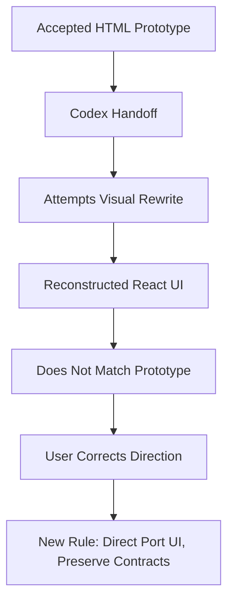

# Study Log: Prototype-to-React Handoff Failure Pattern in Hades OS

**Date:** June 13, 2026
**Topic / Focus:** Why Codex kept failing to port the accepted Hades OS HTML prototype into the real frontend

## Context

We built and accepted a standalone HTML prototype for the Hades OS post-login app. The prototype had the right UX direction: mobile-first phone shell, Minions / Forge / Socials / Settings tabs, fixed bottom nav, contained scroll panels, notification dropdown, minion detail pages, and destination previews.

The real problem started when trying to move that accepted HTML into the actual React frontend.

The repeated failure was not that the prototype was unclear. The failure was that Codex kept treating the prototype as something to **reinterpret** or **reconstruct**, instead of something to **port directly** while preserving only the real app’s data/API/auth contracts.



## Table of Contents

1. [What we had](#1-what-we-had)
2. [What we wanted Codex to do](#2-what-we-wanted-codex-to-do)
3. [What Codex kept doing instead](#3-what-codex-kept-doing-instead)
4. [Why the previous handoffs failed](#4-why-the-previous-handoffs-failed)
5. [The stronger working model](#5-the-stronger-working-model)
6. [Technical / audit log](#6-technical--audit-log)
7. [Current working note](#7-current-working-note)
8. [What to watch next](#8-what-to-watch-next)

---

## 1. What we had

We had an accepted standalone prototype:

```txt
hades_os_post_login_ux_v4.html
```

It solved these UX details:

```txt
- post-login only
- login screen excluded
- mobile-first phone shell
- Hades OS header
- Level 1 / XP status card
- bottom nav: Minions, Forge, Socials, Settings
- Minions screen
- Forge screen
- Socials screen
- Settings screen
- Hades chat
- Forge chat
- template chips
- notification dropdown
- Manual / Auto notification tabs
- notification dropdown internal scroll
- notification dropdown bounded inside phone frame
- Active / Inactive minion panels with internal scroll
- Forge Past Summons with internal scroll
- richer Past Summons cards
- minion detail page
- clear Status / Mode / Destination block
- Destination Preview section
- Discord-style preview
- Gmail-style preview
- automation preview
- command syntax
- plain explanation
- !hades follow-up examples
- timestamps
- theme switcher
```

The accepted prototype was not a rough wireframe anymore. It was the UI/UX target.

---

## 2. What we wanted Codex to do

The intended task was:

```txt
Use the accepted HTML prototype as the UI/UX ground truth.
Replace the old post-login UI.
Keep the existing login screen.
Keep the existing auth/API/data contracts.
Wire the real data into the new UI.
```

The clean split should have been:

```txt
HTML prototype = visual/UI/UX truth
Existing frontend contracts = data/API/auth truth
Old React UI = disposable
```

This meant Codex should have preserved:

```txt
- login screen
- auth flow
- API clients
- existing hooks/services
- backend contracts
- route contracts where needed
- database assumptions
- existing socials cards/order, because user explicitly wanted that retained
```

And Codex should have replaced:

```txt
- old post-login shell
- old Minions page
- old Forge page
- old Settings page
- old bottom nav
- old header/status layout
- old notification dropdown
- old minion detail presentation
- old post-login CSS visual language
```

---

## 3. What Codex kept doing instead

Codex repeatedly behaved as if the task was:

```txt
Improve or reconstruct the existing React UI using the prototype as inspiration.
```

That led to output that still looked like the old app.

The failure pattern looked like this:

```txt
1. Codex reads the prototype.
2. Codex reads the existing React UI.
3. Codex tries to “align” or “harden” the existing UI.
4. It preserves too much old shell/layout.
5. It rewrites CSS and components in a reconstructed way.
6. The result passes tests/build.
7. Visually, it still does not match the prototype.
```

This produced the worst middle ground:

```txt
old app shell + prototype vocabulary + reconstructed CSS + partial new sections
```

That is not what was wanted.

The user’s correction was direct:

```txt
No, it doesn’t look anything like the new UI/UX.
Scrap the old UI/UX except login and socials.
Remake it using the new HTML.
```

Later correction became even stricter:

```txt
Do not reconstruct from it.
Directly port it to the frontend React app.
Remove the old frontend UI.
Wire the data/API contracts underneath it.
```

---

## 4. Why the previous handoffs failed

The earlier handoffs had good intentions, but the wording still left too much room for Codex to choose the wrong implementation mode.

Earlier wording used phrases like:

```txt
- visual alignment
- patch existing app
- preserve existing structure
- use the prototype as visual reference
- rebuild authenticated shell around prototype-style layout
```

Those phrases can accidentally mean:

```txt
Keep old components and make them look more like the prototype.
```

But what we needed was:

```txt
Discard old post-login presentation.
Port the accepted prototype structure directly.
Keep only the real app’s contracts underneath.
```

The phrase **“visual reference”** was too weak.

Better phrase:

```txt
The HTML prototype is the UI source file to port from.
```

The phrase **“rebuild based on prototype”** was also too weak.

Better phrase:

```txt
Convert the accepted HTML DOM/CSS/interaction structure into React as literally as possible.
```

The phrase **“preserve existing UI structure where possible”** was actively harmful.

Better phrase:

```txt
Do not preserve old post-login UI structure unless it exactly matches the prototype.
```

---

## 5. The stronger working model

The current working model is:

```txt
Direct HTML-to-React UI port.
Not reconstruction.
Not inspiration.
Not visual alignment.
```

Priority order:

```txt
1. Existing API/auth/data contracts
2. Accepted HTML prototype UI/UX
3. Existing React UI implementation
```

Conflict rules:

```txt
If old React UI conflicts with the prototype, delete/replace old UI.

If prototype mock data conflicts with real API contracts, keep real API contracts.

If prototype needs display-only fields that the API does not provide, derive them in frontend adapters.

Do not change backend contracts to satisfy visual fields.
```

The post-login UI should be treated as disposable presentation code.

The login screen and socials exception should be explicit:

```txt
- Login screen stays unchanged.
- Auth flow stays unchanged.
- Socials existing cards/order stay first.
- New socials assignment controls can go below existing socials cards.
```

---

## 6. Technical / audit log

<details>
<summary>Audit log: HTML prototype creation and acceptance</summary>

The accepted HTML prototype was created as:

```txt
hades_os_post_login_ux_v4.html
```

It was rebuilt from the prior v3 HTML and user’s low-fi direction.

Main fixes included:

```txt
- notification dropdown constrained inside the phone shell
- notification dropdown internal scroll
- Manual / Auto notification tabs preserved
- location metadata visible inside notification logs
- clickable mock open-location buttons
- Active / Inactive minion tabs
- Active / Inactive panels given internal scroll
- Forge Past Summons redesigned
- Past Summons given its own internal scroll
- Past Summons cards made richer
- Minion Detail updated with Status / Mode / Destination
- Destination Preview added
- Discord Preview added
- Gmail Preview added
- Automation Preview added
- command syntax preserved
- plain explanation preserved
- !hades follow-up examples preserved
- bottom nav fixed
```

A bug appeared after the first v4 pass:

```txt
Internal panels existed, but child lists did not have constrained height.
Cards escaped the panel instead of scrolling inside it.
```

Fix:

```txt
- panel overflow clipped
- child scroll list height constrained
- Active / Inactive lists scroll inside panel
- Past Summons list scrolls inside panel
```

This produced the visually accepted standalone HTML.

</details>

<details>
<summary>Audit log: First Codex handoff approach</summary>

The first handoff told Codex:

```txt
Use the accepted HTML as the visual reference.
Patch the existing app.
Keep API contracts.
```

Problem:

```txt
Codex interpreted this as a patch/hardening pass.
```

It still preserved too much old UI.

The user later noticed the frontend running at:

```txt
http://127.0.0.1:5176/
```

But after login / authenticated shell, it still did not match the accepted prototype.

User correction:

```txt
No, it doesn’t look anything like the new UI/UX.
I want you to scrap the old UI/UX and everything about it except the login screen and socials.
Remake it using the new one I sent through HTML using the handoff.
```

</details>

<details>
<summary>Audit log: Second Codex handoff / replacement framing</summary>

A stronger handoff was given:

```txt
Implement accepted hades_os_post_login_ux_v4.html as real post-login React app.
Scrap old post-login UI/UX.
Keep login screen exactly as-is.
Keep auth flow exactly as-is.
Keep backend/API contracts exactly as-is.
Keep socials page existing social cards/order.
Replace Minions, Forge, Settings, app shell, bottom nav, notification dropdown, minion detail, post-login styling.
```

Guardrails included:

```txt
Do not edit:
- frontend/src/auth/loginTemplate.html
- frontend/src/auth/LoginPage.jsx
- frontend/src/auth/AuthProvider.jsx
- backend/**
```

Do not change:

```txt
- API endpoints
- Supabase auth behavior
- Hermes runtime contracts
- Discord bot contracts
- database schema
- login UI
```

Target structure was specified:

```txt
.viewport
  .phone
    .forge-glow
    .app
      .header
        .top
        .status
      .content
        .screen active
      .bottom
        .nav
```

Primary nav required:

```txt
- Minions
- Forge
- Socials
- Settings
```

Also specified:

```txt
/app/home should redirect to /app/minions.
```

Despite this, the implementation still produced a reconstructed shell rather than a faithful port.

</details>

<details>
<summary>Audit log: Codex implementation attempt</summary>

Codex reported:

```txt
Implemented.
```

Reported changes:

```txt
- Rebuilt authenticated shell around new prototype-style layout in HadesApp.jsx
- Overrode post-login styling in hades.css
- Kept socials page ordered as requested
- Updated layout tests
- Refreshed nav config
```

Reported verification:

```txt
npm --prefix frontend test passed
npm --prefix frontend run build passed
Checked live app at:
http://127.0.0.1:5176/app/minions
http://127.0.0.1:5176/app/socials
```

But user inspection found:

```txt
It still does not look like the prototype.
```

Important lesson:

```txt
Passing tests/build did not validate visual fidelity.
```

The implementation was still a reconstruction.

</details>

<details>
<summary>Audit log: Third correction — direct port requirement</summary>

User correction:

```txt
Nope, it’s not working.
It looks nothing like my prototype.

Instead of trying to reconstruct from it,
can you just directly port it to frontend React app,
without reconstructing,
and just removing the old frontend altogether
and just wiring the data and API contracts?
```

Codex then started a better direction:

```txt
Stop trying to approximate.
Port the prototype more literally into React.
Strip old shell back.
Keep data/API wiring as contract boundary.
Inspect prototype HTML and current frontend entry points.
Map markup directly instead of recreating layout from scratch.
```

Codex inspected:

```txt
- React app entry
- working tree
- prototype HTML
- current shell code
- prototype stylesheet
- prototype sections for four post-login screens
```

But the run was stopped before completion.

Current pending instruction:

```txt
Directly port the accepted HTML into React.
Do not reconstruct.
Remove old post-login UI.
Wire existing data/API contracts underneath.
```

</details>

<details>
<summary>Technical note: what direct port means</summary>

Direct port means:

```txt
Take the accepted HTML structure and CSS vocabulary and convert it into React components as literally as possible.
```

It does not mean:

```txt
Use old HadesApp layout and make it “similar.”
```

Direct port allows:

```txt
- JSX conversion of prototype DOM
- CSS token transfer from prototype
- React state replacing prototype script behavior
- existing API data mapped into prototype-shaped view models
```

Direct port does not allow:

```txt
- generic dashboard layout
- old card structure
- old shell hierarchy
- old nav hierarchy
- reconstructed approximations
- mock-only disconnected screen
- backend/data rewrite
```

Recommended implementation pattern:

```txt
1. Start from prototype HTML DOM.
2. Convert shell to React JSX.
3. Move prototype CSS into post-login stylesheet.
4. Replace prototype mock data with view models.
5. Wire existing hooks/API data into those view models.
6. Preserve login/auth/backend.
7. Keep socials old cards first as special exception.
```

</details>

---

## 7. Current working note

The failure pattern is now clearer:

```txt
Codex is more reliable when asked to port concrete structure than when asked to visually align an existing UI.
```

For Hades OS, “visual alignment” is too vague.

“Rebuild from prototype” is also too vague, because Codex may still reconstruct.

The new phrase should be:

```txt
Directly port the accepted HTML prototype into React.
Use the prototype DOM/CSS/interaction model as the implementation source.
Replace the old post-login UI.
Wire existing contracts underneath.
```

This is the important working distinction:

```txt
Bad:
Prototype-inspired React rewrite.

Better:
Prototype-faithful React port.

Required:
Old post-login UI removed, prototype UI ported, existing data/API/auth preserved.
```

---

## 8. What to watch next

The next Codex attempt should be judged visually, not only by tests.

Watch for:

```txt
- does the app shell match the prototype?
- does it still look like the old dashboard?
- are prototype class structures recognizable?
- did the phone shell survive?
- did the compact header/status card survive?
- did the bottom nav look like the prototype?
- did Minions screen match the accepted layout?
- did Forge match the accepted layout?
- did Settings match the accepted layout?
- did Socials preserve old cards first?
- are scroll panels actually bounded?
- does notification dropdown stay inside bounds?
- does Minion Detail use the exact accepted section order?
- do Destination Previews look like the prototype?
```

Current assumption:

```txt
For accepted HTML prototypes, Codex handoffs should use “direct port” language, not “visual alignment” language.
```

Current risk:

```txt
Codex may still claim it is porting while actually reconstructing.
```

Mitigation:

```txt
Require it to preserve prototype DOM/class structure as much as practical,
then replace mock data with real hooks through adapters.
```

Working implementation instruction:

```txt
Do not start from the old HadesApp JSX.
Start from the accepted prototype structure.
Convert that structure into React.
Then wire the existing data/API contracts into it.
```
