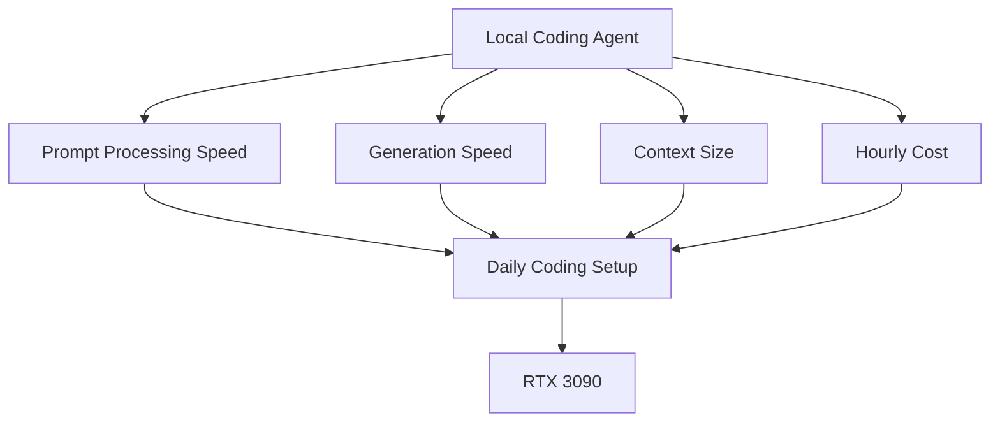

# Study Log: Why I Chose RTX 3090 on Vast.ai for Local Coding Agents

**Date:** 2026-06-07  
**Project:** Local Qwen Coding Agent on Vast.ai  
**Model:** Qwen3.6 27B MTP GGUF  
**Runtime:** llama.cpp + Caddy + OpenCode  
**Decision:** Use RTX 3090 as the default daily coding GPU

---

## Introduction

I tested different Vast.ai GPU options for running a local coding model.

The main comparison was:

```text
RTX 3090 24GB
vs
Q RTX 8000 45–48GB
vs
RTX 4090 24GB
vs
RTX 5090 32GB
```

The comparison was based on:

```text
VRAM
prompt processing speed
generation speed
hourly cost
practical responsiveness
```

The RTX 8000 handled larger context. The RTX 3090 had less VRAM, but had faster prompt processing in my setup and lower daily cost.



---

## Table of Contents

1. What I Was Optimizing For
2. Why Prompt Processing Matters
3. Actual Prompt Processing Speed in My Setup
4. Prompt Processing vs Generation Speed
5. GPU Comparison Table
6. RTX 8000 Test Result
7. RTX 3090 Result
8. RTX 4090 Consideration
9. RTX 5090 Consideration
10. RTX 8000 Consideration
11. Model Choice: 27B Dense vs 35B MoE
12. Final Setup
13. Practical Rule Going Forward

---

## 1. What I Was Optimizing For

I was optimizing for:

```text
- fast OpenCode coding loop
- enough context for phase-based repo work
- low hourly cost
- reliable coding behavior
- good prompt processing speed
- usable generation speed
- manageable setup
```

For coding agents, the model repeatedly reads:

```text
- repo files
- AGENTS.md
- phase plans
- module contracts
- diffs
- test output
- previous tool results
- instructions
```

So the setup needed enough context, but also fast prompt ingestion.

---

## 2. Why Prompt Processing Matters

There are two different speed numbers in local LLM inference:

| Metric | Meaning | Why it matters |
|---|---|---|
| **Prompt processing / PP** | How fast the model reads input tokens | Repo files, diffs, logs, test output, instructions |
| **Generation / TG** | How fast the model writes output tokens | Code, commands, patches, explanations |
| **Total loop time** | PP + tool calls + generation + tests | Actual coding loop speed |

For coding-agent use, prompt processing is important because the loop often looks like:

```text
read context
edit file
read terminal output
read diff
read test failure
edit again
read more context
generate final answer
```

---

## 3. Actual Prompt Processing Speed in My Setup

Public llama.cpp benchmarks are useful for direction, but my working numbers were lower in the actual long-context coding-agent setup.

My setup:

```text
Qwen3.6 27B MTP GGUF
UD-Q4_K_XL
long coding-agent prompts
llama.cpp
Vast.ai
OpenCode
```

Observed / estimated prompt-processing speed:

| GPU | Practical Prompt Processing Speed | Confidence |
|---|---:|---|
| **Q RTX 8000** | ~500 t/s | Measured |
| **RTX 3090** | ~1300 t/s | Measured |
| **RTX 4090** | likely ~1700–2000 t/s | Estimated |
| **RTX 5090** | likely ~2600 t/s | Estimated |

Measured comparison:

```text
Q RTX 8000: ~500 t/s prompt processing
RTX 3090:   ~1300 t/s prompt processing
```

Ratio:

```text
1300 / 500 = 2.6x
```

Conservative estimates for untested cards:

```text
RTX 4090:
probably 30–50% faster than RTX 3090 in this setup

RTX 5090:
probably around 2x RTX 3090 prompt-processing speed in this setup
```

Rough expected prompt-processing range:

```text
RTX 8000: ~500 t/s
RTX 3090: ~1300 t/s
RTX 4090: ~1700–2000 t/s
RTX 5090: ~2600 t/s
```

---

## 4. Prompt Processing vs Generation Speed

The setup needs both prompt processing speed and generation speed.

```text
Prompt processing speed:
How fast the agent reads repo files, logs, diffs, and instructions.

Generation speed:
How fast the agent writes code, commands, summaries, and explanations.
```

| Speed Type | What It Affects | Example |
|---|---|---|
| **Prompt processing speed** | Reading input context | Loading repo files, reading test output, consuming long instructions |
| **Generation speed** | Writing output | Producing code patches, explanations, commands |
| **End-to-end loop speed** | Practical coding flow | Read → edit → test → read → edit again |

The RTX 8000 test showed that large context can fit, but prompt processing speed still affects the coding loop.

---

## 5. GPU Comparison Table

| GPU | VRAM | Practical Prompt Speed | Price Seen | Best For | Decision |
|---|---:|---:|---:|---|---|
| **RTX 3090** | 24GB | ~1300 t/s measured | ~$0.23–$0.25/hr on-demand, ~$0.12–$0.16/hr interruptible | Daily coding, 40k context loops | **Chosen** |
| **Q RTX 8000** | 45–48GB | ~500 t/s measured | ~$0.26/hr seen | Huge context, 100k+ experiments | Not default |
| **RTX 4090** | 24GB | likely ~1700–2000 t/s estimated | ~$0.25 interruptible in one listing, often ~$0.42+ on-demand | Faster tests, speed experiments | Optional |
| **RTX 5090** | 32GB | likely ~2600 t/s estimated | ~$0.37 interruptible, often higher | Higher speed + more VRAM | Future upgrade |

---

## 6. RTX 8000 Test Result

The RTX 8000 successfully handled huge context.

Measured result from my test:

```text
Prompt tokens: 117,826
Truncated: 0
Prompt processing: ~366.66 tokens/sec
Generation speed: ~37.64 tokens/sec
```

In later practical coding-agent use, prompt-processing speed was closer to:

```text
~500 t/s prompt processing
```

The RTX 8000 was useful for:

```text
- 75k–120k context tests
- big repo scans
- huge planning sessions
- fewer compaction cycles
```

---

## 7. RTX 3090 Result

The RTX 3090 had less VRAM than the RTX 8000, but faster prompt processing in my setup.

Observed practical speed:

```text
~1300 t/s prompt processing
```

It had enough memory for:

```text
Qwen3.6 27B MTP GGUF
UD-Q4_K_XL
40k context
OpenCode
```

The project already uses context structure:

```text
AGENTS.md
project-overview.md
phase files
module contracts
failing tests
work logs
```

The working pattern:

```text
40k context
structured project files
faster prompt processing
lower hourly cost
```

---

## 8. RTX 4090 Consideration

The RTX 4090 is likely faster than the RTX 3090 in this setup.

Conservative estimate:

```text
RTX 4090:
around 30–50% faster prompt processing than RTX 3090
```

Estimated prompt-processing range:

```text
~1700–2000 t/s
```

The RTX 4090 still has:

```text
24GB VRAM
```

Best use cases:

```text
- benchmarking
- short speed tests
- faster coding sessions
- daily use if interruptible pricing is close to RTX 3090 pricing
```

Pricing condition:

```text
Use RTX 4090 if the price gap is small.
Use RTX 3090 if the price gap is large.
```

---

## 9. RTX 5090 Consideration

The RTX 5090 has:

```text
32GB VRAM
higher memory bandwidth
higher prompt-processing speed
higher generation speed
```

Conservative estimate:

```text
RTX 5090:
around 2x RTX 3090 prompt-processing speed in this setup
```

Estimated prompt-processing speed:

```text
~2600 t/s
```

Best use cases:

```text
- maximum local model speed
- larger context than RTX 3090
- fewer VRAM compromises
- short high-speed work bursts
- testing larger models or higher KV precision
```

---

## 10. RTX 8000 Consideration

The RTX 8000 has 45–48GB VRAM, which gives more context headroom than the RTX 3090 and RTX 4090.

Useful for:

```text
- 75k–120k context tests
- big repo scans
- huge planning sessions
- fewer compaction cycles
- long-context behavior tests
```

Measured practical prompt-processing comparison:

```text
Q RTX 8000: ~500 t/s prompt processing
RTX 3090:   ~1300 t/s prompt processing
```

Ratio:

```text
RTX 3090 was about 2.6x faster at prompt processing
```

Usage split:

```text
Use RTX 8000 for huge context.
Use RTX 3090 for daily coding.
```

---

## 11. Model Choice: 27B Dense vs 35B MoE

The GPU decision connects to the model decision.

Working rule:

```text
If 27B dense runs fast enough, use 27B dense.
If 27B dense is too slow or too tight, consider 35B MoE.
```

| Model | Strength | Weakness | Best Use |
|---|---|---|---|
| **Qwen3.6 27B Dense** | More reliable for hard coding | Slower than MoE | Contracts, tests, debugging |
| **Qwen3.6 35B-A3B MoE** | Faster active-parameter path | Can be sloppier for coding | Planning, summaries, lighter agent loops |

For this project, the default model setup:

```text
Qwen3.6 27B MTP UD-Q4_K_XL
40k context
RTX 3090
OpenCode
```

Optional use for 35B MoE:

```text
planning
summaries
repo explanation
large-context reading
low-stakes agent loops
```

---

## 12. Final Setup

```text
GPU:
RTX 3090

Model:
Qwen3.6 27B MTP GGUF

Quant:
UD-Q4_K_XL

Context:
40,960 tokens

Runtime:
llama.cpp

Coding Tool:
OpenCode

Access:
Caddy API key proxy + Cloudflare tunnel
```

Selection criteria:

```text
- measured ~1300 t/s prompt processing in my setup
- enough context for phase-based coding
- cheaper than RTX 4090 / RTX 5090
- faster prompt processing than RTX 8000
- compatible with context engineering workflow
```

---

## 13. Practical Rule Going Forward

| Situation | Use |
|---|---|
| Daily coding | **RTX 3090 + 27B dense** |
| Huge context experiment | **RTX 8000** |
| Short speed benchmark | **RTX 4090** |
| Max speed / 32GB VRAM | **RTX 5090** |
| Implementation / tests | **27B dense** |
| Planning / summaries | **35B MoE optional** |
