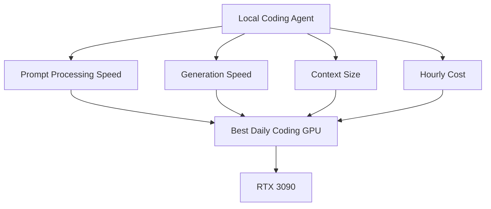

# Study Log: Why I Chose RTX 3090 on Vast.ai for Local Coding Agents

**Date:** 2026-06-07  
**Project:** Local Qwen Coding Agent on Vast.ai  
**Model:** Qwen3.6 27B MTP GGUF  
**Runtime:** llama.cpp + Caddy + OpenCode  
**Decision:** Use RTX 3090 as the default daily coding GPU

---

## Introduction

I tested different Vast.ai GPU options for running a local coding model. The main comparison was:

```text
RTX 3090 24GB
vs
Q RTX 8000 45–48GB
vs
RTX 4090 24GB
vs
RTX 5090 32GB
```

The surprising result was that **more VRAM was not automatically better**.

The RTX 8000 could handle much larger context, but it felt slow for daily coding. The RTX 3090 had less VRAM, but the coding loop felt much faster because prompt processing speed was better.



---

## Table of Contents

1. What I Was Optimizing For
2. GPU Comparison Table
3. Prompt Processing vs Generation Speed
4. RTX 8000 Test Result
5. Why RTX 3090 Felt Better
6. Why Not RTX 4090?
7. Why Not RTX 5090?
8. Why Not RTX 8000?
9. Model Choice: 27B Dense vs 35B MoE
10. Final Decision
11. Practical Rule Going Forward

---

## 1. What I Was Optimizing For

I was not optimizing for the biggest possible context window.

I was optimizing for:

```text
- fast OpenCode coding loop
- enough context for phase-based repo work
- low hourly cost
- reliable coding behavior
- good prompt processing speed
- manageable setup
```

For coding agents, the model spends a lot of time reading:

```text
- repo files
- AGENTS.md
- phase plans
- module contracts
- diffs
- test output
- previous tool results
```

That means **prompt processing speed** matters a lot.

A GPU that can ingest context faster may feel better than a GPU with more VRAM but slower processing.

---

## 2. GPU Comparison Table

| GPU | VRAM | Bandwidth / Speed Notes | Price Seen | Best For | Decision |
|---|---:|---:|---:|---|---|
| **RTX 3090** | 24GB | ~805–827 GB/s on good listings | ~$0.23–$0.25/hr on-demand, ~$0.12–$0.16/hr interruptible | Daily coding, fast 40k context loops | **Chosen** |
| **Q RTX 8000** | 45–48GB | ~430–529 GB/s, older Turing | ~$0.26/hr seen | Huge context, 100k+ experiments | Not default |
| **RTX 4090** | 24GB | ~879 GB/s, faster architecture | ~$0.25 interruptible in one listing, often ~$0.42+ on-demand | Faster tests, speed experiments | Optional |
| **RTX 5090** | 32GB | ~1450 GB/s+ in listings | ~$0.37 interruptible, often higher | Max speed + more context | Too expensive for default |

The Vast listings showed multiple RTX 3090 options around 24GB VRAM, roughly 805–827 GB/s memory bandwidth, and on-demand prices around $0.23–$0.25/hr. The same listings showed a 4090 option around $0.421/hr on-demand and 24GB VRAM, making it faster but usually less attractive for daily value. :contentReference[oaicite:0]{index=0}

Interruptible pricing changed the equation further: some RTX 3090 interruptible listings were around $0.121–$0.165/hr, while a 4090 interruptible listing appeared around $0.256/hr and a 5090 around $0.370/hr. :contentReference[oaicite:1]{index=1}

---

## 3. Prompt Processing vs Generation Speed

There are two different speeds:

| Metric | Meaning | Why it matters |
|---|---|---|
| **Prompt processing / PP** | How fast the model reads input context | Critical for coding agents |
| **Generation / TG** | How fast the model writes output tokens | Important, but often less dominant |
| **Total loop time** | PP + tool calls + generation + tests | What actually matters |

For coding agents, prompt processing can matter more than generation because the agent repeatedly consumes:

```text
repo context
file contents
terminal output
test failures
diffs
instructions
```

So even if generation speed is decent, a slow prompt processor can make the agent feel sluggish.

---

## 4. RTX 8000 Test Result

The RTX 8000 successfully handled huge context.

Measured result:

```text
Prompt tokens: 117,826
Truncated: 0
Prompt processing: ~366.66 tokens/sec
Generation speed: ~37.64 tokens/sec
```

This proved that the RTX 8000 could run large context. It was useful for testing around 100k+ context.

But for actual coding, it felt slow.

The important lesson:

```text
RTX 8000 gave bigger context.
RTX 3090 gave a better daily coding feel.
```

---

## 5. Why RTX 3090 Felt Better

The RTX 3090 felt better because it had much faster prompt processing in practice.

Even though it only has 24GB VRAM, it had enough memory for:

```text
Qwen3.6 27B MTP GGUF
UD-Q4_K_XL
40k context
OpenCode
```

That was enough because the project already uses context engineering:

```text
AGENTS.md
project-overview.md
phase files
module contracts
failing tests
work logs
```

So I do not need to keep the entire repo and the entire conversation in context all the time.

The workflow is:

```text
smaller context
+ better context structure
+ faster prompt processing
= better coding loop
```

This is why 40k fast context can beat 100k slow context.

---

## 6. Why Not RTX 4090?

The RTX 4090 is faster than the RTX 3090, but it usually costs more.

It still has:

```text
24GB VRAM
```

So for this model, the 4090 does not solve the main memory limit. It mostly improves speed.

That makes it good for:

```text
- benchmarking
- short speed tests
- expensive but fast sessions
```

But for daily coding, the RTX 3090 gives better value.

The exception is if a 4090 interruptible instance is very cheap. One listing showed a 4090 interruptible around $0.256/hr, which is interesting, but still not clearly better than a cheap 3090 unless the task finishes much faster. :contentReference[oaicite:2]{index=2}

---

## 7. Why Not RTX 5090?

The RTX 5090 is the most exciting option technically.

It gives:

```text
32GB VRAM
higher memory bandwidth
much higher compute
better future ceiling
```

But the pricing was higher.

The 5090 makes sense if the goal is:

```text
- maximum local model speed
- larger context than 3090
- fewer compromises
- short high-speed work bursts
```

But for my current goal, I wanted a **daily coding backend**, not the fastest possible benchmark.

So the 5090 is a future upgrade, not the default.

---

## 8. Why Not RTX 8000?

The RTX 8000 has the best context headroom among the cheaper options because of its 45–48GB VRAM.

It is useful for:

```text
- 75k–120k context tests
- big repo scans
- huge planning sessions
- fewer compaction cycles
```

But it is older and slower.

In my test, it processed a huge prompt successfully, but actual coding felt slower.

The decision became:

```text
Use RTX 8000 when I need huge context.
Use RTX 3090 when I need fast daily coding.
```

---

## 9. Model Choice: 27B Dense vs 35B MoE

The GPU decision connects to the model decision.

The Reddit thread on Qwen3.6 27B vs 35B-A3B had a useful rule:

```text
If you can run 27B fast, run 27B.
Otherwise run 35B.
```

That matched my own testing. The thread also showed that people were split between 27B and 35B depending on hardware, context, KV cache, and use case. The poll had 772 votes, with the largest option being Qwen3.6 27B Q6K with Q8_0 KV cache, while some users still preferred 35B-A3B when speed/context pressure mattered. :contentReference[oaicite:3]{index=3}

The practical distinction:

| Model | Strength | Weakness | Best Use |
|---|---|---|---|
| **Qwen3.6 27B Dense** | More reliable for hard coding | Slower than MoE | Contracts, tests, debugging |
| **Qwen3.6 35B-A3B MoE** | Faster, only ~3B active per token | Can be sloppier for coding | Planning, summaries, agent loops |

The Reddit discussion also had several warnings about KV cache quantization and long agentic workflows. Some users preferred keeping better KV precision, while others found 35B more attractive when long context made 27B difficult to run. :contentReference[oaicite:4]{index=4}

For this project, the default is:

```text
Qwen3.6 27B MTP UD-Q4_K_XL
40k context
RTX 3090
OpenCode
```

Reason:

```text
coding correctness > raw generation speed
```

---

## 10. Final Decision

The chosen daily setup:

```text
GPU:
RTX 3090

Model:
Qwen3.6 27B MTP GGUF

Quant:
UD-Q4_K_XL

Context:
40,960 tokens

Runtime:
llama.cpp

Coding Tool:
OpenCode

Access:
Caddy API key proxy + Cloudflare tunnel
```

Why:

```text
- fast enough prompt processing
- enough context for phase-based coding
- cheaper than 4090/5090
- more responsive than RTX 8000
- reliable enough for coding
- compatible with context engineering workflow
```

---

## 11. Practical Rule Going Forward

Use this decision rule:

| Situation | Use |
|---|---|
| Daily coding | **RTX 3090 + 27B** |
| Huge context experiment | **RTX 8000** |
| Short speed benchmark | **RTX 4090** |
| Max speed / 32GB VRAM | **RTX 5090** |
| Implementation / tests | **27B dense** |
| Planning / summaries | **35B MoE optional** |

The final lesson:

```text
For coding agents, bigger context is not always better.
Fast prompt processing + disciplined context engineering is usually better.
```

The RTX 3090 won because it gave the best balance:

```text
cost
speed
good-enough context
stable coding workflow
```

For this project, that balance matters more than chasing the biggest context window.
