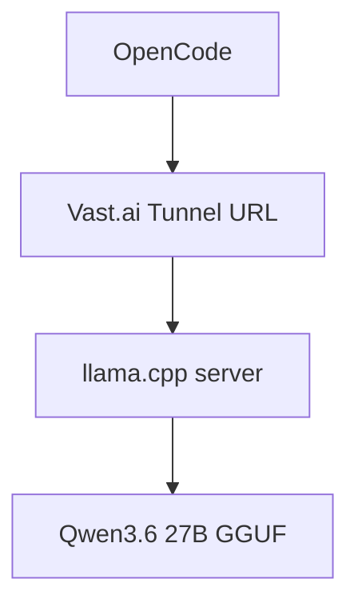
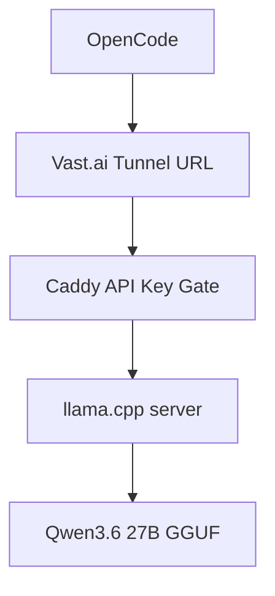
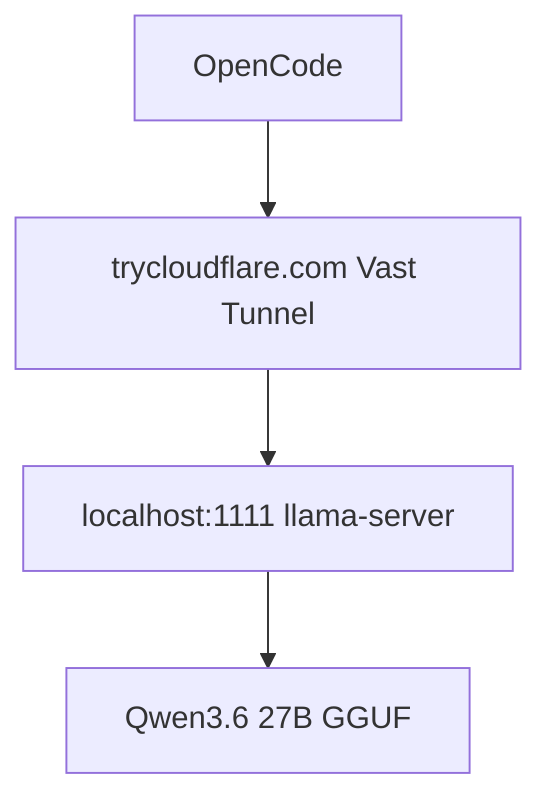

# Study Log: Creating a Local LLM API on Vast.ai With Built-In Tunnels

**Date:** 2026-06-07  
**Project:** Local LLM Coding Server on Vast.ai  
**Stack:** llama.cpp, Qwen3.6 27B, Vast.ai Tunnels, OpenCode  
**Goal:** Run a local OpenAI-compatible LLM server, expose it through a Vast.ai tunnel, and connect it to OpenCode.

---

## Introduction

I originally thought I needed to manually expose my local LLM server with Caddy, Cloudflare Tunnel, or SSH port forwarding.

Then I noticed Vast.ai already has a **Tunnels / Open New Ports** page inside the instance portal.

That means the API creation flow is much simpler:



The model server still runs locally inside the Vast instance.  
The Vast tunnel gives that local server a public URL.

So instead of manually configuring Cloudflare Tunnel, the flow becomes:

```text
localhost model server
→ Vast.ai tunnel
→ public trycloudflare.com URL
→ OpenCode / app / coding agent
```

---

## Table of Contents

1. Goal
2. Install and Run Qwen 27B
3. Start the OpenAI-Compatible API Server
4. Create a Vast.ai Tunnel
5. Find the API Base URL
6. Test the API
7. Configure OpenCode
8. Optional API Key Protection
9. Final Working Layout
10. Notes

---

## 1. Goal

The goal was to create a usable local model API from a rented Vast.ai GPU.

The API needed to work with tools that expect an OpenAI-compatible endpoint, like:

```text
/v1/chat/completions
/v1/models
```

The simple target layout became:

```text
OpenCode → Vast.ai Tunnel URL → llama.cpp server → Qwen model
```

---

## 2. Install and Run Qwen 27B

First, install the basic tools:

```bash
cd /workspace

export HF_HOME=/workspace/.hf_home
export LLAMA_CACHE=/workspace/.hf_home

apt update
apt install -y git cmake build-essential curl python3-pip
```

Clone and build `llama.cpp`:

```bash
cd /workspace

git clone https://github.com/ggml-org/llama.cpp.git
cd llama.cpp

cmake -B build \
  -DBUILD_SHARED_LIBS=OFF \
  -DGGML_CUDA=ON

cmake --build build --config Release -j --target llama-server llama-cli
```

---

## 3. Start the OpenAI-Compatible API Server

Start the model server:

```bash
cd /workspace/llama.cpp

export HF_HOME=/workspace/.hf_home
export LLAMA_CACHE=/workspace/.hf_home

./build/bin/llama-server \
  -hf unsloth/Qwen3.6-27B-MTP-GGUF:UD-Q4_K_XL \
  -ngl 99 \
  -c 40960 \
  -fa on \
  -np 1 \
  --spec-type draft-mtp \
  --spec-draft-n-max 2 \
  --host 0.0.0.0 \
  --port 1111 \
  --jinja
```

Important detail:

```text
Use --host 0.0.0.0 if the Vast.ai tunnel needs to reach the server port.
```

The server is now running on:

```text
http://localhost:1111
```

Test locally:

```bash
curl http://localhost:1111/health
```

Expected:

```json
{"status":"ok"}
```

---

## 4. Create a Vast.ai Tunnel

Open the Vast.ai instance portal.

Go to:

```text
Tunnels / Open New Ports
```

In the target URL field, enter the local server URL:

```text
http://localhost:1111
```

Click:

```text
Create New Tunnel
```

Vast.ai will create a public tunnel URL that looks like:

```text
https://example-words-here.trycloudflare.com
```

Example from the portal:

```text
Target URL:
http://localhost:1111

Tunnel URL:
https://en-gay-wins-told.trycloudflare.com
```

That tunnel URL now points to the local model server.

---

## 5. Find the API Base URL

The tunnel URL is the public API host.

If the tunnel is:

```text
https://en-gay-wins-told.trycloudflare.com
```

Then the OpenAI-compatible base URL is:

```text
https://en-gay-wins-told.trycloudflare.com/v1
```

The chat completions endpoint is:

```text
https://en-gay-wins-told.trycloudflare.com/v1/chat/completions
```

The models endpoint is:

```text
https://en-gay-wins-told.trycloudflare.com/v1/models
```

---

## 6. Test the API

Test health through the tunnel:

```bash
curl https://en-gay-wins-told.trycloudflare.com/health
```

Expected:

```json
{"status":"ok"}
```

Test models:

```bash
curl https://en-gay-wins-told.trycloudflare.com/v1/models
```

Test chat completion:

```bash
curl https://en-gay-wins-told.trycloudflare.com/v1/chat/completions \
  -H "Content-Type: application/json" \
  -d '{
    "model": "qwen",
    "messages": [
      {
        "role": "user",
        "content": "Say ready."
      }
    ],
    "max_tokens": 20,
    "temperature": 0
  }'
```

If the server responds, the API is working.

---

## 7. Configure OpenCode

In OpenCode, use an OpenAI-compatible provider.

Use:

```text
Provider:
OpenAI-compatible
```

Base URL:

```text
https://en-gay-wins-told.trycloudflare.com/v1
```

Model:

```text
qwen
```

API key:

```text
anything
```

Important detail:

```text
llama-server may not enforce the API key by default.
```

So OpenCode can require an API key field, but the backend may accept any value unless another auth layer is added.

Example OpenCode config:

```text
Provider: OpenAI-compatible
Base URL: https://en-gay-wins-told.trycloudflare.com/v1
Model: qwen
API Key: local
```

---

## 8. Optional API Key Protection

The Vast.ai tunnel makes exposing the API easy, but it does not automatically make the API private.

If the tunnel URL is shared, anyone with the URL may be able to send requests to the model server.

For private solo testing, this may be acceptable for a short session.

For anything shared with friends or used longer term, add an auth layer.

The safer layout would be:



In that version:

```text
Vast tunnel target:
http://localhost:18001

Caddy listens on:
localhost:18001

llama-server listens on:
localhost:18000
```

Then Caddy checks:

```text
Authorization: Bearer <your-api-key>
```

Before forwarding the request to llama.cpp.

For the simplest tunnel-only setup, this Caddy layer can be skipped.

For a protected API, keep Caddy.

---

## 9. Final Working Layout

Simple version:



Runtime:

```text
llama.cpp server:
http://localhost:1111

Vast.ai tunnel target:
http://localhost:1111

Public API base URL:
https://your-tunnel-url.trycloudflare.com/v1
```

OpenCode points to:

```text
https://your-tunnel-url.trycloudflare.com/v1
```

Not directly to the Vast IP.

---

## 10. Notes

The main discovery was that Vast.ai already provides a built-in tunnel system.

That means I do not need to manually set up Cloudflare Tunnel just to expose the local model API.

The fastest working setup is:

```text
llama-server
→ localhost port
→ Vast.ai tunnel
→ OpenAI-compatible API URL
→ OpenCode
```

The protected setup is:

```text
llama-server
→ Caddy API key gate
→ Vast.ai tunnel
→ OpenCode
```

For a disposable coding server, the built-in Vast tunnel is the simplest way to create an API.

For anything shared or long-running, Caddy still makes sense as the API key protection layer.
