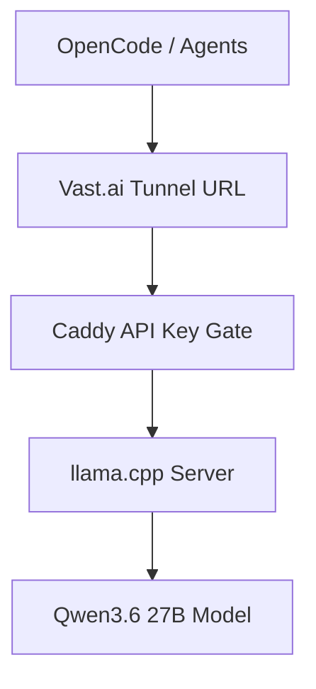
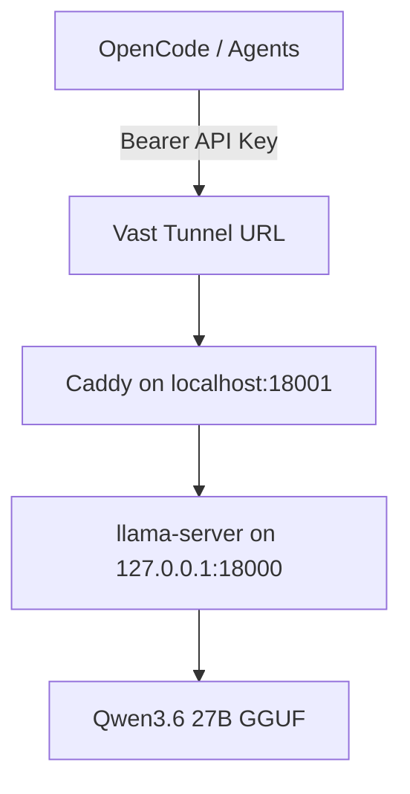

# Study Log: Creating a Protected Local LLM API on Vast.ai With Built-In Tunnels

**Date:** 2026-06-07  
**Project:** Local LLM Coding Server on Vast.ai  
**Stack:** Vast.ai, llama.cpp, Qwen3.6 27B, Caddy, Vast.ai Tunnels, OpenCode  
**Goal:** Run a local OpenAI-compatible LLM API, protect it with an API key, expose it through a Vast.ai tunnel, and track token usage / prompt-processing speed.

---

## Introduction

I wanted to run a local coding model on a rented Vast.ai GPU and use it through OpenCode and future agents.

At first, I thought I needed to manually set up Cloudflare Tunnel, SSH port forwarding, a Vercel admin panel, or a separate API frontend.

Then I noticed Vast.ai already has a **Tunnels / Open New Ports** page inside the instance portal.

That changed the setup.

The final setup is:

```text
OpenCode / agents
→ Vast.ai tunnel URL
→ Caddy API key check
→ llama-server
→ Qwen3.6 27B
```

The important rule:

```text
Do not expose llama-server directly.

Expose Caddy through the Vast tunnel.
Caddy checks the API key.
Caddy forwards valid requests to llama-server.
```



---

## Quick Navigation Tree

```text
Protected Local LLM API Setup
├── 1. Overview
│   ├── 1.1 What this setup does
│   ├── 1.2 Final architecture
│   └── 1.3 Port map
│
├── 2. Install and Build
│   ├── 2.1 Install basic tools
│   ├── 2.2 Clone llama.cpp
│   └── 2.3 Build llama-server
│
├── 3. Start the Model Server
│   ├── 3.1 Start llama-server with MTP and logs
│   ├── 3.2 Check if llama-server is running
│   ├── 3.3 Test llama-server locally
│   ├── 3.4 Confirm MTP, slots, and multimodal loading
│   └── 3.5 Stop llama-server
│
├── 4. Logging and Speed Checks
│   ├── 4.1 Watch full server logs
│   ├── 4.2 Check automatic prompt-processing speed
│   ├── 4.3 Check generation speed
│   └── 4.4 Understand log vs API usage
│
├── 5. API Key Protection With Caddy
│   ├── 5.1 Create API key
│   ├── 5.2 Install Caddy
│   ├── 5.3 Create /etc/caddy folder
│   ├── 5.4 Create Caddyfile
│   ├── 5.5 Start Caddy
│   └── 5.6 Test Caddy locally
│
├── 6. Vast.ai Tunnel
│   ├── 6.1 Create tunnel to Caddy
│   ├── 6.2 Find public API base URL
│   └── 6.3 Avoid tunneling directly to llama-server
│
├── 7. Test the Protected Public API
│   ├── 7.1 Test public health endpoint
│   ├── 7.2 Test public chat endpoint
│   ├── 7.3 Confirm usage object
│   └── 7.4 Confirm timing object
│
├── 8. Token Usage Tracking
│   ├── 8.1 Check usage with curl
│   ├── 8.2 Save full response
│   ├── 8.3 Read prompt/completion/total tokens
│   └── 8.4 Note about automatic calculations
│
├── 9. OpenCode Setup
│   ├── 9.1 Base URL
│   ├── 9.2 Model name
│   └── 9.3 API key
│
├── 10. API Key Rotation
│   ├── 10.1 Rotate key over SSH
│   ├── 10.2 Restart Caddy
│   └── 10.3 Test new key
│
├── 11. Solo vs Parallel Modes
│   ├── 11.1 Current parallel mode
│   ├── 11.2 Solo mode
│   └── 11.3 Context tradeoff
│
├── 12. Troubleshooting
│   ├── 12.1 Server exits immediately
│   ├── 12.2 Port 18000 already in use
│   ├── 12.3 Caddyfile folder missing
│   ├── 12.4 Caddy does not start
│   └── 12.5 Response stops early
│
└── 13. Final Layout
    ├── 13.1 File layout
    ├── 13.2 Runtime layout
    └── 13.3 Notes
```

---

## Table of Contents

- [1. Overview](#1-overview)
  - [1.1 What This Setup Does](#11-what-this-setup-does)
  - [1.2 Final Architecture](#12-final-architecture)
  - [1.3 Port Map](#13-port-map)
- [2. Install and Build](#2-install-and-build)
  - [2.1 Install Basic Tools](#21-install-basic-tools)
  - [2.2 Clone llama.cpp](#22-clone-llamacpp)
  - [2.3 Build llama-server](#23-build-llama-server)
- [3. Start the Model Server](#3-start-the-model-server)
  - [3.1 Start llama-server With MTP and Logs](#31-start-llama-server-with-mtp-and-logs)
  - [3.2 Check if llama-server Is Running](#32-check-if-llama-server-is-running)
  - [3.3 Test llama-server Locally](#33-test-llama-server-locally)
  - [3.4 Confirm MTP, Slots, and Multimodal Loading](#34-confirm-mtp-slots-and-multimodal-loading)
  - [3.5 Stop llama-server](#35-stop-llama-server)
- [4. Logging and Speed Checks](#4-logging-and-speed-checks)
  - [4.1 Watch Full Server Logs](#41-watch-full-server-logs)
  - [4.2 Check Automatic Prompt-Processing Speed](#42-check-automatic-prompt-processing-speed)
  - [4.3 Check Generation Speed](#43-check-generation-speed)
  - [4.4 Understand Log vs API Usage](#44-understand-log-vs-api-usage)
- [5. API Key Protection With Caddy](#5-api-key-protection-with-caddy)
  - [5.1 Create API Key](#51-create-api-key)
  - [5.2 Install Caddy](#52-install-caddy)
  - [5.3 Create /etc/caddy Folder](#53-create-etccaddy-folder)
  - [5.4 Create Caddyfile](#54-create-caddyfile)
  - [5.5 Start Caddy](#55-start-caddy)
  - [5.6 Test Caddy Locally](#56-test-caddy-locally)
- [6. Vast.ai Tunnel](#6-vastai-tunnel)
  - [6.1 Create Tunnel to Caddy](#61-create-tunnel-to-caddy)
  - [6.2 Find Public API Base URL](#62-find-public-api-base-url)
  - [6.3 Avoid Tunneling Directly to llama-server](#63-avoid-tunneling-directly-to-llama-server)
- [7. Test the Protected Public API](#7-test-the-protected-public-api)
  - [7.1 Test Public Health Endpoint](#71-test-public-health-endpoint)
  - [7.2 Test Public Chat Endpoint](#72-test-public-chat-endpoint)
  - [7.3 Confirm Usage Object](#73-confirm-usage-object)
  - [7.4 Confirm Timing Object](#74-confirm-timing-object)
- [8. Token Usage Tracking](#8-token-usage-tracking)
  - [8.1 Check Usage With curl](#81-check-usage-with-curl)
  - [8.2 Save Full Response](#82-save-full-response)
  - [8.3 Read Prompt, Completion, and Total Tokens](#83-read-prompt-completion-and-total-tokens)
  - [8.4 Note About Automatic Calculations](#84-note-about-automatic-calculations)
- [9. OpenCode Setup](#9-opencode-setup)
  - [9.1 Base URL](#91-base-url)
  - [9.2 Model Name](#92-model-name)
  - [9.3 API Key](#93-api-key)
- [10. API Key Rotation](#10-api-key-rotation)
  - [10.1 Rotate Key Over SSH](#101-rotate-key-over-ssh)
  - [10.2 Restart Caddy](#102-restart-caddy)
  - [10.3 Test New Key](#103-test-new-key)
- [11. Solo vs Parallel Modes](#11-solo-vs-parallel-modes)
  - [11.1 Current Parallel Mode](#111-current-parallel-mode)
  - [11.2 Solo Mode](#112-solo-mode)
  - [11.3 Context Tradeoff](#113-context-tradeoff)
- [12. Troubleshooting](#12-troubleshooting)
  - [12.1 Server Exits Immediately](#121-server-exits-immediately)
  - [12.2 Port 18000 Already in Use](#122-port-18000-already-in-use)
  - [12.3 Caddyfile Folder Missing](#123-caddyfile-folder-missing)
  - [12.4 Caddy Does Not Start](#124-caddy-does-not-start)
  - [12.5 Response Stops Early](#125-response-stops-early)
- [13. Final Layout](#13-final-layout)
  - [13.1 File Layout](#131-file-layout)
  - [13.2 Runtime Layout](#132-runtime-layout)
  - [13.3 Notes](#133-notes)

---

# 1. Overview

## 1.1 What This Setup Does

This setup creates one protected OpenAI-compatible API from a Vast.ai GPU server.

It supports routes like:

```text
/v1/chat/completions
/v1/models
/health
```

The API can be used by:

```text
OpenCode
coding agents
document agents
OCR / vision-language agents
local workflow agents
```

The API key can be reused across future agents.

This model can understand images if the model/server path supports vision input.

Image generation is separate and needs a different image-generation model or service.

---

## 1.2 Final Architecture



The important split:

```text
llama-server
= runs the model

Caddy
= checks the API key

Vast tunnel
= exposes Caddy to the internet

OpenCode / agents
= call the protected API
```

---

## 1.3 Port Map

```text
18000 = private llama-server port
18001 = protected Caddy API gateway
```

Use this:

```text
Vast tunnel target:
http://localhost:18001
```

Do not use this for protected access:

```text
Vast tunnel target:
http://localhost:18000
```

---

# 2. Install and Build

## 2.1 Install Basic Tools

SSH into the Vast.ai server.

Then run:

```bash
cd /workspace

export HF_HOME=/workspace/.hf_home
export LLAMA_CACHE=/workspace/.hf_home

apt update
apt install -y git cmake build-essential curl python3-pip jq lsof
```

What these are for:

```text
git = clone llama.cpp
cmake/build-essential = build llama.cpp
curl = test the API
jq = read token usage from JSON responses
lsof = check which process is using a port
python3-pip = optional SDK/testing tools
```

---

## 2.2 Clone llama.cpp

```bash
cd /workspace

git clone https://github.com/ggml-org/llama.cpp.git
cd llama.cpp
```

---

## 2.3 Build llama-server

```bash
cmake -B build \
  -DBUILD_SHARED_LIBS=OFF \
  -DGGML_CUDA=ON

cmake --build build --config Release -j --target llama-server llama-cli
```

After this, the server binary should be here:

```text
/workspace/llama.cpp/build/bin/llama-server
```

---

# 3. Start the Model Server

## 3.1 Start llama-server With MTP and Logs

This starts the model server privately on:

```text
http://127.0.0.1:18000
```

It also saves server logs to:

```text
/workspace/logs/llama-server.log
```

Run:

```bash
cd /workspace/llama.cpp

export HF_HOME=/workspace/.hf_home
export LLAMA_CACHE=/workspace/.hf_home

mkdir -p /workspace/logs

nohup ./build/bin/llama-server \
  -hf unsloth/Qwen3.6-27B-MTP-GGUF:UD-Q4_K_XL \
  -ngl 99 \
  -c 40960 \
  -fa on \
  --parallel 2 \
  --cont-batching \
  --spec-type draft-mtp \
  --spec-draft-n-max 2 \
  --host 127.0.0.1 \
  --port 18000 \
  --jinja \
  > /workspace/logs/llama-server.log 2>&1 &
```

Why `127.0.0.1`:

```text
llama-server should stay private.
Caddy will be the public-facing gateway.
```

---

## 3.2 Check if llama-server Is Running

Check the process:

```bash
ps aux | grep llama-server
```

Check by PID if the shell gives one:

```bash
ps -p <PID> -f
```

Check the port:

```bash
lsof -i :18000
```

Expected shape:

```text
COMMAND    PID USER   FD   TYPE DEVICE SIZE/OFF NODE NAME
llama-ser  8155 root   34u  IPv4 ...    0t0      TCP localhost:18000 (LISTEN)
```

---

## 3.3 Test llama-server Locally

```bash
curl http://127.0.0.1:18000/health
```

Expected:

```json
{"status":"ok"}
```

---

## 3.4 Confirm MTP, Slots, and Multimodal Loading

Check the log:

```bash
tail -n 120 /workspace/logs/llama-server.log
```

Good signs:

```text
llama_server: model loaded
llama_server: server is listening on http://127.0.0.1:18000
update_slots: all slots are idle
```

For MTP:

```text
common_speculative_impl_draft_mtp: adding speculative implementation 'draft-mtp'
common_speculative_impl_draft_mtp: - n_max=2
load_model: speculative decoding context initialized
```

For parallel slots:

```text
load_model: initializing slots, n_slots = 2
slot load_model: id 0 | new slot, n_ctx = 20480
slot load_model: id 1 | new slot, n_ctx = 20480
```

For multimodal / vision support:

```text
loaded multimodal model
mmproj-BF16.gguf
```

Important context note:

```text
With -c 40960 and --parallel 2:

40960 total context / 2 slots = 20480 tokens per slot
```

So with two parallel slots, the effective context per active slot is around:

```text
20480 tokens
```

not the full 40960 per user.

---

## 3.5 Stop llama-server

```bash
pkill llama-server
```

Then confirm:

```bash
ps aux | grep llama-server
lsof -i :18000
```

---

# 4. Logging and Speed Checks

## 4.1 Watch Full Server Logs

```bash
tail -f /workspace/logs/llama-server.log
```

This shows:

```text
server startup logs
model loading logs
errors
request logs
prompt eval timing
generation timing
batching behavior
KV/cache warnings
MTP draft behavior
```

---

## 4.2 Check Automatic Prompt-Processing Speed

llama.cpp automatically calculates prompt-processing speed in the server logs.

I do not need to manually calculate tokens per second.

After sending a request, run:

```bash
grep -Ei "prompt eval|tokens per second|tok/s" /workspace/logs/llama-server.log
```

For a live filtered view:

```bash
tail -f /workspace/logs/llama-server.log | grep -Ei "prompt eval|tokens per second|tok/s"
```

Meaning:

```text
prompt eval = prompt/input processing
tok/s = tokens per second
```

Example meaning:

```text
prompt eval tokens = how many input tokens were processed
prompt eval time = how long prompt processing took
prompt eval speed = prompt processing tokens/sec
```

---

## 4.3 Check Generation Speed

Generation speed is also automatically calculated in the logs.

Search for generation/eval timing:

```bash
grep -Ei "eval time|tokens per second|tok/s" /workspace/logs/llama-server.log
```

Meaning:

```text
eval = generated output
eval time = time spent generating tokens
eval speed = output tokens/sec
```

Prompt processing and generation are different.

```text
prompt eval speed
= how fast the server reads/processes the input

eval speed
= how fast the server generates the answer
```

---

## 4.4 Understand Log vs API Usage

There are two useful sources of data:

```text
llama-server.log
= speed, timing, prompt eval, generation eval

API response .usage
= prompt_tokens, completion_tokens, total_tokens

API response .timings
= prompt speed, generation speed, MTP draft stats
```

Use logs for server-side speed:

```bash
tail -f /workspace/logs/llama-server.log
```

Use API response for token counts:

```bash
curl ... | jq '.usage'
```

Use API response for request-level timings:

```bash
curl ... | jq '.timings'
```

---

# 5. API Key Protection With Caddy

## 5.1 Create API Key

Create a folder for API keys:

```bash
mkdir -p /workspace/api-keys
```

Generate a key:

```bash
openssl rand -hex 32 > /workspace/api-keys/current.key
chmod 600 /workspace/api-keys/current.key
```

Print the key:

```bash
cat /workspace/api-keys/current.key
```

This key will be used by OpenCode and future agents.

The request header will look like:

```text
Authorization: Bearer <your-api-key>
```

Treat this key like a password.

Anyone with both the tunnel URL and this key can use the GPU endpoint.

---

## 5.2 Install Caddy

If Caddy is not installed:

```bash
apt install -y debian-keyring debian-archive-keyring apt-transport-https curl gpg

curl -1sLf 'https://dl.cloudsmith.io/public/caddy/stable/gpg.key' \
  | gpg --dearmor -o /usr/share/keyrings/caddy-stable-archive-keyring.gpg

curl -1sLf 'https://dl.cloudsmith.io/public/caddy/stable/debian.deb.txt' \
  | tee /etc/apt/sources.list.d/caddy-stable.list

apt update
apt install -y caddy
```

Check Caddy:

```bash
caddy version
```

---

## 5.3 Create /etc/caddy Folder

If this command fails:

```bash
cat > /etc/caddy/Caddyfile
```

with:

```text
No such file or directory
```

then the folder does not exist yet.

Create it:

```bash
mkdir -p /etc/caddy
```

---

## 5.4 Create Caddyfile

```bash
cat > /etc/caddy/Caddyfile <<'CADDY'
{
    auto_https off
}

:18001 {
    @missingAuth not header Authorization "Bearer {env.LOCAL_LLM_API_KEY}"

    respond @missingAuth "Unauthorized" 401

    reverse_proxy 127.0.0.1:18000
}
CADDY
```

This means:

```text
Caddy listens on:
http://localhost:18001

Caddy forwards to:
http://127.0.0.1:18000

Caddy requires:
Authorization: Bearer <LOCAL_LLM_API_KEY>
```

---

## 5.5 Start Caddy

Load the key into the environment:

```bash
export LOCAL_LLM_API_KEY="$(cat /workspace/api-keys/current.key)"
```

If Caddy is managed by supervisor:

```bash
supervisorctl restart caddy
```

Check supervisor:

```bash
supervisorctl status
```

If supervisor does not manage Caddy, run it manually:

```bash
mkdir -p /workspace/logs

export LOCAL_LLM_API_KEY="$(cat /workspace/api-keys/current.key)"

nohup caddy run --config /etc/caddy/Caddyfile \
  > /workspace/logs/caddy.log 2>&1 &
```

Check if Caddy stayed running:

```bash
ps aux | grep caddy
```

Watch Caddy logs:

```bash
tail -n 80 /workspace/logs/caddy.log
```

Live Caddy logs:

```bash
tail -f /workspace/logs/caddy.log
```

---

## 5.6 Test Caddy Locally

Test without API key:

```bash
curl http://127.0.0.1:18001/health
```

Expected:

```text
Unauthorized
```

Test with API key:

```bash
curl http://127.0.0.1:18001/health \
  -H "Authorization: Bearer $(cat /workspace/api-keys/current.key)"
```

Expected:

```json
{"status":"ok"}
```

This confirms:

```text
llama-server is running on 18000
Caddy is running on 18001
Caddy is enforcing the API key
Caddy is forwarding valid requests to llama-server
```

---

# 6. Vast.ai Tunnel

## 6.1 Create Tunnel to Caddy

This is done from the **Vast.ai web UI**, not the terminal.

Open the Vast.ai instance page.

Go to:

```text
Tunnels / Open New Ports
```

Create a tunnel to Caddy:

```text
http://localhost:18001
```

The tunnel will give a public URL like:

```text
https://example-words-here.trycloudflare.com
```

---

## 6.2 Find Public API Base URL

If the tunnel URL is:

```text
https://example-words-here.trycloudflare.com
```

Then the OpenAI-compatible API base URL is:

```text
https://example-words-here.trycloudflare.com/v1
```

Endpoints:

```text
Health:
https://example-words-here.trycloudflare.com/health

Models:
https://example-words-here.trycloudflare.com/v1/models

Chat completions:
https://example-words-here.trycloudflare.com/v1/chat/completions
```

---

## 6.3 Avoid Tunneling Directly to llama-server

Do not create the public tunnel directly to:

```text
http://localhost:18000
```

That bypasses Caddy.

Use:

```text
http://localhost:18001
```

Because:

```text
localhost:18000 = raw llama-server
localhost:18001 = Caddy protected gateway
```

---

# 7. Test the Protected Public API

## 7.1 Test Public Health Endpoint

From the Vast server or your laptop:

```bash
curl https://example-words-here.trycloudflare.com/health \
  -H "Authorization: Bearer $(cat /workspace/api-keys/current.key)"
```

Expected:

```json
{"status":"ok"}
```

If testing from your laptop, paste the actual API key instead of using:

```bash
$(cat /workspace/api-keys/current.key)
```

Example:

```bash
curl https://example-words-here.trycloudflare.com/health \
  -H "Authorization: Bearer YOUR_API_KEY_HERE"
```

---

## 7.2 Test Public Chat Endpoint

```bash
curl https://example-words-here.trycloudflare.com/v1/chat/completions \
  -H "Content-Type: application/json" \
  -H "Authorization: Bearer $(cat /workspace/api-keys/current.key)" \
  -d '{
    "model": "qwen",
    "messages": [
      {
        "role": "user",
        "content": "Say ready."
      }
    ],
    "max_tokens": 100,
    "temperature": 0
  }'
```

If this responds, the protected public API is working.

---

## 7.3 Confirm Usage Object

The response should include something like:

```json
"usage": {
  "completion_tokens": 20,
  "prompt_tokens": 13,
  "total_tokens": 33,
  "prompt_tokens_details": {
    "cached_tokens": 0
  }
}
```

Meaning:

```text
prompt_tokens = input tokens
completion_tokens = generated tokens
total_tokens = prompt_tokens + completion_tokens
cached_tokens = prompt tokens reused from cache, if any
```

---

## 7.4 Confirm Timing Object

The response may also include:

```json
"timings": {
  "cache_n": 0,
  "prompt_n": 13,
  "prompt_ms": 501.05,
  "prompt_per_token_ms": 38.54,
  "prompt_per_second": 25.94,
  "predicted_n": 20,
  "predicted_ms": 362.591,
  "predicted_per_token_ms": 18.12,
  "predicted_per_second": 55.15,
  "draft_n": 12,
  "draft_n_accepted": 12
}
```

Meaning:

```text
prompt_n = prompt/input tokens processed
prompt_ms = time spent processing prompt
prompt_per_second = prompt processing speed

predicted_n = generated tokens
predicted_ms = time spent generating
predicted_per_second = generation speed

draft_n = MTP draft tokens proposed
draft_n_accepted = MTP draft tokens accepted
```

This confirms that token/timing data can be checked directly from the API response.

---

# 8. Token Usage Tracking

## 8.1 Check Usage With curl

Run:

```bash
curl -s https://example-words-here.trycloudflare.com/v1/chat/completions \
  -H "Content-Type: application/json" \
  -H "Authorization: Bearer $(cat /workspace/api-keys/current.key)" \
  -d '{
    "model": "qwen",
    "messages": [
      {
        "role": "user",
        "content": "Say ready."
      }
    ],
    "max_tokens": 100,
    "temperature": 0
  }' | jq '.usage'
```

Expected shape:

```json
{
  "prompt_tokens": 13,
  "completion_tokens": 20,
  "total_tokens": 33,
  "prompt_tokens_details": {
    "cached_tokens": 0
  }
}
```

---

## 8.2 Save Full Response

```bash
curl -s https://example-words-here.trycloudflare.com/v1/chat/completions \
  -H "Content-Type: application/json" \
  -H "Authorization: Bearer $(cat /workspace/api-keys/current.key)" \
  -d '{
    "model": "qwen",
    "messages": [
      {
        "role": "user",
        "content": "Say ready."
      }
    ],
    "max_tokens": 100,
    "temperature": 0
  }' | tee /workspace/logs/last_response.json
```

Inspect usage:

```bash
cat /workspace/logs/last_response.json | jq '.usage'
```

Inspect timings:

```bash
cat /workspace/logs/last_response.json | jq '.timings'
```

Inspect the whole response:

```bash
cat /workspace/logs/last_response.json | jq
```

---

## 8.3 Read Prompt, Completion, and Total Tokens

Meaning:

```text
prompt_tokens
= input tokens / prompt processing tokens

completion_tokens
= generated output tokens

total_tokens
= prompt_tokens + completion_tokens
```

For future agents, log this shape:

```json
{
  "timestamp": "2026-06-07T23:41:22-04:00",
  "agent": "opencode",
  "model": "qwen",
  "prompt_tokens": 1234,
  "completion_tokens": 200,
  "total_tokens": 1434
}
```

---

## 8.4 Note About Automatic Calculations

llama.cpp automatically calculates speed in the server logs.

The API response gives token counts and may also give timings.

So:

```text
llama-server.log
= prompt-processing speed and generation speed

response.usage
= prompt token count, completion token count, total token count

response.timings
= per-request prompt speed, generation speed, and MTP draft stats
```

If `.usage` returns `null`, the server/framework may not be exposing usage for that request.

In that case:

```text
Use llama-server logs for prompt eval timing.
Add client-side or proxy-side usage logging later if needed.
```

---

# 9. OpenCode Setup

## 9.1 Base URL

Use the tunnel URL that points to Caddy:

```text
https://example-words-here.trycloudflare.com/v1
```

---

## 9.2 Model Name

Use:

```text
qwen
```

or whatever model name your server exposes in:

```text
/v1/models
```

---

## 9.3 API Key

Use:

```text
contents of /workspace/api-keys/current.key
```

OpenCode config:

```text
Provider:
OpenAI-compatible

Base URL:
https://example-words-here.trycloudflare.com/v1

Model:
qwen

API Key:
<current.key value>
```

Do not point OpenCode directly to:

```text
http://localhost:18000
```

Use the protected tunnel URL.

---

# 10. API Key Rotation

## 10.1 Rotate Key Over SSH

SSH into the Vast instance.

Generate a new key:

```bash
openssl rand -hex 32 > /workspace/api-keys/current.key
chmod 600 /workspace/api-keys/current.key
cat /workspace/api-keys/current.key
```

---

## 10.2 Restart Caddy

Restart Caddy so it uses the new key:

```bash
export LOCAL_LLM_API_KEY="$(cat /workspace/api-keys/current.key)"
supervisorctl restart caddy
```

If Caddy is not managed by supervisor:

```bash
pkill caddy || true

export LOCAL_LLM_API_KEY="$(cat /workspace/api-keys/current.key)"

nohup caddy run --config /etc/caddy/Caddyfile \
  > /workspace/logs/caddy.log 2>&1 &
```

---

## 10.3 Test New Key

```bash
curl https://example-words-here.trycloudflare.com/health \
  -H "Authorization: Bearer $(cat /workspace/api-keys/current.key)"
```

Then update OpenCode or any other agent with the new key.

---

# 11. Solo vs Parallel Modes

## 11.1 Current Parallel Mode

Current command style:

```text
--parallel 2
-c 40960
--cont-batching
```

Meaning:

```text
2 parallel slots
40k total context setting
continuous batching enabled
better for light shared use
more VRAM pressure
```

Actual observed server behavior:

```text
n_slots = 2
n_ctx per slot = 20480
```

So the effective per-slot context is:

```text
40960 / 2 = 20480 tokens
```

This is useful if more than one agent/person may use the API.

---

## 11.2 Solo Mode

For only one serious coding agent:

```text
--parallel 1
-c 40960
```

or:

```text
-np 1
-c 40960
```

Meaning:

```text
1 active slot
more comfortable solo long-context use
lower VRAM pressure
closer to full 40k context for one active request
```

---

## 11.3 Context Tradeoff

Do not use both of these together unless the llama.cpp version expects it:

```text
-np 2
--parallel 2
```

Use one style.

For this setup, use:

```text
--parallel 2
```

The tradeoff:

```text
More context = better for one long coding session
More parallel slots = better for shared API use
More of both = more VRAM pressure
```

On a 24GB RTX 3090, shared long-context use can get tight.

---

# 12. Troubleshooting

## 12.1 Server Exits Immediately

If this happens:

```text
[2]+ Exit 1 nohup ./build/bin/llama-server ...
```

Check the log:

```bash
tail -n 120 /workspace/logs/llama-server.log
```

The log will usually explain the reason.

---

## 12.2 Port 18000 Already in Use

If the log says:

```text
couldn't bind HTTP server socket, hostname: 127.0.0.1, port: 18000
```

then another process is already using port `18000`.

Check:

```bash
lsof -i :18000
```

Example:

```text
COMMAND    PID USER   FD   TYPE DEVICE SIZE/OFF NODE NAME
llama-ser  8155 root   34u  IPv4 ...    0t0      TCP localhost:18000 (LISTEN)
```

If it is already running and healthy, do not start another copy.

Test:

```bash
curl http://127.0.0.1:18000/health
```

If you need to restart from scratch:

```bash
pkill llama-server
```

Then start it again.

---

## 12.3 Caddyfile Folder Missing

If this command:

```bash
cat > /etc/caddy/Caddyfile
```

fails with:

```text
No such file or directory
```

create the folder first:

```bash
mkdir -p /etc/caddy
```

Then create the Caddyfile again.

---

## 12.4 Caddy Does Not Start

Check Caddy logs:

```bash
tail -n 80 /workspace/logs/caddy.log
```

Check if Caddy is running:

```bash
ps aux | grep caddy
```

Check the port:

```bash
lsof -i :18001
```

Test without key:

```bash
curl http://127.0.0.1:18001/health
```

Expected:

```text
Unauthorized
```

Test with key:

```bash
curl http://127.0.0.1:18001/health \
  -H "Authorization: Bearer $(cat /workspace/api-keys/current.key)"
```

Expected:

```json
{"status":"ok"}
```

---

## 12.5 Response Stops Early

If the response ends inside thinking or cuts off, check:

```json
"finish_reason": "length"
```

That means `max_tokens` was too low.

Example problem:

```json
"finish_reason": "length"
```

with:

```json
"max_tokens": 20
```

For real use, increase output tokens:

```json
"max_tokens": 1000
```

or higher depending on the task.

---

# 13. Final Layout

## 13.1 File Layout

```text
/workspace
├── .hf_home/
│   └── Hugging Face model cache
├── llama.cpp/
│   └── build/bin/llama-server
├── api-keys/
│   └── current.key
└── logs/
    ├── llama-server.log
    ├── caddy.log
    └── last_response.json
```

---

## 13.2 Runtime Layout


Ports:

```text
18000 = private llama-server port
18001 = protected Caddy API gateway
```

Vast tunnel target:

```text
http://localhost:18001
```

OpenCode base URL:

```text
https://your-tunnel-url.trycloudflare.com/v1
```

---

## 13.3 Notes

Current setup:

```text
one protected Vast-hosted local LLM API
light shared inference with --parallel 2
manual key rotation over SSH
server logs for speed
API usage for token counts
API timings for per-request speed and MTP stats
```

Direct SSH workflow:

```text
SSH into Vast
→ start llama-server
→ create API key
→ create /etc/caddy folder
→ create Caddyfile
→ start Caddy
→ test local Caddy auth
→ create Vast tunnel to localhost:18001
→ test public API
→ use tunnel URL in OpenCode
→ rotate key manually when needed
```

Useful live log command:

```bash
tail -f /workspace/logs/llama-server.log | grep -Ei "prompt eval|eval time|tokens per second|tok/s"
```

Useful API usage command:

```bash
curl -s https://example-words-here.trycloudflare.com/v1/chat/completions \
  -H "Content-Type: application/json" \
  -H "Authorization: Bearer $(cat /workspace/api-keys/current.key)" \
  -d '{
    "model": "qwen",
    "messages": [
      {
        "role": "user",
        "content": "Say ready."
      }
    ],
    "max_tokens": 100,
    "temperature": 0
  }' | jq '.usage'
```

Useful API timing command:

```bash
curl -s https://example-words-here.trycloudflare.com/v1/chat/completions \
  -H "Content-Type: application/json" \
  -H "Authorization: Bearer $(cat /workspace/api-keys/current.key)" \
  -d '{
    "model": "qwen",
    "messages": [
      {
        "role": "user",
        "content": "Say ready."
      }
    ],
    "max_tokens": 100,
    "temperature": 0
  }' | jq '.timings'
```

Main rule:

```text
Tunnel to Caddy, not directly to llama-server.
```

Security note:

```text
Do not publish the real API key in a blog post.
Use placeholders like YOUR_API_KEY_HERE.
Rotate the key if it was accidentally shared.
```
