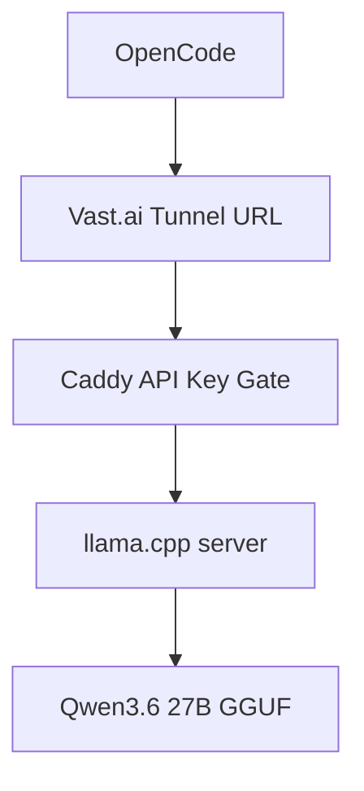
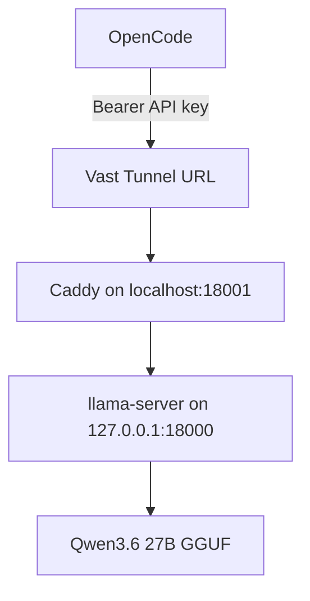

# Study Log: Creating a Protected Local LLM API on Vast.ai With Built-In Tunnels

**Date:** 2026-06-07  
**Project:** Local LLM Coding Server on Vast.ai  
**Stack:** llama.cpp, Qwen3.6 27B, Caddy, Vast.ai Tunnels, OpenCode  
**Goal:** Run a local OpenAI-compatible LLM server, protect it with an API key, expose it through a Vast.ai tunnel, and connect it to OpenCode.

---

## Introduction

I originally thought I needed to manually expose my local LLM server with Cloudflare Tunnel, Caddy, SSH port forwarding, or a separate frontend admin panel.

Then I noticed Vast.ai already has a **Tunnels / Open New Ports** page inside the instance portal.

That changed the API setup.

The final version does not need a separate React frontend or Vercel admin panel. For now, API key creation and rotation can happen directly over SSH inside the Vast server.

The protected flow is:



The model server runs locally inside the Vast instance.  
Caddy sits in front of it and checks the API key.  
The Vast tunnel exposes Caddy, not the raw model server.

So the working layout became:

```text
llama-server on localhost
→ Caddy API key gate
→ Vast.ai tunnel
→ public trycloudflare.com URL
→ OpenCode / coding agent
```

---

## Table of Contents

1. Goal
2. Install and Build llama.cpp
3. Start the Local Model Server
4. Batching and Parallel Slot Settings
5. Create an API Key
6. Configure Caddy as the Protected API Gateway
7. Create a Vast.ai Tunnel
8. Find the API Base URL
9. Test the Protected API
10. Configure OpenCode
11. Rotate the API Key Over SSH
12. Final Working Layout
13. Notes

---

## 1. Goal

The goal was to create one usable local model API from a rented Vast.ai GPU.

The API needed to work with OpenAI-compatible tools such as OpenCode.

Expected routes:

```text
/v1/chat/completions
/v1/models
/health
```

The protected target layout became:

```text
OpenCode → Vast.ai Tunnel URL → Caddy → llama.cpp server → Qwen model
```

The important part is that the Vast tunnel should point to Caddy, not directly to `llama-server`.

Use this:

```text
Vast tunnel target:
http://localhost:18001
```

Not this:

```text
Vast tunnel target:
http://localhost:18000
```

The raw model server should stay behind Caddy.

---

## 2. Install and Build llama.cpp

First, install the basic tools:

```bash
cd /workspace

export HF_HOME=/workspace/.hf_home
export LLAMA_CACHE=/workspace/.hf_home

apt update
apt install -y git cmake build-essential curl python3-pip
```

Clone and build `llama.cpp`:

```bash
cd /workspace

git clone https://github.com/ggml-org/llama.cpp.git
cd llama.cpp

cmake -B build \
  -DBUILD_SHARED_LIBS=OFF \
  -DGGML_CUDA=ON

cmake --build build --config Release -j --target llama-server llama-cli
```

---

## 3. Start the Local Model Server

Start the model server on a private local port.

For the first working version, I used one parallel slot:

```bash
cd /workspace/llama.cpp

export HF_HOME=/workspace/.hf_home
export LLAMA_CACHE=/workspace/.hf_home

./build/bin/llama-server \
  -hf unsloth/Qwen3.6-27B-MTP-GGUF:UD-Q4_K_XL \
  -ngl 99 \
  -c 40960 \
  -fa on \
  -np 1 \
  --spec-type draft-mtp \
  --spec-draft-n-max 2 \
  --host 127.0.0.1 \
  --port 18000 \
  --jinja
```

Important detail:

```text
Use --host 127.0.0.1 when Caddy is the public-facing gateway.
```

The model server is now running on:

```text
http://127.0.0.1:18000
```

Test locally:

```bash
curl http://127.0.0.1:18000/health
```

Expected:

```json
{"status":"ok"}
```

---

## 4. Batching and Parallel Slot Settings

The first version is a **single-user protected API**.

This setting:

```bash
-np 1
-c 40960
```

means:

```text
1 parallel slot
about 40k context for one active request
```

That is better for:

```text
solo OpenCode use
one coding agent at a time
longer single request context
lower VRAM pressure
```

It is not really a batched multi-user setup yet.

For shared use or batched inference, I would need to change the loading command.

Example two-slot version:

```bash
cd /workspace/llama.cpp

export HF_HOME=/workspace/.hf_home
export LLAMA_CACHE=/workspace/.hf_home

./build/bin/llama-server \
  -hf unsloth/Qwen3.6-27B-MTP-GGUF:UD-Q4_K_XL \
  -ngl 99 \
  -c 40960 \
  -fa on \
  -np 2 \
  --parallel 2 \
  --cont-batching \
  --spec-type draft-mtp \
  --spec-draft-n-max 2 \
  --host 127.0.0.1 \
  --port 18000 \
  --jinja
```

The practical meaning:

```text
-np 1 = one active slot
-np 2 = two parallel slots
--cont-batching = continuous batching for queued/parallel requests
-c 40960 = total context setting used by the server
```

On a 24GB RTX 3090, this can get tight.

For solo coding, I would start with:

```bash
-np 1
-c 40960
```

For light shared testing, I would try:

```bash
-np 2
-c 40960
--cont-batching
```

But I would expect less comfortable long-context behavior once multiple people use it.

A simple way to describe the tradeoff:

```text
More context = better for one long coding session
More parallel slots = better for shared API use
More of both = more VRAM pressure
```

For this study log, the default working setup is still:

```text
protected single-user API
```

not a full shared batching server.

---

## 5. Create an API Key

Create a folder for API keys:

```bash
mkdir -p /workspace/api-keys
```

Generate a key:

```bash
openssl rand -hex 32 > /workspace/api-keys/current.key
chmod 600 /workspace/api-keys/current.key
```

Print the key:

```bash
cat /workspace/api-keys/current.key
```

This key will be used by OpenCode.

The request header should look like:

```text
Authorization: Bearer <your-api-key>
```

---

## 6. Configure Caddy as the Protected API Gateway

Install Caddy if needed:

```bash
apt install -y debian-keyring debian-archive-keyring apt-transport-https curl gpg

curl -1sLf 'https://dl.cloudsmith.io/public/caddy/stable/gpg.key' \
  | gpg --dearmor -o /usr/share/keyrings/caddy-stable-archive-keyring.gpg

curl -1sLf 'https://dl.cloudsmith.io/public/caddy/stable/debian.deb.txt' \
  | tee /etc/apt/sources.list.d/caddy-stable.list

apt update
apt install -y caddy
```

Create the Caddyfile:

```bash
cat > /etc/caddy/Caddyfile <<'CADDY'
{
    auto_https off
}

:18001 {
    @missingAuth not header Authorization "Bearer {env.LOCAL_LLM_API_KEY}"

    respond @missingAuth "Unauthorized" 401

    reverse_proxy 127.0.0.1:18000
}
CADDY
```

This means:

```text
Caddy public/proxy port:
http://localhost:18001

Private llama.cpp server:
http://127.0.0.1:18000

Required header:
Authorization: Bearer <LOCAL_LLM_API_KEY>
```

Start or restart Caddy with the key loaded:

```bash
export LOCAL_LLM_API_KEY="$(cat /workspace/api-keys/current.key)"
supervisorctl restart caddy
```

If Caddy is not managed by supervisor, use:

```bash
export LOCAL_LLM_API_KEY="$(cat /workspace/api-keys/current.key)"
caddy run --config /etc/caddy/Caddyfile
```

On some Vast.ai templates, Caddy may already be visible in the instance process manager or supervisor. In that case, `supervisorctl restart caddy` is the cleaner command.

Check supervisor:

```bash
supervisorctl status
```

---

## 7. Create a Vast.ai Tunnel

Open the Vast.ai instance portal.

Go to:

```text
Tunnels / Open New Ports
```

Create a tunnel to Caddy, not to the raw model server.

Use this target:

```text
http://localhost:18001
```

Click:

```text
Create New Tunnel
```

Vast.ai will create a public tunnel URL that looks like:

```text
https://example-words-here.trycloudflare.com
```

Example:

```text
Target URL:
http://localhost:18001

Tunnel URL:
https://example-words-here.trycloudflare.com
```

That public URL now points to Caddy.

Caddy then checks the API key before forwarding the request to `llama-server`.

---

## 8. Find the API Base URL

The tunnel URL is the public API host.

If the tunnel is:

```text
https://example-words-here.trycloudflare.com
```

Then the OpenAI-compatible base URL is:

```text
https://example-words-here.trycloudflare.com/v1
```

The chat completions endpoint is:

```text
https://example-words-here.trycloudflare.com/v1/chat/completions
```

The models endpoint is:

```text
https://example-words-here.trycloudflare.com/v1/models
```

The health endpoint is:

```text
https://example-words-here.trycloudflare.com/health
```

---

## 9. Test the Protected API

First test without an API key:

```bash
curl https://example-words-here.trycloudflare.com/health
```

Expected:

```text
Unauthorized
```

Then test with the API key:

```bash
curl https://example-words-here.trycloudflare.com/health \
  -H "Authorization: Bearer $(cat /workspace/api-keys/current.key)"
```

Expected:

```json
{"status":"ok"}
```

Test models:

```bash
curl https://example-words-here.trycloudflare.com/v1/models \
  -H "Authorization: Bearer $(cat /workspace/api-keys/current.key)"
```

Test chat completion:

```bash
curl https://example-words-here.trycloudflare.com/v1/chat/completions \
  -H "Content-Type: application/json" \
  -H "Authorization: Bearer $(cat /workspace/api-keys/current.key)" \
  -d '{
    "model": "qwen",
    "messages": [
      {
        "role": "user",
        "content": "Say ready."
      }
    ],
    "max_tokens": 20,
    "temperature": 0
  }'
```

If the server responds, the protected API is working.

---

## 10. Configure OpenCode

In OpenCode, use an OpenAI-compatible provider.

Use:

```text
Provider:
OpenAI-compatible
```

Base URL:

```text
https://example-words-here.trycloudflare.com/v1
```

Model:

```text
qwen
```

API key:

```text
contents of /workspace/api-keys/current.key
```

Example:

```text
Provider: OpenAI-compatible
Base URL: https://example-words-here.trycloudflare.com/v1
Model: qwen
API Key: <current.key value>
```

Do not point OpenCode directly to the raw model server.

Do not use:

```text
https://example-words-here.trycloudflare.com pointing to localhost:18000
```

Use the tunnel that points to Caddy:

```text
https://example-words-here.trycloudflare.com pointing to localhost:18001
```

---

## 11. Rotate the API Key Over SSH

For now, the simplest rotation flow is direct SSH.

SSH into the Vast instance, then run:

```bash
openssl rand -hex 32 > /workspace/api-keys/current.key
chmod 600 /workspace/api-keys/current.key
cat /workspace/api-keys/current.key
```

Then restart Caddy so it picks up the new key:

```bash
export LOCAL_LLM_API_KEY="$(cat /workspace/api-keys/current.key)"
supervisorctl restart caddy
```

If Caddy is not managed by supervisor:

```bash
pkill caddy || true

export LOCAL_LLM_API_KEY="$(cat /workspace/api-keys/current.key)"

nohup caddy run --config /etc/caddy/Caddyfile \
  > /workspace/caddy.log 2>&1 &
```

Test the new key:

```bash
curl https://example-words-here.trycloudflare.com/health \
  -H "Authorization: Bearer $(cat /workspace/api-keys/current.key)"
```

Then update OpenCode with the new API key.

---

## 12. Final Working Layout

File layout:

```text
/workspace
├── .hf_home/
│   └── Hugging Face model cache
├── llama.cpp/
│   └── build/bin/llama-server
├── api-keys/
│   └── current.key
└── caddy.log
```

Runtime layout:



Ports:

```text
18000 = llama.cpp private local server
18001 = Caddy protected API gateway
```

Vast tunnel target:

```text
http://localhost:18001
```

OpenCode base URL:

```text
https://your-tunnel-url.trycloudflare.com/v1
```

Default model loading mode:

```text
-np 1
-c 40960
```

Meaning:

```text
single-user protected API
about 40k context
one active coding agent
```

Experimental shared mode:

```text
-np 2
-c 40960
--cont-batching
```

Meaning:

```text
two parallel slots
shared API testing
more VRAM pressure
less comfortable long-context use
```

---

## 13. Notes

The key difference is this:

```text
Tunnel directly to llama-server
= easy, but no real API key protection

Tunnel to Caddy
= still easy, but protected by a Bearer token
```

The simple unprotected version is:

```text
OpenCode
→ Vast tunnel
→ llama-server
```

The protected version is:

```text
OpenCode
→ Vast tunnel
→ Caddy API key gate
→ llama-server
```

For now, I do not need a separate React frontend or Vercel admin panel.

The direct SSH workflow is enough:

```text
SSH into Vast
→ rotate key file
→ restart Caddy
→ update OpenCode
```

For batching, this setup needs to be decided at model load time.

The current default is:

```text
single-user coding API
```

If I want to share the endpoint with friends, I need to test:

```text
-np 2
--cont-batching
```

and watch VRAM, latency, prompt processing speed, and context failures.

For this version, one protected API from the Vast server is enough.
