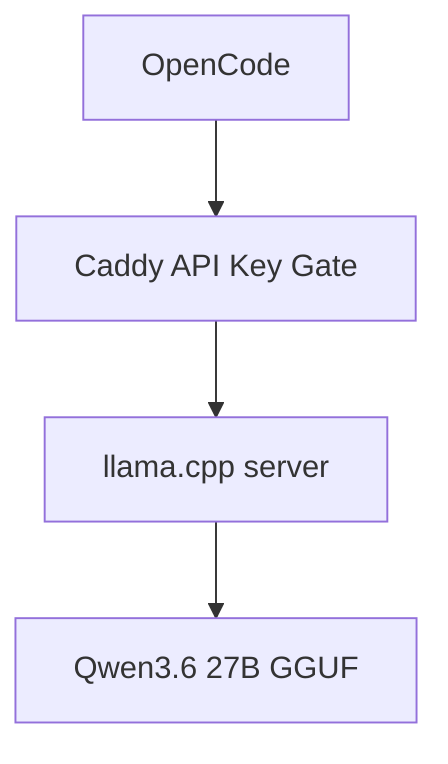
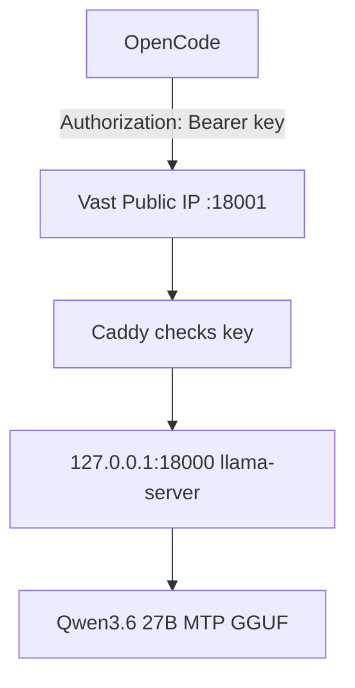

# Study Log: Running a Local LLM Behind Caddy With API Key Protection

**Date:** 2026-06-07  
**Project:** Local LLM Coding Server on Vast.ai  
**Stack:** llama.cpp, Qwen3.6 27B, Caddy, OpenCode  
**Goal:** Run a local OpenAI-compatible LLM server, protect it with an API key, and connect it to OpenCode.

---

## Introduction

I wanted to run a local coding model on a rented GPU and use it through OpenCode without leaving the model endpoint completely open.

The model server itself, `llama-server`, exposes an OpenAI-compatible API, but it does not enforce a serious API key by default. OpenCode may ask for an API key, but the local server usually accepts anything unless another layer checks it.

So the setup became:



Caddy sits in front of the model server. OpenCode talks to Caddy. Caddy checks the `Authorization` header. If the key is valid, the request is forwarded to `llama-server`.

---

## Table of Contents

1. Goal
2. Install and Run Qwen 27B
3. Why Caddy Is Needed
4. Create an API Key
5. Configure Caddy as an API Key Proxy
6. Run Caddy With the Injected Key
7. Rotate the API Key
8. Configure OpenCode
9. Final Working Layout
10. Lessons Learned

---

## 1. Goal

The goal was not to create a production authentication system.

The goal was a simple protection layer for a rented Vast.ai machine:

```text
OpenCode → Caddy protected endpoint → local llama.cpp server
```

This prevents casual access to the public model port and lets OpenCode use a normal OpenAI-style API key.

---

## 2. Install and Run Qwen 27B

First, install the basic tools:

```bash
cd /workspace

export HF_HOME=/workspace/.hf_home
export LLAMA_CACHE=/workspace/.hf_home

apt update
apt install -y git cmake build-essential curl python3-pip
```

Clone and build `llama.cpp`:

```bash
cd /workspace

git clone https://github.com/ggml-org/llama.cpp.git
cd llama.cpp

cmake -B build \
  -DBUILD_SHARED_LIBS=OFF \
  -DGGML_CUDA=ON

cmake --build build --config Release -j --target llama-server llama-cli
```

Start Qwen3.6 27B with around 40k context:

```bash
cd /workspace/llama.cpp

export HF_HOME=/workspace/.hf_home
export LLAMA_CACHE=/workspace/.hf_home

./build/bin/llama-server \
  -hf unsloth/Qwen3.6-27B-MTP-GGUF:UD-Q4_K_XL \
  -ngl 99 \
  -c 40960 \
  -fa on \
  -np 1 \
  --spec-type draft-mtp \
  --spec-draft-n-max 2 \
  --host 127.0.0.1 \
  --port 18000 \
  --jinja
```

Important detail:

```text
Use --host 127.0.0.1 for llama-server if Caddy is the public-facing proxy.
```

That way, the model server itself is not exposed directly.

Test locally:

```bash
curl http://127.0.0.1:18000/health
```

Expected:

```json
{"status":"ok"}
```

---

## 3. Why Caddy Is Needed

`llama-server` gives an OpenAI-compatible endpoint:

```text
/v1/chat/completions
/v1/models
/health
```

But by itself, it is not a real authenticated public endpoint.

OpenCode can send an API key, but the backend has to enforce it.

So Caddy becomes the gatekeeper:

```text
Request has correct Authorization header
→ forward to llama-server

Request is missing or wrong key
→ return 401 Unauthorized
```

---

## 4. Create an API Key

Create a folder for local API keys:

```bash
mkdir -p /workspace/api-keys
```

Generate a key:

```bash
openssl rand -hex 32 > /workspace/api-keys/current.key
chmod 600 /workspace/api-keys/current.key
```

Print the key:

```bash
cat /workspace/api-keys/current.key
```

Example format:

```text
4fd7c3b4e5d6...
```

In OpenCode, this will be used as the API key.

---

## 5. Configure Caddy as an API Key Proxy

Install Caddy if it is not installed:

```bash
apt install -y debian-keyring debian-archive-keyring apt-transport-https curl

curl -1sLf 'https://dl.cloudsmith.io/public/caddy/stable/gpg.key' \
  | gpg --dearmor -o /usr/share/keyrings/caddy-stable-archive-keyring.gpg

curl -1sLf 'https://dl.cloudsmith.io/public/caddy/stable/debian.deb.txt' \
  | tee /etc/apt/sources.list.d/caddy-stable.list

apt update
apt install -y caddy
```

Create a Caddyfile:

```bash
cat > /etc/caddy/Caddyfile <<'CADDY'
{
    auto_https off
}

:18001 {
    @missingAuth not header Authorization "Bearer {env.LOCAL_LLM_API_KEY}"

    respond @missingAuth "Unauthorized" 401

    reverse_proxy 127.0.0.1:18000
}
CADDY
```

This means:

```text
Public endpoint: :18001
Private llama.cpp endpoint: 127.0.0.1:18000
Required header: Authorization: Bearer <key>
```

---

## 6. Run Caddy With the Injected Key

Inject the key through an environment variable:

```bash
export LOCAL_LLM_API_KEY="$(cat /workspace/api-keys/current.key)"
```

Run Caddy:

```bash
caddy run --config /etc/caddy/Caddyfile
```

Now Caddy is listening on:

```text
http://YOUR_VAST_IP:18001
```

The model server remains private on:

```text
http://127.0.0.1:18000
```

Test unauthorized access:

```bash
curl http://127.0.0.1:18001/health
```

Expected:

```text
Unauthorized
```

Test authorized access:

```bash
curl http://127.0.0.1:18001/health \
  -H "Authorization: Bearer $(cat /workspace/api-keys/current.key)"
```

Expected:

```json
{"status":"ok"}
```

Test chat through Caddy:

```bash
curl http://127.0.0.1:18001/v1/chat/completions \
  -H "Content-Type: application/json" \
  -H "Authorization: Bearer $(cat /workspace/api-keys/current.key)" \
  -d '{
    "model": "qwen",
    "messages": [
      {
        "role": "user",
        "content": "Say ready."
      }
    ],
    "max_tokens": 20,
    "temperature": 0
  }'
```

---

## 7. Rotate the API Key

Create a rotation script:

```bash
cat > /workspace/rotate_caddy_key.sh <<'SH'
#!/usr/bin/env bash
set -euo pipefail

KEY_FILE="/workspace/api-keys/current.key"

openssl rand -hex 32 > "$KEY_FILE"
chmod 600 "$KEY_FILE"

echo "New API key:"
cat "$KEY_FILE"

echo
echo "Restart Caddy with:"
echo 'export LOCAL_LLM_API_KEY="$(cat /workspace/api-keys/current.key)"'
echo "caddy run --config /etc/caddy/Caddyfile"
SH

chmod +x /workspace/rotate_caddy_key.sh
```

Run:

```bash
/workspace/rotate_caddy_key.sh
```

Important lesson:

```text
Caddy only sees environment variables from the process that starts it.
```

So if Caddy is running from a terminal, rotating the file alone is not enough. The Caddy process must be restarted or reloaded with the new environment variable.

The simple flow is:

```bash
/workspace/rotate_caddy_key.sh

export LOCAL_LLM_API_KEY="$(cat /workspace/api-keys/current.key)"
caddy run --config /etc/caddy/Caddyfile
```

For a disposable Vast.ai coding box, restarting Caddy is simple enough.

---

## 8. Configure OpenCode

OpenCode should point to the Caddy endpoint, not directly to llama.cpp.

Use:

```text
Base URL:
http://YOUR_VAST_IP:18001/v1
```

Use the model name:

```text
qwen
```

Use API key:

```text
contents of /workspace/api-keys/current.key
```

Example:

```text
Provider: OpenAI-compatible
Base URL: http://YOUR_VAST_IP:18001/v1
Model: qwen
API Key: <current.key value>
```

Do not point OpenCode to this:

```text
http://YOUR_VAST_IP:18000/v1
```

That would bypass Caddy.

Use this instead:

```text
http://YOUR_VAST_IP:18001/v1
```

---

## 9. Final Working Layout

The final layout:

```text
/workspace
├── .hf_home/
│   └── Hugging Face model cache
├── llama.cpp/
│   └── build/bin/llama-server
├── api-keys/
│   └── current.key
└── rotate_caddy_key.sh
```

The runtime layout:



Ports:

```text
18000 = llama.cpp local/private server
18001 = Caddy protected public endpoint
```

---

## 10. Lessons Learned

The important design lesson is that the model server and the public API endpoint should not be the same thing.

`llama-server` is good at serving the model.

Caddy is good at controlling access.

OpenCode only needs an OpenAI-compatible endpoint, so the clean setup is:

```text
OpenCode → Caddy → llama.cpp
```

The API key is not complicated. It is just a shared secret checked by Caddy before the request reaches the model.

For my local coding setup, this is enough:

```text
Qwen3.6 27B
40k context
llama.cpp
Caddy API key gate
OpenCode
```

This keeps the system simple, cheap, and good enough for a rented GPU coding workflow.
