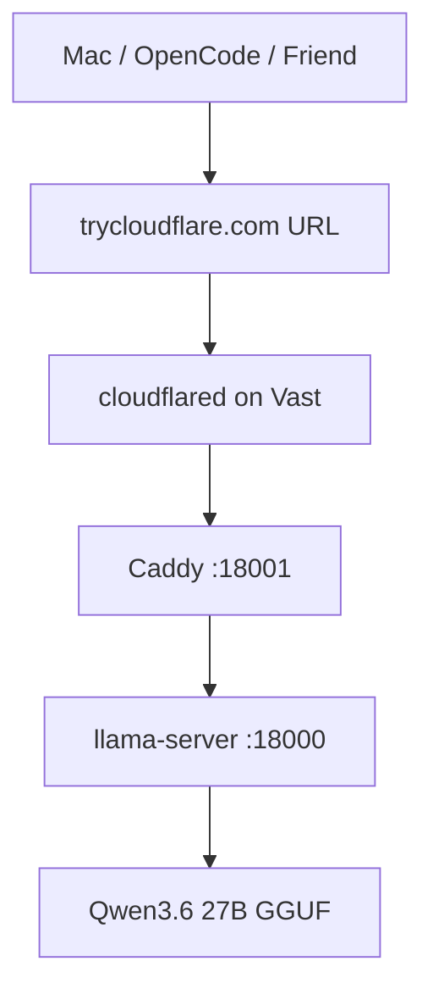

# Study Log: Vast.ai LLM API Connectivity, Cloudflare Tunnel, and OpenCode Setup

**Date:** 2026-06-08  
**Project:** Local Qwen Coding Agent on Vast.ai  
**Stack:** Vast.ai, llama.cpp, Qwen3.6 27B, Caddy, Cloudflare Tunnel, OpenCode  
**Goal:** Run a protected OpenAI-compatible LLM API from a Vast.ai GPU instance and connect OpenCode to it.

---

## Introduction

Yesterday, I thought I had to manually solve public access by exposing ports, using Caddy, or creating a custom frontend/admin panel.

Then I found that Vast.ai provides its own tunnel tooling inside the instance UI, and I also tested a direct `cloudflared` tunnel from inside the server.

The working setup ended up being:

```text
OpenCode / Mac / friend machine
        ↓
trycloudflare.com public URL
        ↓
Cloudflare tunnel
        ↓
Caddy API key gate on :18001
        ↓
llama.cpp server on :18000
        ↓
Qwen3.6 27B
```

The important correction is:

```text
Do not assume every internal Vast port is externally reachable.
```

Vast instances sit behind NAT. Unless a port was exposed when the instance was created, it may not have an external route. Using a Cloudflare tunnel avoids that problem because the tunnel is outbound from the Vast instance.

---

## Quick Navigation

```text
Vast.ai LLM API Setup
├── 1. Problem
├── 2. What I First Assumed
├── 3. What Was Actually Wrong
├── 4. Final Working Architecture
├── 5. Start llama.cpp Server
├── 6. Protect It With Caddy
├── 7. Expose It With Cloudflare Tunnel
├── 8. Test the Public API
├── 9. Connect OpenCode
├── 10. Token Usage and Timing
├── 11. Key Rotation
├── 12. Friend Access
└── 13. Lessons / Notes
```

---

# 1. Problem

I had a `llama.cpp` inference server running on a Vast.ai GPU instance.

The goal was to access it from my Mac and from OpenCode through a protected API endpoint.

The local services were:

```text
llama-server:
http://127.0.0.1:18000

Caddy:
http://127.0.0.1:18001
```

Caddy was supposed to check the API key and forward valid requests to `llama-server`.

But external curl attempts from my Mac failed:

```text
curl: (28) Failed to connect to <host> port 18001 after 75003 ms:
Couldn't connect to server
```

---

# 2. What I First Assumed

My first assumption was:

```text
If Caddy listens on :18001,
then I can call Vast external IP or tunnel on :18001.
```

That was incomplete.

Inside the Vast instance, this worked:

```bash
curl http://127.0.0.1:18001/health \
  -H "Authorization: Bearer $(cat /workspace/api-keys/current.key)"
```

But from my Mac, the external route did not work.

---

# 3. What Was Actually Wrong

Vast.ai uses NAT.

Internal ports are not automatically exposed to the public internet.

Only ports explicitly exposed or mapped by Vast are externally reachable.

So this was true:

```text
Caddy was running internally.
llama-server was running internally.
But external traffic could not reach :18001 directly.
```

The Jupyter port was reachable because Vast had mapped it, but that port was already owned by Jupyter’s HTTPS server.

Trying to reuse the Jupyter port for Caddy caused connection problems because Jupyter was already bound to it.

---

# 4. Final Working Architecture

The working solution was to use a Cloudflare tunnel from inside the Vast instance.

```text
Mac / OpenCode / friend machine
        │
        │ HTTPS
        ▼
trycloudflare.com
        │
        │ outbound tunnel
        ▼
cloudflared on Vast instance
        │
        ▼
Caddy :18001
        │
        ▼
llama.cpp server :18000
```

Diagram:



The tunnel points to Caddy:

```text
http://127.0.0.1:18001
```

not directly to llama-server:

```text
http://127.0.0.1:18000
```

---

# 5. Start llama.cpp Server

Start `llama-server` privately on port `18000`:

```bash
cd /workspace/llama.cpp

export HF_HOME=/workspace/.hf_home
export LLAMA_CACHE=/workspace/.hf_home

mkdir -p /workspace/logs

nohup ./build/bin/llama-server \
  -hf unsloth/Qwen3.6-27B-MTP-GGUF:UD-Q4_K_XL \
  -ngl 99 \
  -c 40960 \
  -fa on \
  --parallel 2 \
  --cont-batching \
  --spec-type draft-mtp \
  --spec-draft-n-max 2 \
  --host 127.0.0.1 \
  --port 18000 \
  --jinja \
  > /workspace/logs/llama-server.log 2>&1 &
```

Check if it is running:

```bash
lsof -i :18000
```

Expected:

```text
llama-ser ... TCP localhost:18000 (LISTEN)
```

Test locally:

```bash
curl http://127.0.0.1:18000/health
```

Expected:

```json
{"status":"ok"}
```

Check logs:

```bash
tail -n 120 /workspace/logs/llama-server.log
```

Good signs:

```text
llama_server: model loaded
server is listening on http://127.0.0.1:18000
update_slots: all slots are idle
```

---

# 6. Protect It With Caddy

Create an API key:

```bash
mkdir -p /workspace/api-keys

openssl rand -hex 32 > /workspace/api-keys/current.key
chmod 600 /workspace/api-keys/current.key

cat /workspace/api-keys/current.key
```

Create the Caddy folder:

```bash
mkdir -p /etc/caddy
```

Create the Caddyfile:

```bash
cat > /etc/caddy/Caddyfile <<'CADDY'
{
    auto_https off
}

:18001 {
    @missingAuth not header Authorization "Bearer {env.LOCAL_LLM_API_KEY}"

    respond @missingAuth "Unauthorized" 401

    reverse_proxy 127.0.0.1:18000
}
CADDY
```

Start Caddy:

```bash
mkdir -p /workspace/logs

export LOCAL_LLM_API_KEY="$(cat /workspace/api-keys/current.key)"

nohup caddy run --config /etc/caddy/Caddyfile \
  > /workspace/logs/caddy.log 2>&1 &
```

Test without API key:

```bash
curl http://127.0.0.1:18001/health
```

Expected:

```text
Unauthorized
```

Test with API key:

```bash
curl http://127.0.0.1:18001/health \
  -H "Authorization: Bearer $(cat /workspace/api-keys/current.key)"
```

Expected:

```json
{"status":"ok"}
```

---

# 7. Expose It With Cloudflare Tunnel

Install `cloudflared`:

```bash
curl -L https://github.com/cloudflare/cloudflared/releases/latest/download/cloudflared-linux-amd64 \
  -o /usr/local/bin/cloudflared

chmod +x /usr/local/bin/cloudflared
```

Start a tunnel pointing to Caddy:

```bash
cloudflared tunnel --url http://127.0.0.1:18001
```

This prints a public URL like:

```text
https://progress-hook-url-index.trycloudflare.com
```

The OpenAI-compatible API base URL becomes:

```text
https://progress-hook-url-index.trycloudflare.com/v1
```

Important:

```text
The trycloudflare.com URL is temporary.
It changes when cloudflared restarts.
```

For a stable URL, use a named Cloudflare tunnel later.

---

# 8. Test the Public API

Test health from the Vast server or Mac:

```bash
curl https://progress-hook-url-index.trycloudflare.com/health \
  -H "Authorization: Bearer YOUR_API_KEY_HERE"
```

Expected:

```json
{"status":"ok"}
```

Test chat completion:

```bash
curl https://progress-hook-url-index.trycloudflare.com/v1/chat/completions \
  -H "Content-Type: application/json" \
  -H "Authorization: Bearer YOUR_API_KEY_HERE" \
  -d '{
    "model": "qwen",
    "messages": [
      {
        "role": "user",
        "content": "Say ready."
      }
    ],
    "max_tokens": 100,
    "temperature": 0
  }'
```

If the response comes back, the full path works:

```text
Mac
→ Cloudflare URL
→ cloudflared
→ Caddy auth
→ llama-server
```

---

# 9. Connect OpenCode

Global config file:

```text
~/.config/opencode/opencode.jsonc
```

Create or edit it:

```bash
mkdir -p ~/.config/opencode
nano ~/.config/opencode/opencode.jsonc
```

Working config:

```jsonc
{
  "$schema": "https://opencode.ai/config.json",
  "provider": {
    "local-qwen": {
      "npm": "@ai-sdk/openai-compatible",
      "name": "Local Qwen via Cloudflare",
      "options": {
        "baseURL": "https://progress-hook-url-index.trycloudflare.com/v1"
      },
      "models": {
        "qwen": {
          "name": "Qwen 27B Local"
        }
      }
    }
  }
}
```

Important mistake:

```text
Use "provider", not "providers".
```

Wrong:

```jsonc
{
  "providers": {}
}
```

Correct:

```jsonc
{
  "provider": {}
}
```

Register the API key:

```bash
opencode auth login
```

Choose:

```text
Other
```

Provider ID:

```text
local-qwen
```

API key:

```text
YOUR_API_KEY_HERE
```

The provider ID must match the config key exactly:

```jsonc
"local-qwen": {
```

Restart OpenCode.

Select:

```text
Local Qwen via Cloudflare / Qwen 27B Local
```

---

# 10. Token Usage and Timing

The API response includes usage:

```json
"usage": {
  "completion_tokens": 100,
  "prompt_tokens": 13,
  "total_tokens": 113,
  "prompt_tokens_details": {
    "cached_tokens": 9
  }
}
```

Meaning:

```text
prompt_tokens = input tokens
completion_tokens = generated tokens
total_tokens = prompt + completion
cached_tokens = prompt cache reuse
```

The API can also include timings:

```json
"timings": {
  "prompt_n": 13,
  "prompt_ms": 501.05,
  "prompt_per_second": 25.94,
  "predicted_n": 20,
  "predicted_ms": 362.591,
  "predicted_per_second": 55.15,
  "draft_n": 12,
  "draft_n_accepted": 12
}
```

Meaning:

```text
prompt_per_second = prompt processing speed
predicted_per_second = generation speed
draft_n = MTP draft tokens proposed
draft_n_accepted = MTP draft tokens accepted
```

Check usage directly:

```bash
curl -s https://progress-hook-url-index.trycloudflare.com/v1/chat/completions \
  -H "Content-Type: application/json" \
  -H "Authorization: Bearer YOUR_API_KEY_HERE" \
  -d '{
    "model": "qwen",
    "messages": [{"role": "user", "content": "Say ready."}],
    "max_tokens": 100,
    "temperature": 0
  }' | jq '.usage'
```

Check timings:

```bash
curl -s https://progress-hook-url-index.trycloudflare.com/v1/chat/completions \
  -H "Content-Type: application/json" \
  -H "Authorization: Bearer YOUR_API_KEY_HERE" \
  -d '{
    "model": "qwen",
    "messages": [{"role": "user", "content": "Say ready."}],
    "max_tokens": 100,
    "temperature": 0
  }' | jq '.timings'
```

---

# 11. Key Rotation

Rotate the master key:

```bash
openssl rand -hex 32 > /workspace/api-keys/current.key
chmod 600 /workspace/api-keys/current.key
cat /workspace/api-keys/current.key
```

Caddy does not automatically reload environment variables.

Restart Caddy:

```bash
pkill caddy

export LOCAL_LLM_API_KEY="$(cat /workspace/api-keys/current.key)"

caddy run --config /etc/caddy/Caddyfile &
```

Important:

```text
caddy reload is not enough if Caddy is not running.
caddy reload also will not magically update environment variables.
```

If this fails:

```text
connect: connection refused on localhost:2019
```

it means the Caddy admin API is not running because the Caddy process is dead.

Use restart instead:

```bash
pkill caddy
export LOCAL_LLM_API_KEY="$(cat /workspace/api-keys/current.key)"
caddy run --config /etc/caddy/Caddyfile &
```

---

# 12. Multi-Key Friend Access

Caddy can allow multiple bearer tokens.

Example:

```caddy
{
    auto_https off
}

:18001 {
    @missingAuth {
        not header Authorization "Bearer {env.LOCAL_LLM_API_KEY}"
        not header Authorization "Bearer FRIEND_KEY_HERE"
    }

    respond @missingAuth "Unauthorized" 401

    reverse_proxy 127.0.0.1:18000
}
```

Generate a friend key:

```bash
openssl rand -hex 32
```

Add it to the Caddyfile.

Restart Caddy:

```bash
pkill caddy
export LOCAL_LLM_API_KEY="$(cat /workspace/api-keys/current.key)"
caddy run --config /etc/caddy/Caddyfile &
```

To revoke a friend:

```text
Remove their key from the Caddyfile.
Restart Caddy.
```

---

# 13. Friend OpenCode Setup Script

Send friend this script after replacing:

```text
TUNNEL_URL
FRIEND_KEY
```

Script:

```bash
#!/bin/bash

TUNNEL_URL="https://progress-hook-url-index.trycloudflare.com"

mkdir -p ~/.config/opencode

cat > ~/.config/opencode/opencode.jsonc << EOF
{
  "\$schema": "https://opencode.ai/config.json",
  "provider": {
    "local-qwen": {
      "npm": "@ai-sdk/openai-compatible",
      "name": "Local Qwen via Cloudflare",
      "options": {
        "baseURL": "${TUNNEL_URL}/v1"
      },
      "models": {
        "qwen": {
          "name": "Qwen 27B Local"
        }
      }
    }
  }
}
EOF

echo "Config written."
echo ""
echo "Now run:"
echo "opencode auth login"
echo ""
echo "Choose:"
echo "Other"
echo ""
echo "Provider ID:"
echo "local-qwen"
echo ""
echo "API key:"
echo "<paste the key I gave you>"
```

Friend instructions:

```text
1. Save the script as setup-opencode.sh
2. Run: bash setup-opencode.sh
3. Run: opencode auth login
4. Choose: Other
5. Provider ID: local-qwen
6. Paste the API key
7. Restart OpenCode
8. Select Local Qwen via Cloudflare
```

---

# 14. Troubleshooting

## 14.1 curl times out from Mac

If this happens:

```text
curl: (28) Failed to connect to host port 18001
```

Cause:

```text
Vast did not expose that internal port externally.
```

Fix:

```text
Use cloudflared tunnel --url http://127.0.0.1:18001
```

---

## 14.2 llama-server is down

Check:

```bash
curl http://127.0.0.1:18000/health
```

If it fails, start `llama-server`.

---

## 14.3 Caddy is down

Check:

```bash
curl http://127.0.0.1:18001/health
```

Expected without key:

```text
Unauthorized
```

If it cannot connect, Caddy is not running.

Start it:

```bash
export LOCAL_LLM_API_KEY="$(cat /workspace/api-keys/current.key)"

caddy run --config /etc/caddy/Caddyfile &
```

---

## 14.4 API key on disk does not match Caddy memory

Check disk key:

```bash
cat /workspace/api-keys/current.key
```

Check current shell env:

```bash
echo $LOCAL_LLM_API_KEY
```

If they differ, restart Caddy:

```bash
pkill caddy
export LOCAL_LLM_API_KEY="$(cat /workspace/api-keys/current.key)"
caddy run --config /etc/caddy/Caddyfile &
```

---

## 14.5 OpenCode crashes or cannot connect

Check config path:

```bash
cat ~/.config/opencode/opencode.jsonc
```

Check these:

```text
"provider" must be singular.
Provider ID must be local-qwen.
baseURL must end with /v1.
API key must be registered through opencode auth login.
```

Test API outside OpenCode:

```bash
curl https://progress-hook-url-index.trycloudflare.com/health \
  -H "Authorization: Bearer YOUR_API_KEY_HERE"
```

If curl works but OpenCode fails, the problem is OpenCode config/auth.

---

# 15. Final Notes

The corrected final setup is:

```text
llama-server private on :18000
Caddy protected on :18001
cloudflared exposes Caddy
OpenCode connects to Cloudflare URL
OpenCode auth key registered through opencode auth login
```

The biggest correction from the first attempt:

```text
Do not rely on arbitrary Vast internal ports being externally reachable.
```

The working external access method:

```bash
cloudflared tunnel --url http://127.0.0.1:18001
```

Main rule:

```text
Tunnel to Caddy.
Do not tunnel directly to llama-server.
```

Security note:

```text
Do not publish real API keys.
Use placeholders in public logs.
Rotate keys if they are pasted into chats, screenshots, or shared docs.
```
