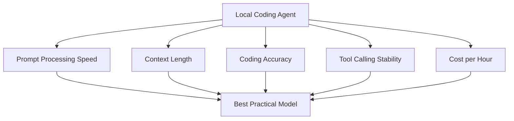

# Study Log: Qwen3.6 27B vs 35B-A3B for Local Agentic Coding

**Date:** 2026-06-07  
**Project:** Local AI Coding Stack on Vast.ai  
**Models Compared:** Qwen3.6 27B Dense vs Qwen3.6 35B-A3B MoE  
**Runtime:** llama.cpp / OpenAI-compatible local server  
**Primary Use Case:** OpenCode coding agent, modular monolith build phases, TDD, context-engineered repo workflow  

---

## Introduction

I compared two local coding model options for my Vast.ai setup:

```text
Qwen3.6 27B dense
vs
Qwen3.6 35B-A3B MoE
```

The question was not simply which model is “better.” The real question was:

```text
Which model gives the best coding-agent workflow under my hardware limits?
```

A coding agent is not just answering one prompt. It has to read context, follow phase rules, edit files, run tests, recover from mistakes, and continue across multiple turns.

That makes the tradeoff more complicated than raw tokens per second.



---

## Table of Contents

1. The Core Decision
2. What 27B Dense Means
3. What 35B-A3B MoE Means
4. Reddit Thread Summary
5. Hardware Reality
6. Context Length vs Context Quality
7. KV Cache Problem
8. MTP and Speed Tradeoff
9. My Vast.ai Results
10. Best Use Cases for 27B
11. Best Use Cases for 35B-A3B
12. Final Decision
13. Practical Testing Plan
14. Lessons Learned

---

## 1. The Core Decision

The simple version:

```text
Use 27B if correctness matters more.
Use 35B-A3B if speed / long agent loops matter more.
```

But for my project, correctness matters a lot.

I am building phased backend/frontend modules with contracts, tests, fixtures, evals, review queues, and deterministic boundaries. That means I need the coding model to be careful.

For this use case:

```text
Correct TypeScript contracts
Passing tests
Respecting phase scope
Avoiding subtle bugs
Following repo instructions
```

matter more than raw output speed.

So the default answer is:

```text
Qwen3.6 27B dense should be my primary coding model.
```

---

## 2. What 27B Dense Means

Qwen3.6 27B is a dense model.

That means the model uses all, or effectively all, of its parameters during inference.

Practical meaning:

```text
More computation per token
Usually slower than MoE
Often better reasoning consistency
Often better for hard coding/debugging
```

For coding, dense models often feel more stable because every token is produced with the full model involved.

The downside is speed and VRAM pressure.

On a 24GB RTX 3090, I can run:

```text
Qwen3.6 27B MTP
UD-Q4_K_XL
~40k context
llama.cpp
OpenCode
```

That is enough for a context-engineered coding workflow.

---

## 3. What 35B-A3B MoE Means

Qwen3.6 35B-A3B is a Mixture-of-Experts model.

It has around:

```text
35B total parameters
~3B active parameters per token
```

That means it does not use the full 35B on every token.

Practical meaning:

```text
Much faster token generation
Often faster agent loops
Can feel lightweight despite large total size
May be less consistent than dense models
Can confuse itself on hard coding tasks
```

This is why some users like it for agentic workflows. The model can process many smaller steps quickly.

But there is a catch:

```text
Fast is not always better if the model makes more subtle mistakes.
```

---

## 4. Reddit Thread Summary

The Reddit thread did not give one clean answer.

The strongest pattern was:

```text
If you can run 27B fast, run 27B.
Otherwise, run 35B.
```

That is the most useful practical rule.

The thread had several important opinions:

```text
27B dense:
- preferred by many for hard coding
- often viewed as smarter
- better when full / higher-quality KV cache is possible
- slower because it is dense

35B-A3B:
- faster because it only activates ~3B params
- useful for longer agentic workflows
- can be better when 27B is too slow or too context-limited
- some users say it confuses itself on coding
```

One user summarized the decision very directly:

```text
“If you can run 27b fast, you run 27b. Otherwise you run 35b.”
```

That matches my own experience.

---

## 5. Hardware Reality

My relevant hardware options were:

```text
RTX 3090
- 24GB VRAM
- fast prompt processing
- good value
- around 40k context practical for 27B

RTX 8000
- 45–48GB VRAM
- much larger context
- much slower prompt processing
- better only when huge context is needed

RTX 4090
- 24GB VRAM
- faster than 3090
- more expensive
- same VRAM limit

RTX 5090
- 32GB VRAM
- much faster
- expensive
- better future option
```

For daily coding, the RTX 3090 felt much better than RTX 8000 because prompt processing speed matters a lot.

The RTX 8000 could run huge context, but the actual coding loop felt slow.

---

## 6. Context Length vs Context Quality

One mistake is assuming bigger context always means better coding.

It does not.

For agentic coding, context must be:

```text
relevant
structured
current
phase-specific
test-grounded
```

A messy 100k context can be worse than a clean 40k context.

My existing context-engineering setup helps the 27B model:

```text
AGENTS.md
project overview
current phase file
module contracts
relevant files only
failing tests
recent work log
```

This means I do not need to dump the entire repo into context.

Instead of relying on huge context, the repo explains itself.

That makes 40k context much more usable.

---

## 7. KV Cache Problem

The Reddit thread had a lot of concern around KV cache quantization.

The issue:

```text
KV cache stores attention history.
Long context depends heavily on KV cache quality.
```

Some users said KV quantization can hurt:

```text
tool calling
long agent behavior
reasoning consistency
multi-turn coding
```

Others said Q8 KV cache has improved and may now be acceptable.

The important lesson is:

```text
Do not blindly maximize context by aggressively quantizing KV cache.
```

For coding agents, bad KV cache behavior can be worse than shorter context.

A shorter context with better KV precision may beat a longer context with degraded recall/tool behavior.

For my setup, this means:

```text
Prefer stable 27B at 40k over unstable long-context hacks.
```

---

## 8. MTP and Speed Tradeoff

MTP helps speed up generation through speculative decoding.

For Qwen3.6 27B MTP, my command uses:

```bash
--spec-type draft-mtp
--spec-draft-n-max 2
```

This can improve generation speed.

But Reddit users also noted that MTP can cost extra VRAM.

That means MTP creates another tradeoff:

```text
More speed
vs
less room for context / quant quality
```

For my 27B setup, MTP still seems worth it because I successfully ran around 40k context on the RTX 3090.

So my practical 27B command stays:

```bash
./build/bin/llama-server \
  -hf unsloth/Qwen3.6-27B-MTP-GGUF:UD-Q4_K_XL \
  -ngl 99 \
  -c 40960 \
  -fa on \
  -np 1 \
  --spec-type draft-mtp \
  --spec-draft-n-max 2 \
  --host 127.0.0.1 \
  --port 18000 \
  --jinja
```

---

## 9. My Vast.ai Results

My RTX 8000 test proved that huge context works, but also showed why it is not ideal for daily coding.

Measured RTX 8000 run:

```text
117,826 prompt tokens
truncated = 0
prompt processing = ~366 tok/s
generation = ~37.6 tok/s
```

That is impressive for context size.

But for actual OpenCode usage, it felt slow.

The RTX 3090 felt much faster even with compaction.

That tells me:

```text
Prompt processing speed matters more than maximum context for daily coding.
```

Coding agents constantly process:

```text
files
diffs
logs
test output
repo instructions
phase plans
tool results
```

So PP speed affects the whole development loop.

---

## 10. Best Use Cases for 27B

Qwen3.6 27B dense is best for:

```text
hard coding
debugging
TypeScript contracts
schema design
test-driven development
multi-file refactors
phase implementation
careful reasoning
following strict instructions
```

For my modular monolith project, this is exactly what I need.

The 27B model is the better default for:

```text
Phase 1 contracts
fixtures
DTOs
schemas
eval-runner behavior
review queue logic
run lock logic
tests
```

The model may be slower than 35B-A3B, but fewer mistakes are more valuable.

---

## 11. Best Use Cases for 35B-A3B

Qwen3.6 35B-A3B is best for:

```text
fast agent loops
summaries
SEO drafts
content analysis
planning drafts
reports
low-risk repetitive edits
tool-heavy workflows
broad repo scanning
```

It may also be better when:

```text
27B is too slow
27B cannot hold enough context
the task is not deep coding
the workflow benefits from many cheap reasoning passes
```

For my SEO automation project, 35B-A3B may become useful later as a runtime model for:

```text
keyword extraction
draft generation
content rewrite suggestions
report generation
SERP summary
competitor page comparison
```

But I should not assume it is the best model for building the codebase itself.

---

## 12. Final Decision

My decision:

```text
Use Qwen3.6 27B dense as the main coding model.
Use Qwen3.6 35B-A3B as an experiment / secondary model.
```

Current best default:

```text
RTX 3090
Qwen3.6 27B MTP
UD-Q4_K_XL
40k context
OpenCode
strict context engineering
TDD
```

The reason:

```text
27B is more likely to produce correct code.
40k context is enough because my repo context is structured.
RTX 3090 gives better speed/value than RTX 8000.
```

35B-A3B is still worth testing, but only with a direct benchmark.

---

## 13. Practical Testing Plan

The only benchmark that really matters is my actual coding workflow.

Test both models on the same task:

```text
Read AGENTS.md, project overview, and Phase 1 plan.
Implement only Phase 1 TypeScript contracts and fixtures.
Add schema/DTO tests.
Run tests.
Fix failures.
Stop when tests pass.
```

Measure:

```text
time to first useful plan
time to first edit
number of failed tests
number of correction loops
whether it respects phase scope
total time until passing tests
quality of final code
```

The decision rule:

```text
If 35B finishes faster but creates more subtle bugs, use 27B.
If 35B finishes faster with equal test quality, use 35B for easier phases.
If 27B is slower but cleaner, keep 27B as default.
```

Do not compare models only by tokens per second.

Compare them by:

```text
passing tests per dollar
useful code per hour
fewer manual corrections
less context confusion
```

---

## 14. Lessons Learned

The biggest lesson is that model choice depends on workflow.

For one-shot chat, the faster model may feel better.

For agentic coding, the better model is the one that:

```text
keeps context stable
calls tools correctly
does not lose instructions
passes tests
does not silently create bad architecture
```

The Reddit thread reinforced that there is no universal winner.

The real rule is:

```text
Dense 27B for correctness.
MoE 35B-A3B for speed and agent loops.
```

For my setup, because I already have strong context engineering, I do not need to chase maximum context first.

My working stack should be:

```text
RTX 3090
Qwen3.6 27B MTP
40k context
Caddy API key proxy
OpenCode
phase files
module contracts
tests
```

That is the best balance of cost, speed, and correctness for building the project.

The 35B-A3B model is still useful, but it belongs as a benchmark and possible secondary model, not the default coding model yet.
