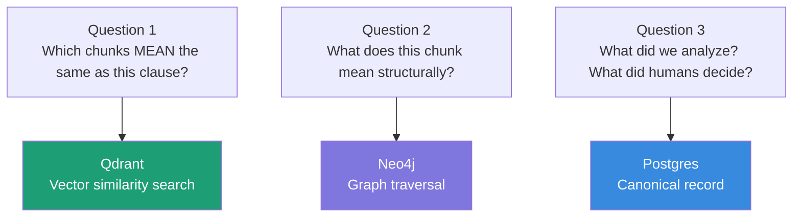
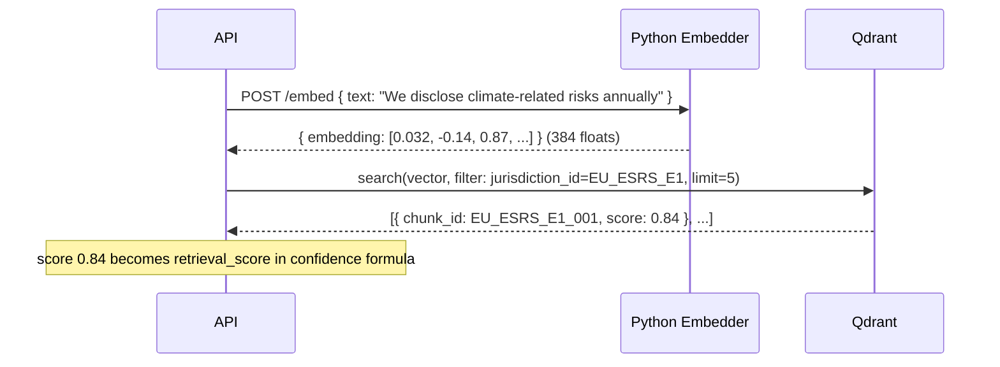
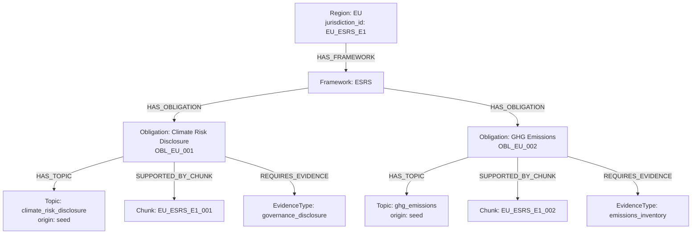
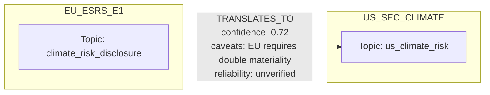
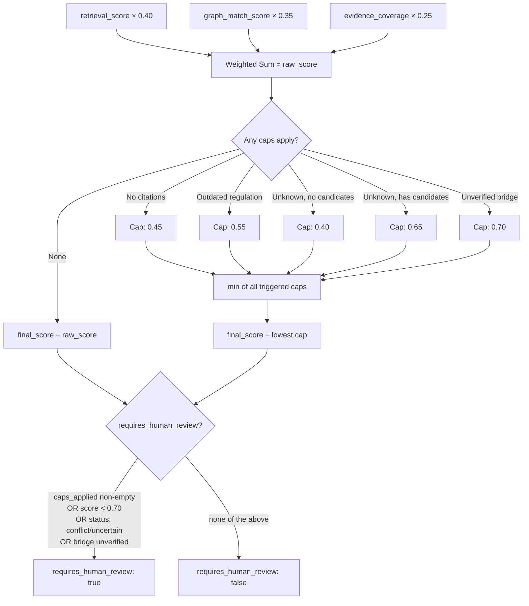
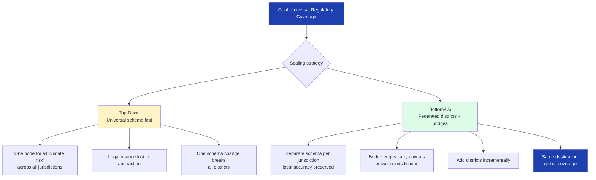
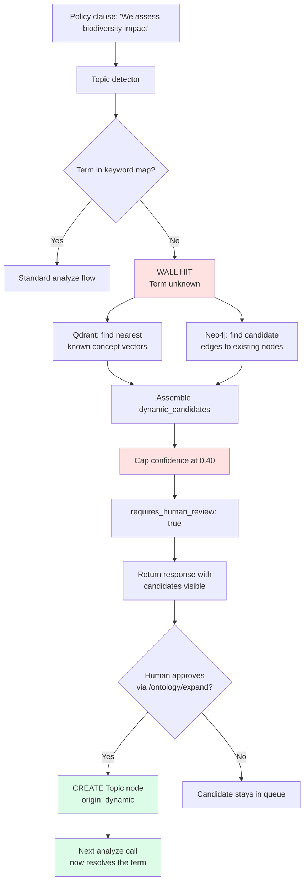

# Understanding the Database Architecture
## A Learning Guide for the Regulatory Impact Demo

> **What this document covers:** Why three different databases are used in this project, how each one works, what problems they solve, what would break if you tried to use Postgres for everything, and how they work together on every `/analyze` call.

---

## Table of Contents

1. [The Core Problem](#1-the-core-problem)
2. [Postgres — The Grid](#2-postgres--the-grid)
3. [Qdrant — The Meaning Machine](#3-qdrant--the-meaning-machine)
4. [Neo4j — The Relationship Map](#4-neo4j--the-relationship-map)
5. [How All Three Work Together](#5-how-all-three-work-together)
6. [Why Not Just Use Postgres for Everything?](#6-why-not-just-use-postgres-for-everything)
7. [The Architectural Decision](#7-the-architectural-decision)
8. [Things That Bit Us During Setup](#8-things-that-bit-us-during-setup)
9. [Key Things to Remember](#9-key-things-to-remember)

---

## 1. The Core Problem

The system needs to answer three completely different kinds of questions for every `/analyze` call:

```
Question 1: "Which regulatory chunks are most similar in MEANING to this policy clause?"
→ This is a semantic problem. Postgres cannot do this natively.

Question 2: "What does this chunk MEAN inside the regulatory structure?
             What obligation does it support? What jurisdiction? What evidence type?"
→ This is a relationship traversal problem. Postgres can do it but needs 4-5 JOINs
  and the structure becomes invisible in the schema.

Question 3: "What did we analyze? What did humans decide? What was exported?"
→ This is a canonical record problem. Postgres is perfect for this.
```

Each question maps to a different database. That is the entire architectural reason.



---

## 2. Postgres — The Grid

### What it is

Postgres is a **relational database**. Every piece of data lives in a table — a grid of rows and columns. You query it by matching exact values.

### How data looks

```
Table: regulatory_chunks

chunk_id          | region | framework | topic                   | status
------------------|--------|-----------|-------------------------|--------
EU_ESRS_E1_001    | EU     | ESRS      | climate_risk_disclosure | active
EU_ESRS_E1_002    | EU     | ESRS      | ghg_emissions           | active
US_SEC_001        | US     | SEC       | climate_risk            | active
US_SEC_002        | US     | SEC       | scope_emissions         | active
EU_ESRS_E1_003    | EU     | ESRS      | board_oversight         | active
```

### How you query it

```sql
-- Give me all EU chunks that are active
SELECT * FROM regulatory_chunks
WHERE region = 'EU'
AND status = 'active';
```

Postgres is exceptionally good at this. Exact match on a column, filter, return rows.

### What it cannot do

```sql
-- This is not a real SQL query — Postgres cannot do this
SELECT * FROM regulatory_chunks
ORDER BY similarity_to('We disclose climate-related risks annually') DESC;
```

Postgres has no concept of "meaning." It can tell you `region = 'EU'` but it cannot tell you that `"We disclose climate risk"` and `"Annual reporting of climate-related financial exposure"` mean roughly the same thing.

### Where it lives in this project

Deferred to production. In the demo, results are held in memory. In a real deployment, Postgres (Neon) would be the canonical source of truth — storing every analysis result, annotation, and export for audit purposes.

```
┌─────────────────────────────────────────────────────────────┐
│  Postgres — what it stores in production                    │
│                                                             │
│  policy_documents     ← the raw uploaded policies          │
│  policy_clauses       ← extracted individual clauses       │
│  impact_results       ← what /analyze returned             │
│  confidence_scores    ← the scoring breakdown per result   │
│  human_annotations    ← what reviewers decided             │
│  dataset_exports      ← eval and finetune JSONL exports    │
│  audit_events         ← every action, timestamped          │
└─────────────────────────────────────────────────────────────┘
```

---

## 3. Qdrant — The Meaning Machine

### What it is

Qdrant is a **vector database**. Every item stored in it has a hidden column — a list of 384 numbers that represent its *meaning* in mathematical space. You search by meaning, not by exact value.

### The key concept: embeddings

An **embedding** is what the Python embedder produces. You give it a sentence, it gives you 384 numbers:

```
"We disclose climate-related risks annually"
→ [0.032, -0.14, 0.87, 0.23, -0.55, 0.91, ... 378 more numbers]

"Annual reporting of climate financial exposure"
→ [0.028, -0.11, 0.84, 0.19, -0.51, 0.88, ... 378 more numbers]
```

These two sentences produce **similar** number arrays because they mean similar things. That similarity is measurable — it is called **cosine similarity** and produces a score between 0 and 1.

```
cosine_similarity(sentence_A_vector, sentence_B_vector) = 0.91
→ very similar in meaning

cosine_similarity(sentence_A_vector, sentence_C_vector) = 0.23
→ very different in meaning
```

### How data looks in Qdrant

There are no tables. There are **collections** containing **points**. Each point has three things:

```json
{
  "id": "a3f2c1d4-8b3e-4f7a-9c2d-1e5f6a7b8c9d",
  "vector": [0.032, -0.14, 0.87, 0.23, "...381 more floats..."],
  "payload": {
    "chunk_id": "EU_ESRS_E1_001",
    "jurisdiction_id": "EU_ESRS_E1",
    "region": "EU",
    "framework": "ESRS",
    "topic": "climate_risk_disclosure",
    "obligation_id": "OBL_EU_001",
    "citation_label": "ESRS E1 §29 (demo paraphrase)",
    "status": "active",
    "authority_level": "mandatory",
    "effective_date": "2024-01-01"
  }
}
```

- `id` — must be a UUID (string slugs are rejected — we learned this the hard way)
- `vector` — the meaning in numbers, generated by the Python embedder
- `payload` — any JSON you want; this is how you filter

### How you query it

```javascript
// Find the 5 chunks most similar in meaning to this clause,
// but only within the EU jurisdiction
await qdrant.search('regulatory_impact_chunks', {
  vector: embedder.embed("We disclose climate-related risks annually"),
  filter: {
    must: [{ key: 'jurisdiction_id', match: { value: 'EU_ESRS_E1' } }]
  },
  limit: 5
});

// Returns:
[
  { id: 'a3f2...', score: 0.84, payload: { chunk_id: 'EU_ESRS_E1_001', ... } },
  { id: 'b7c1...', score: 0.71, payload: { chunk_id: 'EU_ESRS_E1_003', ... } },
  { id: 'c2d4...', score: 0.63, payload: { chunk_id: 'EU_ESRS_E1_002', ... } }
]
```

The `score` values become `retrieval_score` in the confidence formula.

### How the vector space works — the search flow



In reality vectors are 384-dimensional. If you could compress that to 2D for illustration:

```
                    ┌─ climate risk zone ─────────────┐
                    │                                  │
                    │   ● EU_ESRS_E1_001               │
                    │       ● EU_ESRS_E1_003            │
                    │   ● SEC_001                       │
                    └──────────────────────────────────┘


                                    ┌─ emissions zone ──────────┐
                                    │                           │
                                    │  ● EU_ESRS_E1_002         │
                                    │      ● SEC_002             │
                                    │  ● EU_ESRS_E1_004          │
                                    └───────────────────────────┘


    ★ your query clause
    ↗ nearest neighbors = highest scoring matches
```

Chunks about the same topic cluster together. Your query vector lands near the cluster it belongs to. The closest points are your results.

### The payload index problem (and how we fixed it)

Qdrant does not automatically know which payload fields you plan to filter on. You must create **payload indexes** at collection creation time:

```javascript
// Without this, filtering by jurisdiction_id scans EVERY point
// With millions of chunks this becomes catastrophically slow
await qdrant.createPayloadIndex('regulatory_impact_chunks', {
  field_name: 'jurisdiction_id',
  field_schema: 'keyword'
});
// Same for: topic, framework, region, status
```

We hit this during setup. The collection was created without indexes, filtered queries failed, the collection had to be deleted and recreated. The fix now lives permanently in the shared vector driver — every new collection gets these indexes at creation time automatically.

---

## 4. Neo4j — The Relationship Map

### What it is

Neo4j is a **graph database**. There are no tables. There are **nodes** (things) and **relationships** (named arrows between things). The structure of how things connect is part of the data itself — not implied by foreign keys.

### How data looks in Neo4j

```
Nodes are things:
  (r:Region    { id: "EU", name: "European Union", jurisdiction_id: "EU_ESRS_E1" })
  (f:Framework { id: "ESRS", name: "ESRS", authority_level: "mandatory" })
  (o:Obligation{ id: "OBL_EU_001", text: "...", status: "active" })
  (c:RegulatoryChunk { id: "EU_ESRS_E1_001", citation_label: "ESRS E1 §29" })
  (t:Topic     { id: "climate_risk_disclosure", origin: "seed" })
  (e:EvidenceType { id: "governance_disclosure" })

Relationships are named arrows:
  (r)-[:HAS_FRAMEWORK]->    (f)
  (f)-[:HAS_OBLIGATION]->   (o)
  (o)-[:HAS_TOPIC]->        (t)
  (o)-[:SUPPORTED_BY_CHUNK]->(c)
  (o)-[:REQUIRES_EVIDENCE]-> (e)
```

### The query language: Cypher

Cypher reads like a diagram. You describe the shape of the path you want:

```cypher
-- Find the full path from Region down to a specific chunk
MATCH (r:Region { jurisdiction_id: "EU_ESRS_E1" })
      -[:HAS_FRAMEWORK]->(f:Framework)
      -[:HAS_OBLIGATION]->(o:Obligation)
      -[:SUPPORTED_BY_CHUNK]->(c:RegulatoryChunk { id: "EU_ESRS_E1_001" })
RETURN r.name, f.name, o.text, c.citation_label
```

The same query in SQL requires four JOINs:

```sql
SELECT r.name, f.name, o.text, c.citation_label
FROM regions r
JOIN frameworks f ON f.region_id = r.id
JOIN obligations o ON o.framework_id = f.id
JOIN regulatory_chunks c ON c.obligation_id = o.id
WHERE r.jurisdiction_id = 'EU_ESRS_E1'
AND c.id = 'EU_ESRS_E1_001';
```

Both return the same data. As the graph grows — more obligations, more evidence types, cross-jurisdiction bridges — Cypher stays readable. SQL accumulates JOINs until the structure of the relationships becomes impossible to see in the code.

### Your EU graph in this demo


  │
  └─[HAS_FRAMEWORK]──────────────────► Framework: ESRS
                                          │
                          ┌───────────────┼──────────────────────┐
                          │               │                      │
               [HAS_OBLIGATION]  [HAS_OBLIGATION]         [HAS_OBLIGATION]
                          │               │                      │
                          ▼               ▼                      ▼
              Obligation: OBL_EU_001   OBL_EU_002           OBL_EU_003
              Climate Risk Disclosure  GHG Emissions         Board Oversight
                          │               │
              ┌───────────┤   ┌───────────┤
              │           │   │           │
         [HAS_TOPIC] [SUPP_BY] [HAS_TOPIC] [SUPP_BY]
              │           │   │           │
              ▼           ▼   ▼           ▼
           Topic:      Chunk: Topic:    Chunk:
           climate_   E1_001 ghg_emis- E1_002
           risk               sions
```

### Why Neo4j for cross-jurisdiction bridges

The bridge edges between EU and US topics carry their own data:

```cypher
-- A bridge edge with caveats stored ON the relationship itself
(:Topic { id: "climate_risk_disclosure", jurisdiction_id: "EU_ESRS_E1" })
  -[:TRANSLATES_TO {
      bridge_type: "semantic_equivalence",
      confidence: 0.72,
      caveats: ["EU_requires_double_materiality", "US_investor_materiality_only"],
      mapping_basis: "both_require_climate_governance_disclosure",
      reliability: "unverified"
  }]->
(:Topic { id: "us_climate_risk", jurisdiction_id: "US_SEC_CLIMATE" })
```

### Bridge edge between EU and US



```sql
-- The relationship is not a first-class thing — it needs its own table
CREATE TABLE topic_bridges (
  from_topic_id  TEXT REFERENCES topics(id),
  to_topic_id    TEXT REFERENCES topics(id),
  bridge_type    TEXT,
  confidence     FLOAT,
  caveats        TEXT[],
  mapping_basis  TEXT,
  reliability    TEXT
);
```

In Neo4j the relationship carries its own data natively. This is the difference between relationships being first-class vs. being implied.

### The living ontology

When a new term like `biodiversity` is encountered and approved by a human, a new Topic node is created at runtime without any schema migration:

```cypher
MERGE (t:Topic { id: 'biodiversity_impact' })
ON CREATE SET
  t.name = 'Biodiversity Impact',
  t.status = 'active',
  t.origin = 'dynamic',        -- marks it as human-promoted, not seeded
  t.jurisdiction_id = 'EU_ESRS_E1'
WITH t
MATCH (existing:Topic { id: 'climate_risk_disclosure' })
MERGE (t)-[:SEMANTICALLY_RELATED_TO { source: 'vector_co_occurrence' }]->(existing);
```

The `origin: dynamic` field makes ontology growth auditable. You can always query which nodes were seeded and which grew from use.

---

## 5. How All Three Work Together

Every `/analyze` call follows this exact sequence:

```
Step 1 — Clause arrives
  "We disclose climate-related risks annually in our sustainability report."

Step 2 — Topic detector (backend, keyword map)
  → topic: climate_risk_disclosure

Step 3 — Python embedder converts clause to vector
  "We disclose climate-related risks annually..."
  → [0.032, -0.14, 0.87, ...] (384 floats)

Step 4 — Qdrant query
  input:  vector from step 3
  filter: jurisdiction_id = EU_ESRS_E1
  output: EU_ESRS_E1_001 (score 0.84)
          EU_ESRS_E1_003 (score 0.71)

Step 5 — Neo4j query (using chunk IDs from step 4)
  MATCH paths from those chunk IDs back through graph
  output: Region:EU → Framework:ESRS → Obligation:OBL_EU_001
          → Topic:climate_risk_disclosure
          → EvidenceType:governance_disclosure
  graph_match_score: 0.82 (fraction of expected hops resolved)

### Confidence scoring formula


  retrieval_score   = 0.84  ×  0.40  =  0.336
  graph_match_score = 0.82  ×  0.35  =  0.287
  evidence_coverage = 0.76  ×  0.25  =  0.190
                              total  =  0.813
  caps applied: none
  final_score: 0.78

Step 7 — Response
  {
    result_id: "RESULT_CLAUSE_001_EU_ESRS",
    impact_status: "partially_aligned",
    confidence_score: 0.78,
    confidence_level: "medium_high",
    citations: ["EU_ESRS_E1_001"],
    qdrant_matches: [{ chunk_id: "EU_ESRS_E1_001", score: 0.84, ... }],
    neo4j_graph_context: [{ path: ["Region:EU", "Framework:ESRS", ...] }],
    caps_applied: [],
    requires_human_review: true
  }
```

### Full system flow

```
┌──────────────────────────────────────────────────────────────┐
│                    Policy clause (input)                      │
└───────────────────────────┬──────────────────────────────────┘
                            │
┌───────────────────────────▼──────────────────────────────────┐
│                     Topic detector                            │
│         keyword map → climate_risk_disclosure                 │
└─────────────────┬──────────────────┬────────────────────────┘
                  │                  │
        embed text│                  │chunk IDs (after Qdrant)
                  │                  │
┌─────────────────▼──┐    ┌──────────▼──────────────────────┐
│  Python embedder   │    │                                  │
│  sentence-trans-   │    │            Neo4j                 │
│  formers           │    │                                  │
│  text → 384 floats │    │  traverse: chunk → obligation    │
└─────────────────┬──┘    │  → framework → region           │
                  │        │  → evidence types               │
┌─────────────────▼──┐    └──────────┬──────────────────────┘
│       Qdrant        │               │
│                    │               │ graph paths +
│  cosine search     │               │ evidence coverage
│  filter: EU only   │               │
│  → chunk IDs +     │               │
│    scores          │               │
└─────────┬──────────┘               │
          │                          │
          └───────────────┬──────────┘
                          │
┌─────────────────────────▼──────────────────────────────────┐
│                Backend confidence scorer                     │
│                                                             │
│   retrieval_score × 0.40                                   │
│ + graph_match_score × 0.35                                 │
│ + evidence_coverage × 0.25                                 │
│ → apply caps (no citations = max 0.45, weak retrieval =    │
│   max 0.60, no graph context = max 0.65...)                │
│ → impact_status, confidence_level, requires_human_review   │
└─────────────────────────┬──────────────────────────────────┘
                          │
┌─────────────────────────▼──────────────────────────────────┐
│                    Response to caller                        │
│   impact_status, confidence_score, citations, graph paths   │
└─────────────────────────────────────────────────────────────┘

                                 ┌──────────────┐
                                 │   Postgres   │
                                 │   (Neon)     │  ← production only
                                 │              │     stores canonical
                                 │              │     results + audit log
                                 └──────────────┘
```

---

## 6. Why Not Just Use Postgres for Everything?

| What you need to do | Postgres | Qdrant | Neo4j |
|---|---|---|---|
| Find chunks that MEAN the same as a sentence | ❌ Not native — pgvector extension exists but is bolted on | ✅ Core purpose | ❌ Not its job |
| Filter by jurisdiction before similarity search | ⚠️ pgvector filtering is limited | ✅ Payload indexes handle this natively | ❌ Not its job |
| Traverse Region → Framework → Obligation → Chunk | ⚠️ 4 JOINs, structure invisible in schema | ❌ Not its job | ✅ Core purpose |
| Store bridge edges with caveats between two topics | ⚠️ Junction table required, relationship not first-class | ❌ Not its job | ✅ Edge carries data natively |
| Grow the ontology without schema migration | ❌ New concept = ALTER TABLE | ❌ Not its job | ✅ Add nodes/edges at runtime |
| Store canonical records, audit log, annotations | ✅ Core purpose | ❌ Not its job | ❌ Not its job |

**The honest answer:** You *could* use Postgres for all three. pgvector exists. JOIN chains work. Junction tables work. But you'd be fighting the tool on two of the three jobs, and the structure of the regulatory graph would be invisible — implied by foreign keys rather than explicit in the data model.

---

## 7. The Architectural Decision

The hiring post from the Scorealytics CTO described exactly these problems:

> *"Many studies now show that if you use a vector database with a graph database, you can get better results. But why is that? The graph database can give us context."*

> *"You tend to end up with a fixed, static vocabulary... There are techniques that allow for a living ontology that grows as you add more to the system."*

This demo directly answers both of those statements:

| CTO's concern | Demo stage | How it is solved |
|---|---|---|
| Vector DB hits similarity walls | Stage 1 | Qdrant retrieval with scores visible in every response |
| Graph DB adds context | Stage 1 | Neo4j paths attached to every matched chunk |
| Static vocabulary limits scaling | Stage 2 | Unknown terms cap confidence and surface dynamic candidates instead of hallucinating |
| Living ontology | Stage 3a | `/ontology/expand` promotes candidates to real Topic nodes at runtime |
| Universal regulatory coverage | Stage 3b | Federated bridge edges — the path toward global coverage |

### Federation vs. universal schema

### Federation vs. universal schema



```
Goal: Universal Regulatory Coverage
           │
           ▼
  Two scaling strategies:

  Top-Down (universal schema first):
  ┌────────────────────────────────────┐
  │ One schema for all jurisdictions   │
  │ Fast initial coverage              │
  │ Risk: EU "climate risk" and        │
  │ US "climate risk" get collapsed    │
  │ into one node — legal nuance lost  │
  │ One change breaks all districts    │
  └────────────────────────────────────┘

  Bottom-Up (federation → universal):
  ┌────────────────────────────────────┐
  │ Per-jurisdiction schemas           │
  │ Typed bridge edges carry caveats   │
  │ Local accuracy preserved           │
  │ Add districts incrementally        │
  │ Same destination: global coverage  │
  └────────────────────────────────────┘
```

EU "climate risk disclosure" requires double materiality.
US "climate risk disclosure" requires investor materiality only.
These are not the same obligation. Collapsing them loses the nuance Scorealytics needs to surface for customers. Bridge edges with caveats preserve it while still enabling cross-jurisdiction reasoning.

---

### What happens when the system hits an unknown term



### Problem 1: Qdrant rejects string point IDs

Qdrant only accepts **UUIDs or unsigned integers** as point IDs. Human-readable slugs like `EU_ESRS_E1_001` are rejected.

```javascript
// ❌ This fails — Qdrant rejects it
await qdrant.upsert('regulatory_impact_chunks', {
  points: [{ id: 'EU_ESRS_E1_001', vector: [...], payload: {...} }]
});

// ✅ This works — deterministic UUID from SHA1 hash
import { createHash } from "crypto";

function chunkIdToUuid(chunkId) {
  const hash = createHash("sha1").update(chunkId).digest("hex");
  return [
    hash.slice(0, 8),
    hash.slice(8, 12),
    hash.slice(12, 16),
    hash.slice(16, 20),
    hash.slice(20, 32)
  ].join("-");
}
// "EU_ESRS_E1_001" → "a3f2c1d4-8b3e-4f7a-9c2d-1e5f6a7b8c9d"
// Stable across reseeds. Original chunk_id stays in the payload.
```

### Problem 2: Payload indexes must exist before filtering

```javascript
// Without this, Qdrant scans every point on every filtered query
await qdrant.createPayloadIndex('regulatory_impact_chunks', {
  field_name: 'jurisdiction_id',
  field_schema: 'keyword'  // keyword = exact match; float for numbers
});
// Also needed: topic, framework, region, status
```

If a collection already exists without indexes, you must delete and recreate it. Qdrant does not add indexes to existing collections.

### Problem 3: AuraDB username is not always "neo4j"

AuraDB documentation says the username is `neo4j`. For some instances, the username is the instance ID (e.g. `d5fca390`). The standard connectivity check does not test authentication.

```javascript
// ❌ This passes even with the wrong username
await driver.verifyConnectivity();

// ✅ Always test auth with a real query
const session = driver.session();
const result = await session.run("RETURN 1 AS n");
// If this works, auth is correct
await session.close();
```

### Problem 4: The embedder was calling Ollama

The original `python/services/embedder/main.py` required Ollama — a separate local LLM runner. Replaced with `sentence-transformers` which is self-contained.

```python
# Before — requires Ollama running separately on port 11434
OLLAMA_URL = os.getenv("OLLAMA_URL", "http://localhost:11434")
resp = requests.post(f"{OLLAMA_URL}/api/embeddings",
                     json={"model": "nomic-embed-text", "prompt": req.text})
return {"embedding": resp.json()["embedding"]}

# After — self-contained, no external dependency
from sentence_transformers import SentenceTransformer
model = SentenceTransformer("all-MiniLM-L6-v2")  # 384-dim

@app.post("/embed")
def embed(req: EmbedRequest):
    vector = model.encode(req.text).tolist()
    return {"embedding": vector}
```

### Problem 5: Vector dimension must match collection config

The model `all-MiniLM-L6-v2` produces 384-dimensional vectors. The Qdrant collection must be configured to expect exactly 384. If you change the embedding model, you must delete the collection and reseed — Qdrant rejects vectors with the wrong dimension.

---

## 9. Key Things to Remember

```
AUTHENTICATION
  The AuraDB username for this instance is d5fca390, not neo4j.
  Do not change it.
  Always test auth with RETURN 1, not verifyConnectivity().

QDRANT IDs
  Point IDs must be UUIDs.
  The SHA1 conversion lives in qdrant.adapter.js.
  The original chunk_id stays in the payload.

QDRANT INDEXES
  Payload indexes must exist before filtering.
  They are created in shared/vector/driver.js at collection creation.
  If a collection is deleted and recreated, indexes are recreated automatically.

EMBEDDER
  The embedder must be running before seeding.
  If unreachable, seed falls back to placeholder vectors and logs clearly.
  Re-seed with the embedder running to get real vectors.
  Vector dimension: 384 (all-MiniLM-L6-v2).

IMPORT PATHS (always use index.js, not driver.js directly)
  Neo4j:  import { getGraphDriver }  from "../../shared/graph/index.js"
  Qdrant: import { getVectorDriver } from "../../shared/vector/index.js"
  Events: import { getEventBus }     from "../../shared/events/index.js"

ONTOLOGY
  Dynamic Topic nodes carry origin: "dynamic".
  This marks them as human-promoted, not seeded.
  Seed nodes carry origin: "seed".

BRIDGES
  Bridge edges default to reliability: "unverified".
  Confidence is capped at 0.70 until /bridges/approve is called.
  Never return a bridge edge without a caveats array.
  Bridge edges carry data (caveats, confidence, mapping_basis) directly on the edge.
```

---

## Phase Progress

| Phase | Status | What it proves |
|---|---|---|
| Phase 0: Module scaffold | ✅ Complete | Module wires into existing monolith without modifying other modules |
| Phase 1: EU + US seed | ✅ Complete | Real vectors in Qdrant, real graph in Neo4j, embedder running end-to-end |
| Phase 2: Local analyze | 🔨 Next | Real Qdrant match + Neo4j path + deterministic confidence on a live clause |
| Phase 3: Living ontology | Not started | Unknown terms surface candidates, human promotes to real node, re-analyze improves |
| Phase 4: Bridge layer | Not started | EU → US bridge with caveats and reliability tracking |
| Phase 5: Frontend | Not started | Three-view narrative: district → wall → federation |
| Phase 6: Diff + export | Not started | Current vs. proposed clause comparison with Markdown report |
| Phase 7: Tests + deploy | Not started | 8 critical path tests passing, live URL, README |

**Phase 2 goal:** `POST /analyze` with `CLAUSE_001` returns a real Qdrant match, a real Neo4j graph path, populated `confidence_components`, and a result ID in the format `RESULT_CLAUSE_001_EU_ESRS`.
