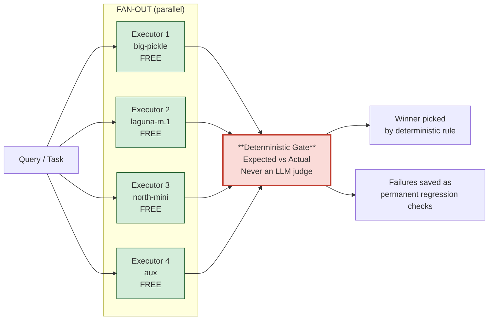
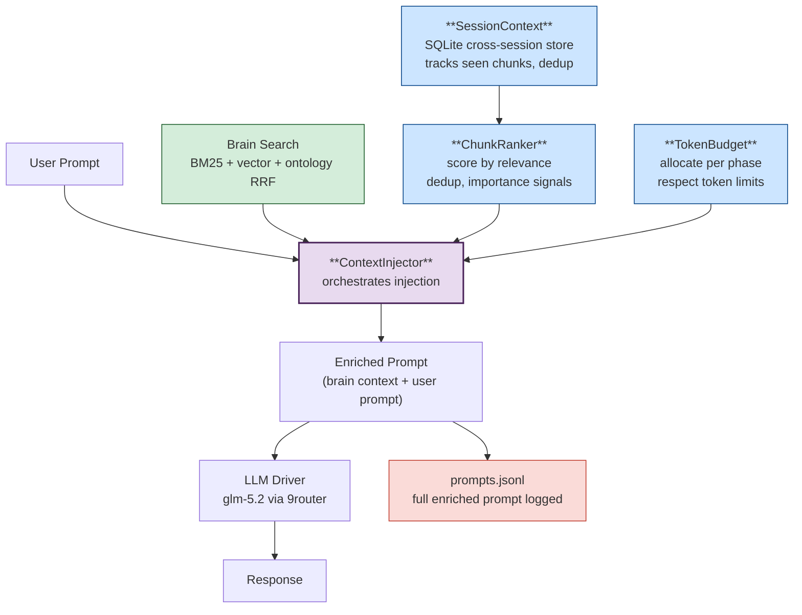
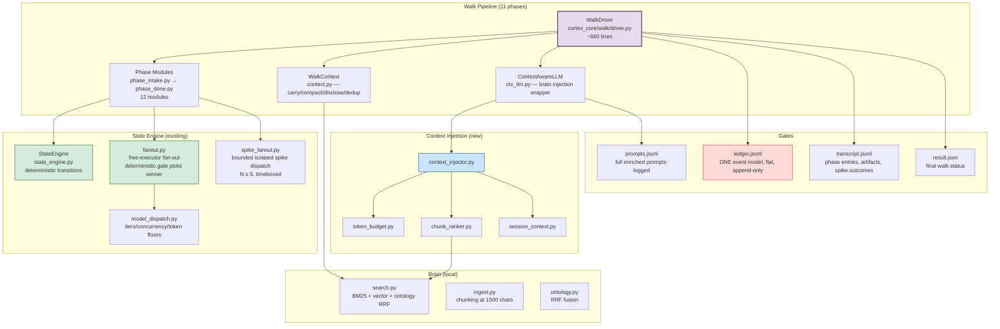
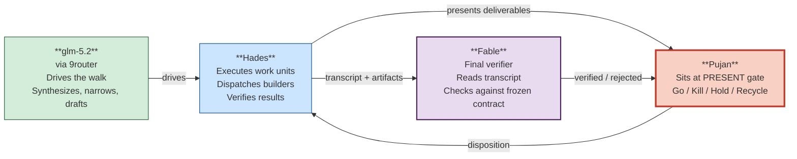

# Cortex Pipeline Architecture

**Date:** 2026-07-16  
**Status:** Walking skeleton complete, 617 tests passing  
**Contract:** `FINAL-PIPELINE-CONTRACT.md` (frozen, 330 lines)  
**Repo:** `D:\claude\cortex-agent-wrapper`

---

## What Is Cortex

Cortex is an 11-phase research-to-execution pipeline that uses **fan-out/fan-in with free LLM executors** to investigate questions, narrow scope, present findings to a human gate, execute work, and verify results — all with deterministic gates and zero LLM self-judging.

The pipeline alternates **fan-out** (diverge, parallel investigation) and **fan-in** (converge, deterministic merge) in a Double Diamond pattern. A human sits at the PRESENT gate. Everything is recorded in a single flat ledger keyed by run-ID.

### Design Principles

1. **Contract must be complete; batches may be small** — all 11 phases ship in the first release as a walking skeleton, then each thickens
2. **Expected outcome takes precedence** — designed backwards from DONE; no "v1 then v2"
3. **Free models only** — 6+ live free executors (big-pickle, aux, laguna-m.1, north-mini); paid models are reviewer-only
4. **Agents are independent** — zero cross-communication, no debate, no consensus voting
5. **All gates are deterministic** — no LLM judge, no self-reported quality scores
6. **Fan-out is bounded** — N ≤ 5 per fan-out point, complexity-gated
7. **Human at the gate** — PRESENT is a 4-way disposition (Go/Kill/Hold/Recycle) decided by a named human, never automated

---

## The 11-Phase Pipeline

### Mermaid Flowchart

```mermaid
flowchart TD
    START([Task Input]) --> P1

    P1["**Phase 1: INTAKE**<br/>fan-out<br/>Search brain from 5 fixed angles<br/>DECISIONS · CODE · FAILURES · RESEARCH · SESSION-HISTORY"]
    P1 --> P2

    P2["**Phase 2: NARROW**<br/>fan-in<br/>Dedup, merge, produce narrowing artifact<br/>Open questions tagged 100%/80%/50% confidence"]
    P2 --> P3

    P3["**Phase 3: RESEARCH**<br/>fan-out<br/>≤5 timeboxed spikes in parallel<br/>Each spike: 1 question, 1 owner, 1 timebox"]
    P3 --> P3b

    P3b["**Phase 3b: RE-NARROW**<br/>fan-in<br/>Fold spike findings, shrink open questions<br/>Saturation check: did this round produce new material?"]
    P3b --> SAT{Saturation<br/>reached?}
    SAT -- "No" --> P3
    SAT -- "Yes" --> P4

    P4["**Phase 4: PRESENT**<br/>🎯 HUMAN GATE<br/>4-way disposition: Go / Kill / Hold / Recycle<br/>Double confirmation required for Go"]
    P4 --> DISP{Disposition}

    DISP -- "Kill" --> P11K["**CLOSEOUT**<br/>Audit: killed at PRESENT"]
    DISP -- "Hold" --> HOLD["Stall + resume<br/>Awaiting user re-entry"]
    DISP -- "Recycle" --> P3
    DISP -- "Go ✅" --> P5

    P5["**Phase 5: EXECUTE**<br/>fan-out<br/>≤5 disjoint work units dispatched<br/>Single writer per artifact, no shared state"]
    P5 --> P6

    P6["**Phase 6: VERIFY**<br/>gate<br/>Deterministic expected-vs-actual checks<br/>Never an LLM judge. Never self-reported."]
    P6 --> VERIFY{All checks<br/>pass?}
    VERIFY -- "No" --> REWORK["Rework round<br/>max 2 retries"]
    REWORK --> P5
    VERIFY -- "Yes" --> P7

    P7["**Phase 7: DELIVER**<br/>fan-in<br/>Expected-vs-actual report<br/>Missed steps, scope creep, say-do ratio"]
    P7 --> P8

    P8["**Phase 8: REVIEW**<br/>gate<br/>Did we miss steps? Scope creep?<br/>Pushback validation. Gaps enumerated."]
    P8 --> P9

    P9["**Phase 9: LEARN**<br/>fan-in<br/>Extract lessons → action items<br/>Every item: 1 named owner + 1 deadline"]
    P9 --> P10

    P10["**Phase 10: NEW RESEARCH**<br/>fan-out<br/>Gap investigation, spike-shaped<br/>Once per gap. Repeat gaps → escalate to user."]
    P10 --> P11

    P11["**Phase 11: DONE**<br/>close<br/>Scribe writes audit record<br/>Who signed off, when, what evidence"]
    P11 --> DONE([Complete])

    style P4 fill:#f9d0c4,stroke:#c0392b,stroke-width:3px
    style P6 fill:#fadbd8,stroke:#c0392b,stroke-width:2px
    style P8 fill:#fadbd8,stroke:#c0392b,stroke-width:2px
    style DISP fill:#fff3cd,stroke:#856404,stroke-width:2px
    style SAT fill:#fff3cd,stroke:#856404,stroke-width:2px
    style VERIFY fill:#fff3cd,stroke:#856404,stroke-width:2px
    style P1 fill:#d4edda,stroke:#155724
    style P3 fill:#d4edda,stroke:#155724
    style P5 fill:#d4edda,stroke:#155724
    style P10 fill:#d4edda,stroke:#155724
    style P2 fill:#cce5ff,stroke:#004085
    style P3b fill:#cce5ff,stroke:#004085
    style P7 fill:#cce5ff,stroke:#004085
    style P9 fill:#cce5ff,stroke:#004085
    style P11 fill:#e2d5f1,stroke:#4a235a
```



### Phase Summary Table

| # | Phase | Type | What Happens | Exit Criterion |
|---|-------|------|--------------|----------------|
| 1 | INTAKE | fan-out | Search brain from 5 fixed angles | All angle results collected (raw, unmerged) |
| 2 | NARROW | fan-in | Dedup, merge, produce narrowing artifact | Fixed-size artifact exists (expected outcome + open questions with confidence) |
| 3 | RESEARCH | fan-out | ≤5 timeboxed spikes, each answering 1 question | Every spike ended (timebox expired or answered) |
| 3b | RE-NARROW | fan-in | Fold findings, shrink open questions, saturation check | List updated, saturation recorded |
| 4 | PRESENT | **gate** | Human decides: Go / Kill / Hold / Recycle | Recorded disposition. Go requires double confirmation |
| 5 | EXECUTE | fan-out | ≤5 disjoint work units dispatched to free executors | All units returned or timed out |
| 6 | VERIFY | **gate** | Deterministic expected-vs-actual checks | All checks pass, or failure escalated |
| 7 | DELIVER | fan-in | Expected-vs-actual report (diffs, missed steps, scope creep) | Report written |
| 8 | REVIEW | **gate** | Coverage check, gap enumeration | Gaps enumerated |
| 9 | LEARN | fan-in | Lessons → action items with owner + deadline | 100% of items have owner + deadline |
| 10 | NEW RESEARCH | fan-out | Spike investigation for each gap | Each gap investigated once; repeats escalate |
| 11 | DONE | close | Scribe writes audit record | Audit fold matches ledger |

---

## Fan-Out / Fan-In Method

### How Dispatch Works



### Four Binding Rules

1. **Agents are independent** — zero cross-communication. No debate, no rounds, no consensus. DarkForest pattern: independent agents + structured aggregation beats debate by up to 30.7% with 6.5× fewer tokens.

2. **Fan-out is bounded (N ≤ 5)** — Ringelmann Effect: effective-to-nominal ratio declines with team size. Raising N requires measured evidence that the marginal angle contributes unique results (~40% uniqueness benchmark from Bing production).

3. **Fan-out is complexity-gated** — simple lookups (1 known question, 1 known location) run 1 agent. Maximum-context strategy on simple tasks wastes 85–92% of resources. Fan-out is reserved for hard, multi-angle questions.

4. **Fan-in is deterministic** — merge = dedup by rule; winner-picking = deterministic gate. Never an LLM judge, never majority voting, never self-reported quality scores. Self-reported quality routing selects the *worst* delegates — worse than random.

### Free Executors (6 live, confirmed 2026-07-16)

| Executor | Tier | Model | Lane | Cost |
|----------|------|-------|------|------|
| big-pickle | opencode-zen | big-pickle | opencode | $0 |
| aux | ninerouter-aux | (9router aux) | ninerouter-aux | $0 |
| laguna-m.1 | openrouter | poolside/laguna-m.1:free | openrouter | $0 |
| north-mini | openrouter | cohere/north-mini-code:free | openrouter | $0 |
| laguna-xs | openrouter | poolside/laguna-xs-2.1:free | openrouter | $0 |
| qwen35b | qwen35b | qwen3.6-35b-a3b. | qwen35b | $0 |

**Premium tiers (reviewer-only, NEVER executors):** opus, sonnet, fable-max, haiku, chatgpt-5.5xhigh

---

## Context Injection System

The pipeline injects brain context into every LLM call, ensuring nothing important gets missed.



### What Was Built

| Module | Lines | Purpose |
|--------|-------|---------|
| `token_budget.py` | ~6KB | Replaces blind `[:1200]` truncation with real token counting and per-phase budget allocation |
| `chunk_ranker.py` | ~6KB | Ranks brain search chunks by relevance, deduplicates, surfaces cross-angle importance signals |
| `session_context.py` | ~13KB | SQLite-based cross-session context store — tracks runs, phases, decisions, seen chunks |
| `context_injector.py` | ~10KB | Orchestrates: search brain → rank chunks → allocate budget → inject into prompt |
| `ctx_llm.py` | — | ContextAwareLLM wrapper — injects brain context into every LLM call, logs full enriched prompt |

### Injection Stats (from real walk)

- **Total LLM calls:** 13
- **Injected calls:** 13 (100%)
- **Avg brain block length:** 4,954 chars
- **Phases with injection:** INTAKE, NARROW, RE-NARROW, PRESENT, EXECUTE

---

## Architecture Map

### Core Components



### File Map

| Component | File | What It Does |
|-----------|------|-------------|
| **Walk Driver** | `cortex_core/walk/driver.py` | 11-phase drive loop, state machine transitions, artifact persistence |
| **Phase Modules** | `cortex_core/walk/phase_*.py` | 12 phase implementations (intake through done) |
| **Walk Context** | `cortex_core/walk/context.py` | Managed context spine — carry, compact, disclose, dedup |
| **Context LLM** | `cortex_core/walk/ctx_llm.py` | LLM wrapper that injects brain context into every call |
| **Ledger** | `cortex_core/walk/ledger.py` | Single flat event model, append-only, run-ID keyed |
| **Spikes** | `cortex_core/walk/spikes.py` | Spike lifecycle: create, run, end/expire with timebox |
| **Spike Fanout** | `cortex_core/walk/spike_fanout.py` | Bounded isolated dispatch (N ≤ 5), reuses fanout.py lane discipline |
| **Gates** | `cortex_core/walk/gates.py` | Gate composer (fail-closed), non-waivable phase enforcement |
| **Checks** | `cortex_core/walk/checks.py` | Deterministic verify checkers (expected vs actual) |
| **Fanout** | `cortex_core/fanout.py` | Free-executor fan-out + deterministic gate, 619 lines |
| **State Engine** | `cortex_core/state_engine.py` | Chart engine, deterministic transitions, idempotency |
| **Search** | `cortex_core/search.py` | BM25 + vector + ontology RRF, chunk_text() at 1500 chars |
| **Token Budget** | `cortex_core/token_budget.py` | Real token counting, per-phase budget allocation |
| **Chunk Ranker** | `cortex_core/chunk_ranker.py` | Relevance scoring, dedup, importance signals |
| **Session Context** | `cortex_core/session_context.py` | SQLite cross-session store, seen-chunk tracking |
| **Context Injector** | `cortex_core/context_injector.py` | Orchestrates search → rank → budget → inject |

---

## Confirmation Rules (Non-Negotiable)

### The PRESENT Gate

The PRESENT gate is a **4-way disposition** decided by a named human:

| Disposition | What Happens | Confirmation Required |
|-------------|-------------|----------------------|
| **Go** | Proceed to EXECUTE | Double confirmation (two explicit "yes") |
| **Kill** | Walk ends, audit records "killed at PRESENT" | None |
| **Hold** | Walk stalls, awaits user re-entry | None |
| **Recycle** | Re-enter RESEARCH with named unanswered assumptions | None |

Three of four dispositions are NOT Go — this is the structural form of "never eager to confirm."

### Evidence Depth Scales With Reversibility

| Door Type | Evidence Required | Confirmation |
|-----------|------------------|-------------|
| **One-way** (irreversible/destructive) | Full PRESENT checklist, high evidence | Double confirmation |
| **Two-way** (reversible) | Lighter deliverable set, ~70% information | Double confirmation |

### Key Rules

1. **Double confirmation** — nothing moves to EXECUTE without TWO explicit "yes"
2. **Never eager to confirm** — always suggest further research first
3. **Accidental confirmation = NOT confirmed** — ambiguous messages treated as unconfirmed
4. **Research is always welcome** — "research more" takes priority over execution at any point

---

## Role Separation



---

## Test Coverage

| Suite | Tests | Status |
|-------|-------|--------|
| Walk phase tests | 570 | ✅ All pass |
| Token budget tests | 22 | ✅ All pass |
| Chunk ranker tests | 21 | ✅ All pass |
| Session context tests | 31 | ✅ All pass |
| Context injector tests | 24 | ✅ All pass |
| Context integration tests | 8 | ✅ All pass |
| **Total** | **617** | **✅ All pass** |

Run: `python -m pytest tests/ --timeout=300`

---

## CLI Commands

```bash
cd /d/claude/cortex-agent-wrapper

# Probe live executors
cortex-models

# Run a walk
python run_real_walk.py

# Run tests
python -m pytest tests/ --timeout=300

# Search the brain
cortex-search --hybrid "living ontology"

# Fan out a query to free executors
cortex-fanout "query here"
```

---

## Evidence Base

The pipeline design is backed by 44+ research papers:

- **EVIDENCE-FOR** (20+ papers): Multi-agent search recall +9.4–12.5%, accuracy +2–38.7%, hallucination 15% → 1.45%
- **EVIDENCE-AGAINST** (24+ papers): Conformity 57–77% correct→wrong flips, debate costs 2.1–3.4× tokens for equal/lower accuracy, Ringelmann scaling ceilings

Key patterns adopted:
- **DarkForest** — independent agents + structured aggregation beats debate by 30.7% with 6.5× fewer tokens
- **ConSensus** — single-round fusion matches iterative debate at 12.7× lower token cost
- **Amazon PR/FAQ** — write the finished product's press release before any code
- **Shape Up** — circuit-breaker timeboxes, scope with explicit no-gos
- **Google SRE** — every action item gets a single named owner + deadline
- **DORA** — small batches predict higher delivery performance
- **NN/g** — ~5 units surface most findings, saturation stops the search

---

## Current State (2026-07-16)

### ✅ Complete
- All 11 phases implemented and walking end-to-end
- 617 tests passing
- Real dispatch wired (free executors, not stubs)
- Context injection system (4 modules + ContextAwareLLM)
- Human gate (FileBasedIO, pauses for response)
- RECYCLE disposition implemented
- Transcript logging (phase entries, artifacts, spike outcomes)
- Prompts.jsonl logging (full enriched prompts)
- Fable verification package ready

### 🔄 Next Steps
1. Run a real walk with the 14-issue list as the task
2. User sits at PRESENT gate (Go/Kill/Hold/Recycle)
3. Fable reads transcript, verifies against frozen contract
4. Batch 4: E2E tests + frozen conformance suite + docs

---

*Source: `FINAL-PIPELINE-CONTRACT.md` (330 lines, frozen), `DESIGN/` specs (18 files), `ARCHITECTURE.md`. All claims trace to contract sections with citation conventions.*
