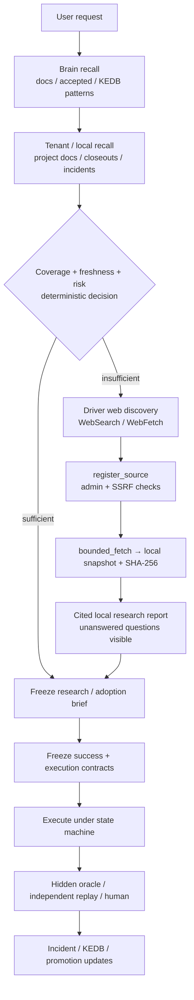
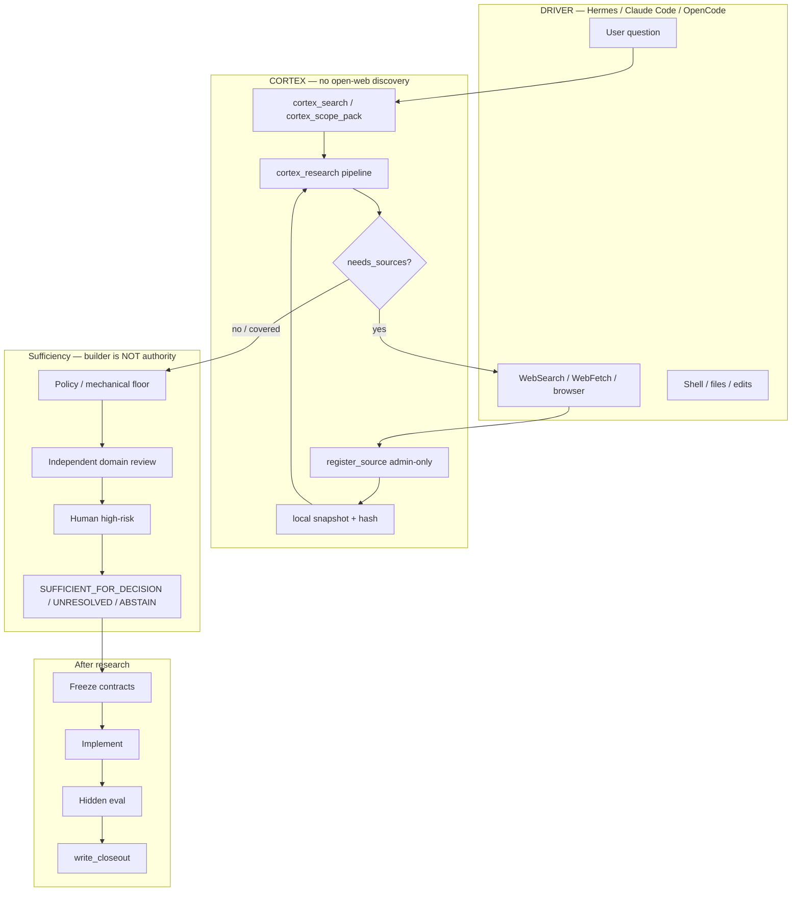
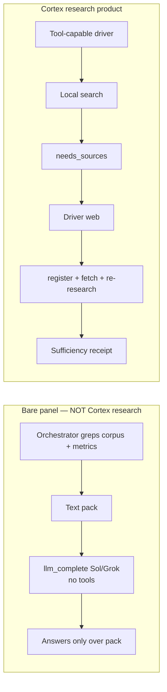

# Cortex research path — end-to-end flowchart (2026-07-19)

**Audience:** owner (non-expert-friendly)  
**Why this exists:** Mermaid in chat clients often does not render. This page is published so GitHub (and the HTML companion) can render the diagrams.  
**Repo note:** `private-study-log` is currently **public** on GitHub despite the name — treat content accordingly.

**Sources (Cortex corpus, not vibes):**
- `docs/harness/KNOWLEDGE-ESCALATION.md` (normative target + “not enforced today”)
- `cortex_core/research.py` (`run_research`)
- `cortex_core/mcp.py` (`cortex_register_source` — caller has web tools; Cortex does not)
- `docs/harness/START-HERE.md` / `CAPABILITY-STATUS.md`
- OpenCode session 2026-07-19: bare `llm_complete` panels vs tool-capable drivers

---

## 0. One-line mental model

```text
Cortex  =  local memory + fetch-of-REGISTERED-URLs + cite/sufficiency gates
Driver  =  discovery (web) + tools + mutation
Bare llm_complete  =  judge over text you already packed  (NOT research)
fanout (this repo)  =  multi-model BUILD executors  (NOT web-research fanout)
```

---

## 1. Why it was built this way (not “lazy”)

| Design goal | Consequence for research |
|-------------|---------------------------|
| Evidence over vibes | Prefer local, hashed, re-searchable sources over live snippets |
| Don’t trust model confidence | Sufficiency = gates/receipts, not “I researched enough” |
| Don’t poison the Brain | Web discovery is **driver-side**; `register_source` is **admin-gated** |
| Cheap / offline-capable | No paid search API required; agent-assisted discovery |
| Fail closed on “researched” | Missing sources → `needs_sources` / `UNRESOLVED`, not fake completeness |

This is closer to **enterprise RAG + gated ingest** than to Perplexity / multi-agent web research products.

---

## 2. Target path (what the contract says you should get)



---

## 3. What `cortex_research` actually does in code

```mermaid
flowchart LR
  Q[question] --> F{do_frame?}
  F -->|yes| H1[Haiku frame → sub_questions]
  F -->|no| SQ[sub_questions = question]
  H1 --> REG[load sources.yaml registry]
  SQ --> REG
  REG --> SEL[select_sources by topics]
  SEL --> BF{do_fetch?}
  BF -->|yes| GET[bounded_fetch ONLY registered URLs]
  BF -->|no| EV
  GET --> EV[gather_evidence on LOCAL index<br/>Brain + tenant]
  EV --> CC[cite_check<br/>coverage / corroboration / unanswered]
  CC --> GAP[assess_source_gap → needs_sources?]
  GAP --> SUM{do_summarize?}
  SUM -->|yes| H2[Haiku summarize findings]
  SUM -->|no| WR
  H2 --> WR[write_report + rebuild tenant index]
```



**Critical:** there is **no** step “open the open web and pick URLs.”  
Web only enters after **driver discovers URL → register_source → fetch to disk**.

---

## 4. Full system map (driver + Cortex + sufficiency)



---

## 5. What went wrong in the “research subagent” panels (2026-07-19)



| Expectation | Reality of bare `llm_complete` |
|-------------|-------------------------------|
| Subagents use search tools | No tools attached |
| Fanout = web research | Fanout = multi-model **build** |
| Outside-corpus citations | Only if **you** already put them in the pack |

---

## 6. Is “one orchestrator packs sources” enough?

| Claim type | Pack-only judgment | Real research pipeline |
|------------|--------------------|------------------------|
| In-repo decisions, contracts, your metrics | Often **enough** | Still better with citations |
| Open-world (market, papers, vendor status, “is Opus dead”) | **Not enough** | Need independent external captures + cite-check + named sufficiency |

**Honest implementation gaps** (from `KNOWLEDGE-ESCALATION.md` “Not enforced today”):
- Cortex does not discover the open web itself  
- Driver web calls are not auto-joined to the research task  
- Source diversity / trust weighting weak  
- Quarantine + poisoning scan + Brain promotion incomplete  
- Production sufficiency signers not fully live  

So: **gates are strong in design; research depth is still half-wired.**

---

## 7. Improvements (ranked)

| # | Improvement | Fixes |
|---|-------------|--------|
| 1 | **Tool-loop researchers** (search + web + fetch + register + re-research) | Agents validate outside the pack |
| 2 | **Mandatory external leg** when `needs_sources` or EXTERNAL fact class | Stops corpus-only theater |
| 3 | **Join driver web events → research task_id** | End-to-end audit |
| 4 | **Multi-agent research fanout** (different vendors discover; then adjudicate) | Not build-fanout |
| 5 | **Non-Claude summarizer** for research (today frame/summarize can be Haiku) | Anti-circularity on Claude topics |
| 6 | **Source diversity gates** (authority, independence, freshness) | Counts ≠ corroboration |
| 7 | Wire **assured_research** + sufficiency receipts on OpenCode path | “Researched” = receipt |

---

## 8. Related study-log / Cortex artifacts

- Live Claude bias metrics: `ops/claude_bias_prometheus_exporter.py` (in stupidly-simple-cortex)
- Calibration: `calibration/results/BIAS-AUDIT.md`, `evals/reports/STAGE1_REPORT.md`
- Anti-circularity draft: `docs/design/DRAFT-CONTRACT-anti-circularity-law-2026-07-19.md`
- OpenCode preflight/closeout: `docs/OPENCODE-PROTOCOL.md`, `cortex_core/session_preflight.py`

---

## 9. HTML companion

If Mermaid still fails in your viewer, open:

**[cortex-research-path-flowchart-2026-07-19.html](./cortex-research-path-flowchart-2026-07-19.html)**

(uses Mermaid.js from CDN; works offline-ish once cached in browser)

---

*Published from OpenCode session 2026-07-19 for owner clarity. Not a freeze; not a contract amendment.*
