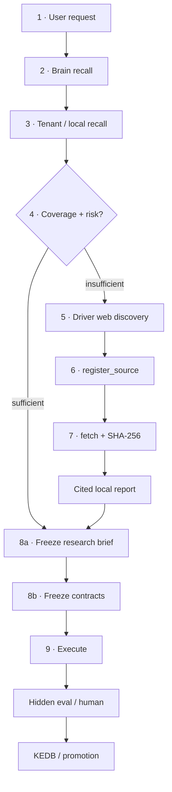
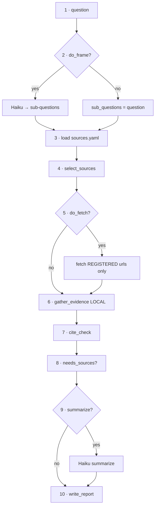
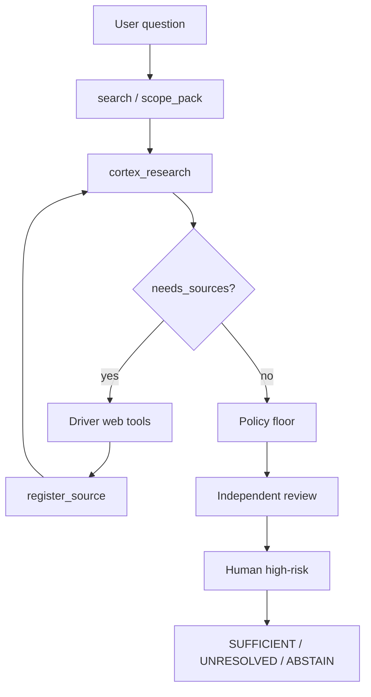
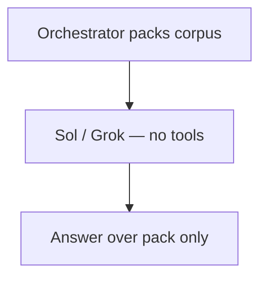
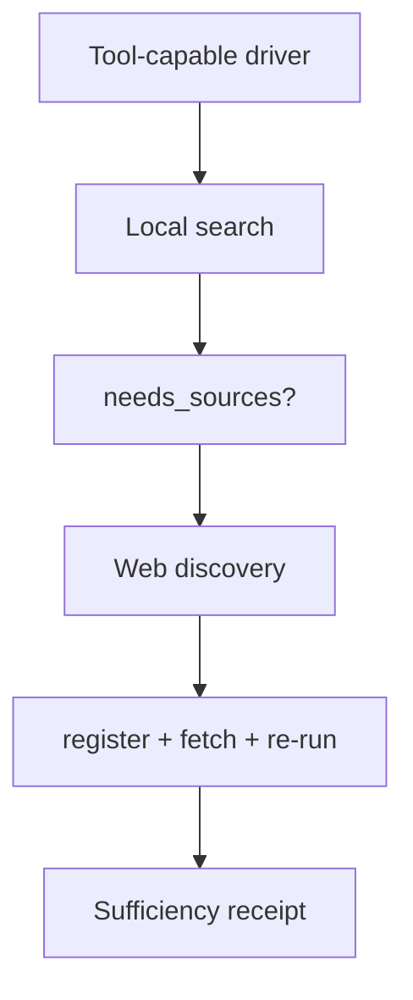

# Cortex research path — end-to-end flowchart (2026-07-19, v2 mobile)

**Audience:** owner (phone + laptop)  
**Diagram standard:** `WORK-METHODOLOGIES.md` **M27** (vertical / mobile-first; dual channel)  
**HTML (best on phone):** [cortex-research-path-flowchart-2026-07-19.html](./cortex-research-path-flowchart-2026-07-19.html)

All Mermaid below is **`flowchart TB`** (top→bottom). Each section has a text step list first.

---

## 0. One-line model

```text
Cortex  = local memory + fetch of REGISTERED URLs + cite/sufficiency gates
Driver  = web discovery + tools + mutation
Bare llm_complete = judge over a pack (NOT research)
fanout (this repo) = multi-model BUILD (NOT web-research fanout)
```

---

## 1. Target path (contract)

**Steps:**
1. User request  
2. Brain recall  
3. Tenant / local recall  
4. Coverage + freshness + risk → sufficient **or** driver web  
5. register_source  
6. bounded_fetch + SHA-256  
7. Cited local report  
8. Freeze research brief → freeze contracts  
9. Execute → eval / human → KEDB  



---

## 2. What cortex_research does

**Steps:** question → optional frame → load registry → select sources → fetch registered only → local gather → cite_check → needs_sources? → optional summarize → write_report  



---

## 3. Driver + Cortex + sufficiency

**Steps:** user → search → research → needs_sources? → (web → register → re-run) **or** policy → independent → human → receipt  



---

## 4. Bare panel vs real research

### A — Bare llm_complete (NOT research)



### B — Real Cortex research



---

## 5. Improvements ranked

| # | Improvement | Fixes |
|---|-------------|--------|
| 1 | Tool-loop researchers | Agents validate outside the pack |
| 2 | Mandatory external leg | Stops corpus-only theater |
| 3 | Join driver web → task_id | Audit trail |
| 4 | Multi-agent research fanout | ≠ build fanout |
| 5 | Non-Claude summarizer | Anti-circularity |
| 6 | Source diversity gates | Counts ≠ corroboration |
| 7 | assured_research on OpenCode | Researched = receipt |

---

## Methodology

- **M27** owner-legible diagrams (vertical / mobile-first) — `docs/methodology/WORK-METHODOLOGIES.md`
- **Research-only draft contract** — `docs/design/DRAFT-CONTRACT-research-only-path-2026-07-19.md`

*v2 rebuild 2026-07-19: all charts TB; dual text+diagram; phone column.*
