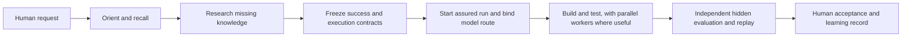

# Start here: what Cortex does and what to expect

This is the short, human-first map of Cortex. It explains the intended experience, the evidence a
real run should produce, and what is actually usable today. It is not a claim that every stage is
already connected.

## The 30-second answer

Cortex is meant to help an AI runtime such as Hermes, Claude, or Codex complete difficult work from
research through implementation and independent evaluation. It supplies shared knowledge, frozen
success rules, workflow state, model-routing policy, evidence records, and learning from prior
failures. The runtime supplies the models and the tools that actually browse, edit, run, and test.

Cortex is **not** a model, a generic dashboard generator, a substitute for domain experts, or proof
that an output is correct merely because an agent followed its phases. A builder cannot certify its
own work. Telemetry, screenshots, receipts, and state transitions prove only the facts they actually
record.

**Current truth, checked against [CAPABILITY-STATUS.md](CAPABILITY-STATUS.md):** many core mechanisms
exist and pass component tests, but the inspected live Hades/Hermes route has not yet been replayed
after its configuration changes. No model is currently route-ready, the route-to-real-call actuator
is not built, production signer services are not deployed, and there is no universal live external
evaluator or cross-driver harness. A production-quality application must therefore **not** be called
"Cortex-governed" today. The honest current result is `BLOCKED`, `UNRESOLVED`, or an explicitly
permitted advisory/ungoverned run.

## What a complete user journey should look like

The table below describes the target journey and identifies today's gaps. "Built" means code exists;
it does not mean the live route has proved the behavior.

| Stage | Who owns it | What the user should see | Expected tool or evidence output | Current truth |
|---|---|---|---|---|
| 1. Request and boundaries | Human + strong planner | Restated outcome, constraints, unknowns, consequential human decisions, and what will count as success | Request digest and a draft brief | The documentation contract exists; consistent runtime presentation is only partial |
| 2. Connect and orient | Runtime wrapper + main Cortex | Whether Cortex is connected, access mode, current run readiness, and a key-free model roster with freshness and blockers | `cortex_register` returns a session identity; `cortex_status` returns access/health and a compact catalog; `cortex_dispatch_tier(action="catalog")` returns the full no-spend catalog | Catalog and local status path are built. Corrected Hades configuration still needs a live gateway restart/replay |
| 3. Recall prior knowledge | Main Cortex Brain + tenant project + KEDB | Which prior decisions, project records, incidents, promoted patterns, and public oracle metadata were actually found; no hidden evaluator fixtures | `cortex_search` or `cortex_scope_pack`, with store/plane provenance, coverage, paths read, and an attributable search record | Composite recall is built and enforced inside those tools, not across every driver workflow; live Hades use is unproved |
| 4. Close knowledge gaps | Runtime web tools + Cortex research | Research questions, local coverage gaps, accepted sources, failed providers, contradictions, and unanswered questions | `cortex_research(action="run"/"status")` yields a task ID, `needs_sources`, report/citation results; accepted discoveries go through `register_source` and retain URL, local path, and SHA-256 | Fetch, capture, and reports are partial. Cortex does not discover the open web itself, driver web calls are not automatically joined, and source-quality/adoption gates are incomplete |
| 5. Decide whether research is usable | Cortex policy gate + independent domain reviewer + human where required | "Sufficient for decision X as of Y," or a visible unresolved/abstain result; never "all research is complete" | A decision-bound research receipt: `SUFFICIENT_FOR_DECISION`, `UNRESOLVED`, or `ABSTAIN`, tied to policy, evidence snapshot, reviewer, risk, and expiry | Core verification and assured-track gate are built locally. Production signer services, protected trust/DB deployment, and live Hermes integration remain open |
| 6. Freeze the rules | Human + planner + external observer | One success contract for the result and one execution contract for the required process, including fallback and human boundaries | Canonical SHA-256 digests of both contracts; approach details may be prepared through `cortex_contract` | Schemas and core validation exist. Runtime-wide use is not yet closed end to end |
| 7. Start the assured run | Main Cortex state engine | `ASSURED`, server-issued task/run identity, current phase, sequence number, legal next tools, and fallback policy | `cortex_run_start(track="assured_build" or "assured_research")` returns `task_id`, `run_id`, state, sequence, and assurance mode; each `cortex_run_step` returns the next state receipt | Local no-spend probe reached this route. The live Hades gateway has not yet been restarted and replayed. Legacy `build`, `research`, and local wrapper `cortex-govern` are not assured |
| 8. Select and bind models | Main Cortex router + runtime call adapter + external observer | Exact served model, capability evidence, fresh availability, cost/free status, independence, task scorecard, and why candidates were rejected | `cortex_dispatch_tier(action="route")` returns a route receipt or `MODEL_ROUTE_UNRESOLVED`; the actual provider/model call must carry and externally prove the same route/run identity | Route planning is built, but current data is stale or unqualified and zero models are route-ready. Generic route-to-call/delegation binding is missing |
| 9. Activate the driver | External preflight signer + wrapper display | `GOVERNED_ACTIVE` only after the signed observation proves the assured track, contracts, live tools/model call, route binding, evaluator readiness, telemetry policy, and joined IDs | `cortex_contract(action="driver_preflight")` verifies an external signed observation and returns the activation status | Verification code and Hades hook exist. The external signer is not deployed and there is no live end-to-end proof |
| 10. Implement and integrate | Runtime driver + qualified workers + Cortex mission engine | Claimed work partitions, active workers, tests, final artifact identity, and visible failures; not just worker prose | Mission/worker IDs, disjoint claims, per-worker receipts, merge receipt, native tool events, final artifact hashes, and remote container/test receipts where required | Mission and narrow app-gate components exist. Detached-delegate, final-merge, and real cross-driver enforcement are not proved |
| 11. Evaluate outside the builder | Independent evaluator + clean driver/environment | Hidden task-specific behavior results, direct user-journey replay, security/boundary findings, and separate result axes | Signed external result bound to run, contracts, final artifact/evidence manifest, evaluator/replay identity, and expiry; stored `ar_...` receipt can be rechecked with `cortex_contract(action="receipt_status")` | Signed-result ingestion is built locally. No universal live evaluator runner, production signer isolation, or CaseOS end-to-end run exists yet |
| 12. Accept and learn | Human + Cortex closeout/KEDB/current-state system | Procedure, behavior, evidence, independence, repeatability, and human acceptance shown separately; failures remain searchable | Evidence-index closeout, human accept/reject/unresolved record, incident/KEDB links, and replay-anchored current-state/ontology projections | Task-bound closeout ingestion, atomic current/projection publication, ontology synchronization/drift detection, active-only retrieval, recovery, CLI and doctor are built locally. This checkout is not bootstrapped because no production external authority verifier exists; cross-repository signed synchronization and human acceptance automation remain open |

## Who owns what

| Component | Owns | Must not claim or do |
|---|---|---|
| Human owner/domain expert | Intent, risk acceptance, subjective product quality, and consequential legal/medical/financial/security decisions | Delegate nondelegable judgment to a model |
| Hermes/Claude/Codex runtime | Native browsing, coding, shell/browser/API work, orchestration, and displaying Cortex-issued status | Mint its own assurance, research authority, or evaluator result |
| Wrapper/host adapter | Thin connection, lazy tool discovery, provider-call transport, and preserving server-issued run/task/route IDs | Become a second Cortex brain or assurance authority |
| Main Cortex | Brain/local/KEDB recall, contracts, assured state, research receipt checks, route plans, run identity, evidence indexing, and receipt verification | Treat a state walk, model statement, ontology entry, or telemetry event as product correctness |
| Model workers | Propose, research, implement, test, and adversarially review within assigned work | Certify their own output or decide hidden evaluation |
| Gravebuster | Remote Docker/container execution and its operational evidence | Decide whether the product is correct |
| OTel and Langfuse | Correlated observability using the same run/task/route identities | Act as verdict authority |
| External evaluator | Hidden checks, direct artifact inspection, replay, and signed result | Share hidden fixtures with the builder or reuse the builder as the sole judge |
| Current-state reducer and projections | Derive current operational state and human/agent views from accepted events | Let the newest transcript or ontology entry silently replace project truth |

## What the status words mean

| Status | Plain-language meaning |
|---|---|
| `PASS` | One named axis passed its frozen checker. It is not automatically an overall pass |
| `FAIL` | A frozen requirement was observed to fail; other axes are still reported separately |
| `SUFFICIENT_FOR_DECISION` | The named research decision met its policy as of a stated time; it does not mean research is universally complete |
| `UNRESOLVED` | Required evidence or authority is missing or contradictory; do not guess |
| `ABSTAIN` | The available authority cannot honestly decide the question |
| `ENVIRONMENT_UNAVAILABLE` | A required tool, provider, telemetry plane, or environment could not be exercised; this is not evidence of task success or failure |
| `BLOCKED` | The frozen fail-closed policy forbids proceeding as governed until prerequisites exist |
| `UNGOVERNED_RUN` | Cortex was absent or required governance evidence was unavailable; work may continue only if the contract explicitly permits it and it must retain this label |
| `ADVISORY_RUN` | Cortex guidance may be used, but the run does not receive a governance claim |
| `LEGACY_UNASSURED` | A compatibility/local route may enforce some ordering or checks but lacks the assured research and external-activation boundary |
| `GOVERNED_ACTIVE` | An external signed preflight has verified the exact live route and contract. Repository code existing is not enough |

## Current versus target at a glance

| Area | Built/local evidence | Live or end-to-end truth now | Target |
|---|---|---|---|
| Knowledge | Composite Brain/tenant/KEDB recall, source registration/fetch, research reports | Recall is not mandatory across every workflow; web discovery and source-quality policy are not closed | Evidence-gap-driven recall, discovery, capture, quality review, and reuse in one joined run |
| Assurance | Assured charts, decision-specific research receipts, signed preflight/result verification | Signer services and live Hades replay are missing | OS-separated authorities and independently reproducible governed activation/result |
| Models | Key-free joined catalog and fail-closed route planner | Stale/unqualified evidence; zero route-ready; no route-to-call actuator | Cheapest qualified model per stage, with real-call binding and outcome feedback |
| Execution | State engine, mission/claim and narrow app-gate components | Cross-driver merge, remote evidence join, and task-specific acceptance are not closed | One correlated run from request through final artifact, replay, and human decision |
| Evaluation | Objective lanes and signed external-result ingest boundary | No universal live runner or CaseOS integration | Hidden task-matched checks plus independent replay and human boundaries |
| Observability | Joined run/task/route fields in local OTel/Langfuse payloads | Remote gravebuster/Langfuse correlation is unproved | Queryable cross-plane evidence for the same run; still not verdict authority |
| Current state | Deliberate hand-authored root handoff until explicit bootstrap; built append-only store, authority-gated reducer, generated views, ontology receipt/sync, active-only retrieval, CLI/doctor and recovery (113 targeted tests) | Production authority verifier/signer, trusted normative bootstrap, signed cross-repo/runtime ingestion, and live Hades replay are not complete | Rebuildable `project-state/current.json`; generated handoff/resume/status/doc views; `ontology-sync.json`; replay-checked operator status |

## Find the answer without reading everything

| Question | Read |
|---|---|
| What is the current goal, checkout, blocker list, and safe continuation? | [Root HANDOFF.md](../../HANDOFF.md) |
| What experience and quality standard should a user expect? | [EXPECTED-BEHAVIOR.md](EXPECTED_BEHAVIOR.md) |
| Who acts at each runtime stage and what receipt should exist? | [RUNTIME-MAP.md](RUNTIME-MAP.md) |
| What do the execution and success contracts freeze? | [CONTRACTS.md](CONTRACTS.md) |
| When should Cortex search Brain, local history, KEDB, or the internet? | [KNOWLEDGE-ESCALATION.md](KNOWLEDGE-ESCALATION.md) |
| Which mechanisms are built, live, enforced, and tested right now? | [CAPABILITY-STATUS.md](CAPABILITY-STATUS.md) |
| How should current truth replace transcript/handoff drift? | [CURRENT-STATE-AUTOMATION.md](CURRENT-STATE-AUTOMATION.md) |

If documents appear to disagree, use `CAPABILITY-STATUS.md` for whether a capability is currently
built/enabled/enforced/tested, and use root `HANDOFF.md` for the present continuation and owner
constraints. Normative target documents describe what must eventually be true; they do not activate
the behavior by being written.

## Resume in five minutes or less

1. **First minute:** read the current-truth paragraph at the top of this page. Assume the run is not
   governed unless signed live governance activation says otherwise.
2. **Second minute:** open [root HANDOFF.md](../../HANDOFF.md), read **Honest blockers** and the rule
   not to restart Hades or start CaseOS without owner approval.
3. **Third minute:** open [CAPABILITY-STATUS.md](CAPABILITY-STATUS.md) and read **Immediate blockers**.
   This is the current human-readable inventory of what is actually enabled and enforced.
4. **Fourth minute:** inspect the current project-state/diff summary without opening secret files.
   Preserve unrelated work. If the owner has approved live work, use only a no-spend
   `environment readiness -> register -> status/catalog -> assured start -> route -> signed
   governance-activation attempt` replay.
5. **Fifth minute:** choose the first unmet blocker as the next task. Today, expect route or activation
   to return `UNRESOLVED`/`BLOCKED`; recording that honestly is correct behavior.

Do not reconstruct the project from chat transcripts, do not treat an old closeout as current merely
because it is newer, and do not turn an unavailable environment into a passing claim.
