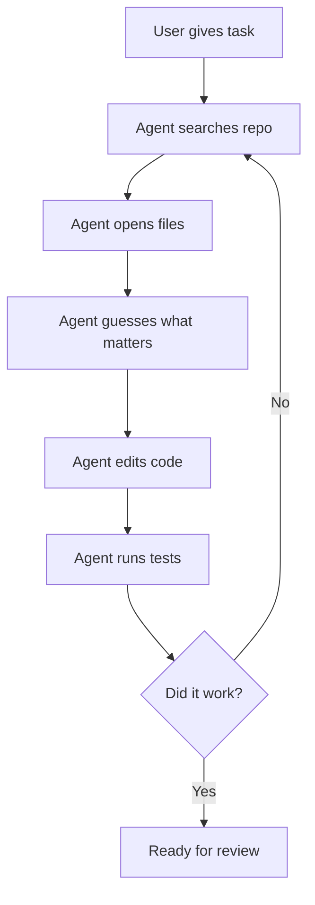
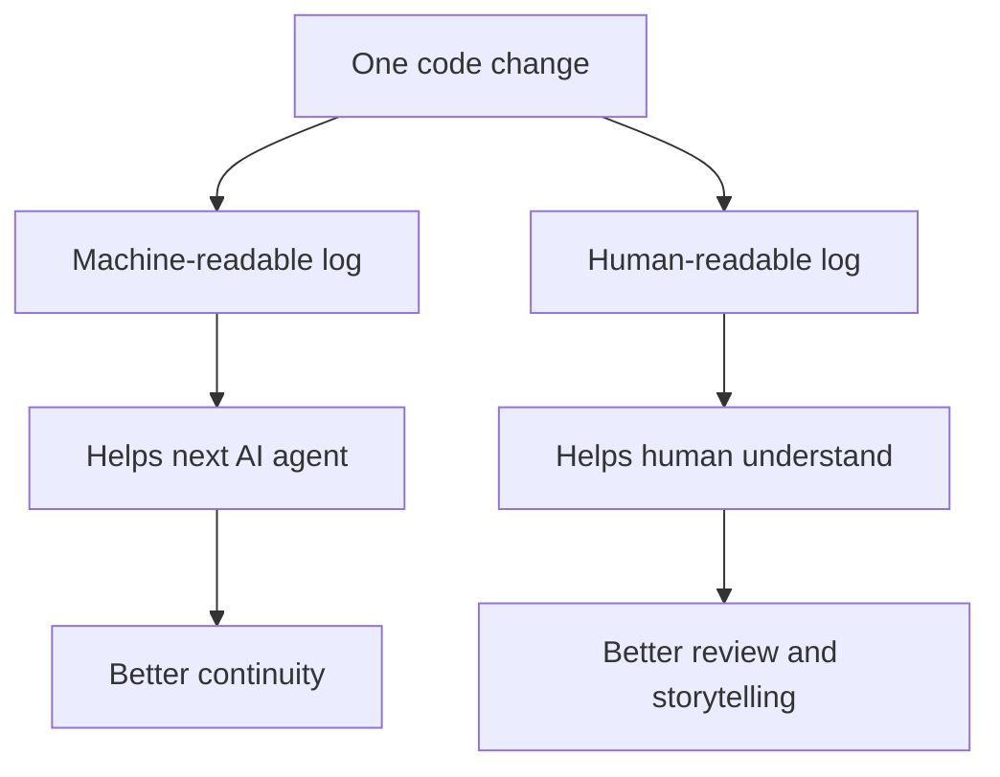
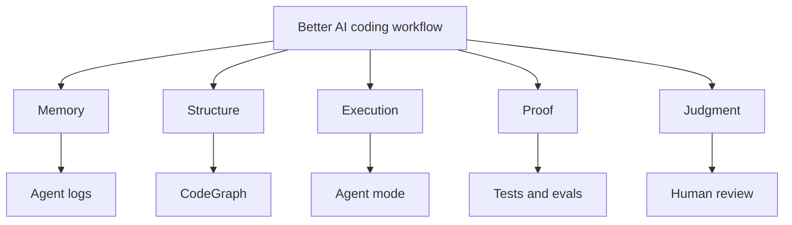
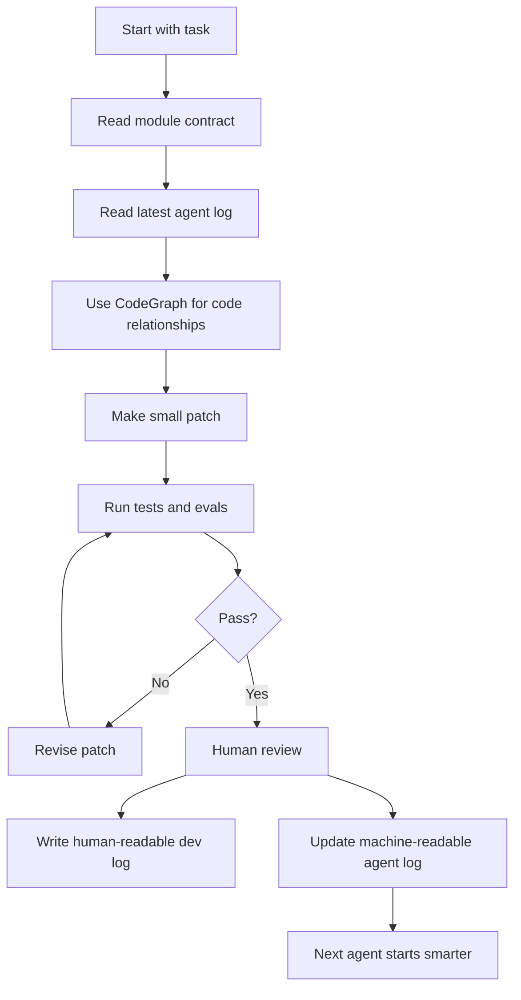
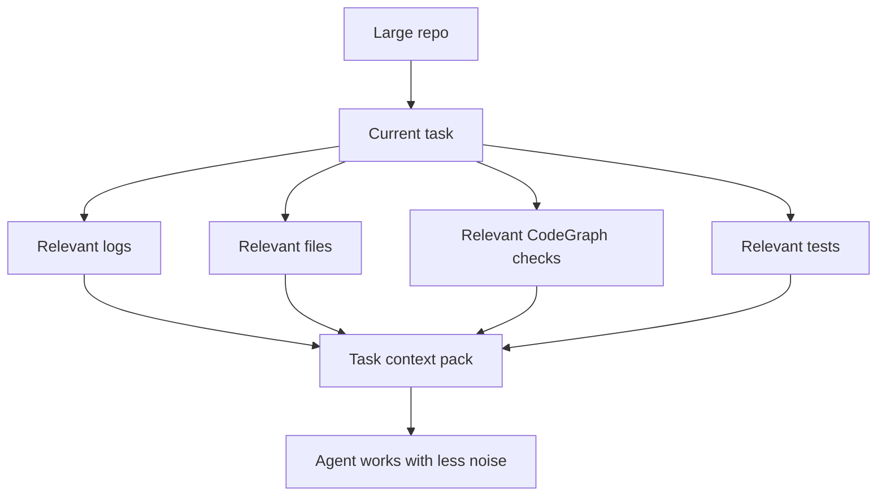

# Making AI Coding Agents More Reliable: Agent Logs, CodeGraph, and Simple Module Contracts

> A simple learning note on how I am improving my Cursor workflow by comparing my own agent logs with CodeGraph, and by thinking about the benefits, tradeoffs, and easy ways others can try the same idea.

---

## Table of Contents

1. [Why I Started Thinking About This](#why-i-started-thinking-about-this)
2. [The Problem With Normal Agent Mode](#the-problem-with-normal-agent-mode)
3. [My Existing Workflow](#my-existing-workflow)
4. [Where CodeGraph Fits](#where-codegraph-fits)
5. [The Simple Difference](#the-simple-difference)
6. [Benefits](#benefits)
7. [Tradeoffs](#tradeoffs)
8. [The Simple Contract Anyone Can Use](#the-simple-contract-anyone-can-use)
9. [A Better Agent Workflow](#a-better-agent-workflow)
10. [What I Would Add Next](#what-i-would-add-next)
11. [Final Takeaway](#final-takeaway)
12. [LinkedIn Version](#linkedin-version)

---

## Why I Started Thinking About This

Lately, I have been thinking about how to make AI coding agents more useful inside real projects.

Most people focus on the prompt.

That matters, but I think another thing matters just as much:

> What context does the agent have before it starts editing?

When an AI agent enters a repo, it can read files, search code, run tests, and make changes.

But it does not automatically know:

- what happened in the last coding session
- why a module was changed
- what approach failed before
- what files are risky to touch
- what tests prove the change worked
- what the next agent should avoid repeating

That is the problem I started solving in my own Cursor workflow.

Then I read about CodeGraph, and it helped me see the difference between my own system and a code structure tool.

---

## The Problem With Normal Agent Mode

Normal agent mode is powerful because it can explore the repo by itself.

But it often starts cold.

It has to search, open files, guess relationships, edit, test, and repeat.



This works, but it can waste time.

The agent may read the wrong files, repeat old mistakes, or change code without understanding why the current structure exists.

That is where better context helps.

---

## My Existing Workflow

Before reading about CodeGraph, I already had my own workflow.

I made dev logs before pushes.

But I made them in two versions.

### 1. Machine-readable agent log

This version is for the next AI agent.

It gives the agent practical memory:

- what changed
- which files were touched
- what the module owns
- what the module does not own
- known risks
- rejected approaches
- tests to run
- what the next agent should know

Example:

```text
MODULE:
motion-docketing

RECENT_CHANGE:
Split parsing from deterministic deadline validation.

FILES_TOUCHED:
- parser.ts
- deadlineCalculator.ts
- motionSchema.ts
- motion-docketing.test.ts

KNOWN_RISK:
Do not let the LLM decide final legal deadline confidence.

NEXT_AGENT_NOTE:
Check deadlineCalculator.ts and related tests before editing.
```

This is not written for a public reader.

It is written so the next AI agent does not start from zero.

### 2. Human-readable dev log

This version is for me or another human.

It explains the work in plain English:

```text
The motion-docketing module was refactored so parsing and deadline validation are separate.

The older version mixed extraction, validation, and confidence scoring too closely.

The new version is easier to test, easier to debug, and safer for legal workflow use.
```

Same development event.

Two different outputs.

Two different goals.



---

## Where CodeGraph Fits

CodeGraph solves a different problem.

It does not mainly explain the history of the work.

It maps how the code is connected right now.

It can help answer questions like:

- what calls this function?
- what does this file import?
- what tests may be affected?
- where is this route handled?
- which symbols are related?

So CodeGraph helps the agent navigate the current codebase faster.

My logs help the agent understand what happened before.

That is the key difference.

---

## The Simple Difference

```text
Agent logs = memory

Human dev logs = explanation

CodeGraph = structure

Traditional agent mode = execution

Tests and evals = proof

Human review = judgment
```

A simple way to picture it:



Each layer helps in a different way.

The mistake is thinking one layer replaces the others.

The stronger idea is to combine them.

---

## Benefits

### Benefit 1: Less repeated work

The agent does not have to rediscover everything every time.

It can start with:

- recent changes
- known risks
- module notes
- rejected approaches
- tests to run

This saves time and reduces confusion.

### Benefit 2: Better module boundaries

Agent logs and module contracts can tell the AI:

```text
This module owns this logic.
This module does not own that logic.
Do not move this responsibility into the wrong layer.
```

That helps prevent architecture drift.

### Benefit 3: Faster code navigation

CodeGraph helps the agent find:

- callers
- imports
- affected files
- related tests
- connected symbols

This reduces random file searching.

### Benefit 4: Better review

Human-readable dev logs make it easier to understand what happened.

That helps with:

- portfolio writing
- team review
- future debugging
- explaining technical decisions
- remembering why something changed

### Benefit 5: Safer changes

When agent memory, code structure, tests, and human review work together, the agent is less likely to make a fast but careless change.

---

## Tradeoffs

None of these tools are perfect.

Each one has a tradeoff.

| Layer | Benefit | Tradeoff |
|---|---|---|
| Traditional agent mode | Flexible and can investigate anything | Can wander and waste time |
| Machine-readable agent logs | Preserves memory across sessions | Can become stale if not updated |
| Human-readable dev logs | Easy for people to understand | Not enough for exact code navigation |
| CodeGraph | Fast map of code relationships | Does not know why decisions were made |
| Tests and evals | Proves behavior | Only useful if coverage is good |
| Human review | Adds judgment | Slower than automation |

The practical lesson:

> Use each layer for what it is good at.

Do not expect CodeGraph to explain product decisions.

Do not expect dev logs to calculate every code relationship.

Do not expect the agent to be reliable without tests.

---

## The Simple Contract Anyone Can Use

You do not need a huge system to improve your own AI coding workflow.

Start with one simple module contract.

Create a file like:

```text
MODULE:
Name of the module

OWNS:
What this module is responsible for

DOES_NOT_OWN:
What this module should not control

IMPORTANT_FILES:
Files the agent should inspect first

RECENT_CHANGES:
What changed recently

KNOWN_RISKS:
What can break easily

REJECTED_APPROACHES:
What was tried and should not be repeated

TESTS_TO_RUN:
The main tests for this module

NEXT_AGENT_NOTE:
What the next agent should know before editing
```

Example:

```text
MODULE:
motion-docketing

OWNS:
- motion filing parsing
- return date extraction
- deadline confidence scoring

DOES_NOT_OWN:
- judge behavior prediction
- part rules lookup
- timeline UI rendering

IMPORTANT_FILES:
- parser.ts
- deadlineCalculator.ts
- motionSchema.ts
- motion-docketing.test.ts

KNOWN_RISKS:
- multiple dates in one filing
- noisy NYSCEF text
- LLM should not be final authority for deadlines

TESTS_TO_RUN:
- motion-docketing.test.ts
- deadlineCalculator.test.ts

NEXT_AGENT_NOTE:
Keep LLM extraction separate from deterministic validation.
```

This small file can already make agent mode much better.

It gives the AI a better starting point.

---

## A Better Agent Workflow

Here is the workflow I am moving toward:



This is still simple.

But it is much stronger than:

```text
Prompt -> Code
```

Because it adds memory, structure, proof, and review.

---

## What I Would Add Next

The next improvement would be a **task context pack**.

Instead of making the agent read everything, give it only what matters for the current task.

Example:

```text
TASK:
Fix deadline confidence scoring.

RELEVANT_MODULE:
motion-docketing

READ_FIRST:
- module-contract.md
- latest-agent-log.md
- deadlineCalculator.ts
- deadlineCalculator.test.ts

CODEGRAPH_CHECKS:
- callers of calculateReturnDate
- files importing MotionDeadlineSchema
- affected tests

DO_NOT_TOUCH:
- litigation-ontology core schema
- redaction-intake module

SUCCESS_CHECK:
- tests pass
- add edge-case test
- keep deterministic validation as final authority
```

This is the idea:



The agent does not need all context.

It needs the right context.

---

## Final Takeaway

The main lesson for me is simple:

> AI coding gets better when the agent has memory, structure, and proof.

My current model:

```text
Agent logs tell the agent what happened before.

Human dev logs explain the change to people.

CodeGraph shows how the code is connected now.

Traditional agent mode edits and debugs.

Tests and evals prove whether it worked.

Human review decides whether it is good enough.
```

This does not need to be complicated.

Even one simple module contract can improve the workflow.

The goal is not just making AI write code faster.

The goal is helping AI understand:

- what happened before
- where the code lives now
- what should not break
- what tradeoffs were already made
- how to prove the change worked

That is what turns AI from autocomplete into something closer to an engineering partner.

---

## LinkedIn Version

I have been thinking about how to make AI coding agents more reliable inside real codebases.

Most people focus on the prompt.

But I think the bigger unlock is the context system around the agent.

In my Cursor workflow, I already use two types of dev logs before pushes:

**1. Machine-readable agent logs**  
These help the next agent understand prior changes, module context, files touched, known risks, and what not to repeat.

**2. Human-readable dev logs**  
These help me understand what changed, why it changed, and how the project evolved.

Then I looked at CodeGraph, and the tradeoff became clearer.

CodeGraph gives the agent a live structural map of the codebase:

```text
What calls this function?
What imports this schema?
Which files are related?
Which tests may be affected?
```

My dev logs give the agent historical and design context:

```text
Why was this module split?
What did the previous agent try?
What approach was rejected?
What rule should not be violated?
```

So the real benefit is not choosing one system.

It is combining them.

```text
Agent logs = memory
CodeGraph = structure
Traditional agent mode = execution
Tests/evals = proof
Human review = judgment
```

The tradeoff:

CodeGraph is fast and useful for navigation, but it does not automatically know why a decision was made.

Agent logs preserve reasoning and prior mistakes, but they can become stale if no one updates them.

Traditional agent mode is flexible, but it can waste time rediscovering the repo.

The best setup is a simple contract between all three:

```text
Before editing:
- read the latest module log
- check current code relationships
- identify affected files and tests
- state what should not change

After editing:
- run relevant tests
- write what changed
- record risks or rejected approaches
- update the next-agent note
```

This is easy for anyone to integrate.

Start with one file per module:

```text
MODULE:
OWNS:
DOES_NOT_OWN:
IMPORTANT_FILES:
RECENT_CHANGES:
KNOWN_RISKS:
REJECTED_APPROACHES:
TESTS_TO_RUN:
NEXT_AGENT_NOTE:
```

That small contract already makes AI coding agents more useful.

Because the goal is not just making the agent write code faster.

The goal is helping it understand:

- what happened before
- where the code lives now
- what tradeoffs were already made
- what it should not break
- how to prove the change worked

That is the difference between using AI as autocomplete and using AI as an engineering partner.
