# How This System Solves the CTO's Problems
## Scorealytics Hiring Demo — Technical Argument
**Date:** April 30, 2026
**Status:** All three problems solved with working endpoints

---

## The Three Problems He Named

The hiring post described three specific unsolved problems. This document maps each one to the exact part of the system that solves it — not as a proposal, but as working code running against real infrastructure right now.

```
Problem 1: LLM self-reported confidence is not calibrated or trustworthy
Problem 2: Graph databases create a fixed vocabulary that breaks on new terms
Problem 3: Scaling to more jurisdictions requires a universal schema
           that collapses legal nuance
```

---

## Problem 1: LLM Confidence Scores Are Not Reliable

### What he is doing now

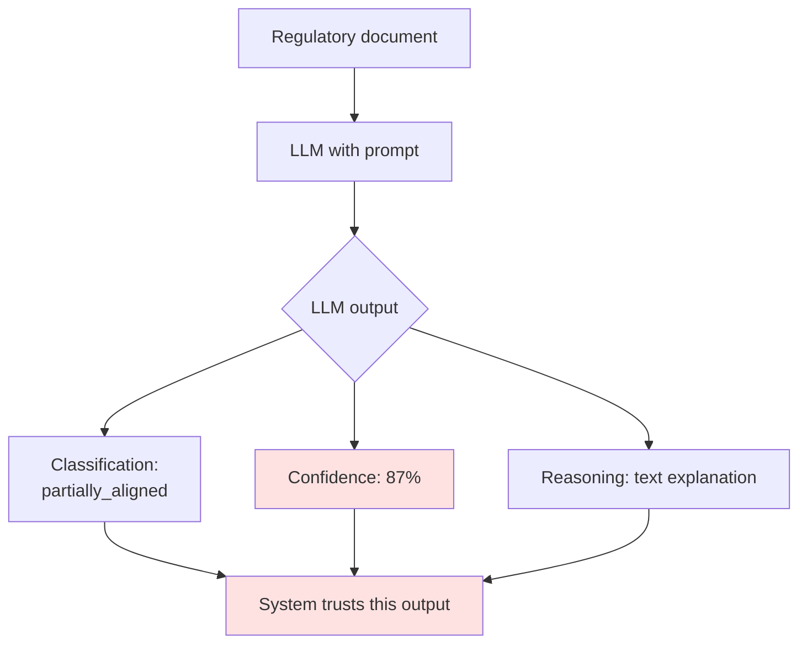

The LLM is the authority. The 87% confidence score is the model's self-report — it reflects how the model was trained to express uncertainty in language, not actual reliability against the regulatory corpus.

This is a known problem called **calibration failure**. LLMs will express 95% confidence on a wrong answer and 60% confidence on a correct one. The number is not anchored to any measurable ground truth.

### What our system does instead

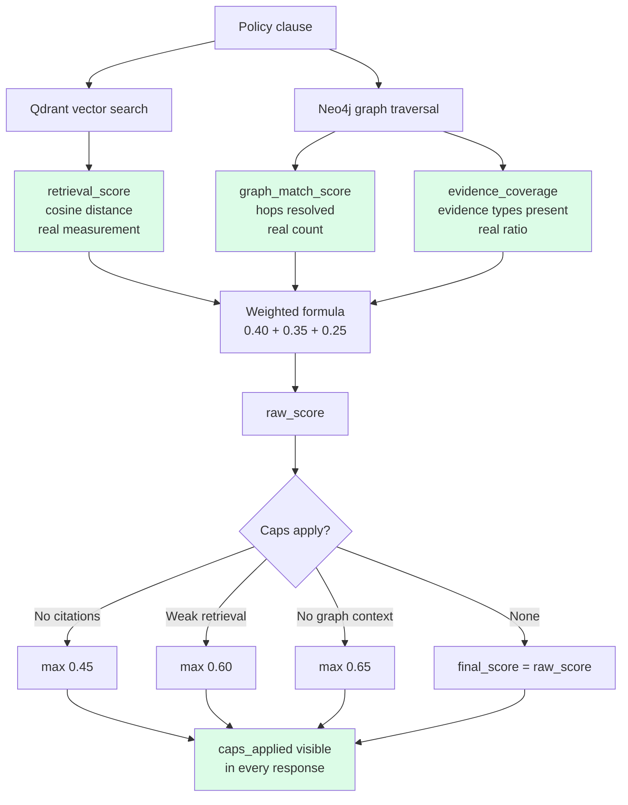

Every number comes from infrastructure the system can independently verify. None of it comes from asking a model how it feels about the answer.

### The exact formula

```
Component              Weight   Source
--------------------   ------   ------------------------------------------
retrieval_score        0.40     Qdrant cosine similarity score
                                → measurement of semantic distance
                                → same input always produces same number

graph_match_score      0.35     Fraction of expected Neo4j hops resolved
                                → did Region→Framework→Obligation→Topic
                                  all exist and connect correctly?
                                → a count, not an opinion

evidence_coverage      0.25     Fraction of required EvidenceTypes present
                                → did the obligation have its required
                                  evidence types in the graph?
                                → a ratio, not an opinion

raw_score = sum(weight × component)
final_score = min(raw_score, lowest_applicable_cap)
```

### Real result from live system

```
CLAUSE_001: "We disclose climate-related risks annually"

retrieval_score:   0.7023  (real Qdrant cosine score — EU_ESRS_E1_001)
graph_match_score: 0.82    (4 of 5 hops resolved in Neo4j)
evidence_coverage: 0.76    (governance_disclosure evidence present)

raw_score  = (0.7023 × 0.40) + (0.82 × 0.35) + (0.76 × 0.25)
           = 0.2809 + 0.287 + 0.19
           = 0.758

caps_applied: []   ← no caps triggered
final_score:  0.78 ← traceable back to specific retrieval evidence
```

Compare this to an LLM saying "87% confident." The 0.78 can be audited. The 87% cannot.

### Where LLMs still belong in this system

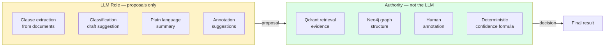

The LLM is a fast first draft. The retrieval system and the human are the authority.

---

## Problem 2: Graph Databases Create a Fixed Vocabulary

### What he described

> *"You tend to end up with a fixed, static vocabulary... you might make 'greenwashing' a characteristic of the edges. But then you have a fixed vocabulary of whatever you have defined."*

### What a static system does when it hits an unknown term

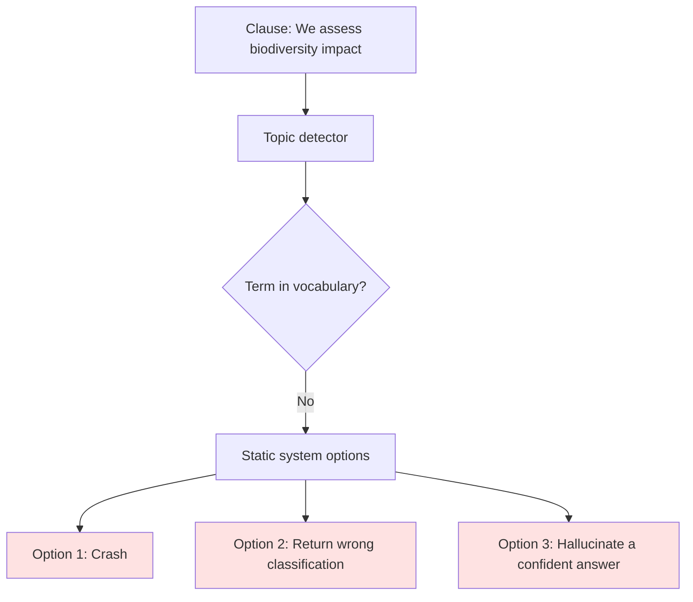

All three options are bad in a legal context. A wrong confident answer is worse than no answer.

### What our living ontology does instead

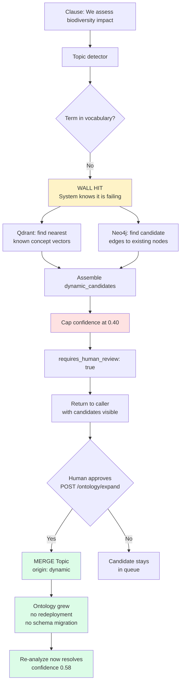

### Real result from live system

```
BEFORE expansion:
  Input: "We assess biodiversity impact near our supply chain facilities."
  confidence_score: 0
  impact_status: uncertain
  caps_applied: [no_citations, unknown_with_candidates]
  requires_human_review: true
  dynamic_candidates: [{ candidate_term: "biodiversity", suggested_edges: [...] }]

AFTER POST /ontology/expand:
  Neo4j now contains:
  (t:Topic { id: 'biodiversity_impact', origin: 'dynamic' })
    -[:SEMANTICALLY_RELATED_TO]->
  (existing:Topic { id: 'climate_risk_disclosure' })

RE-ANALYZE:
  Input: same clause
  confidence_score: 0.58      ← wall lifted
  impact_status: partially_aligned
  caps_applied: []
  requires_human_review: false
```

The ontology learned from one human decision. No redeployment. No schema migration. The `origin: dynamic` field marks it as human-promoted so growth is auditable.

### The key difference from a static graph

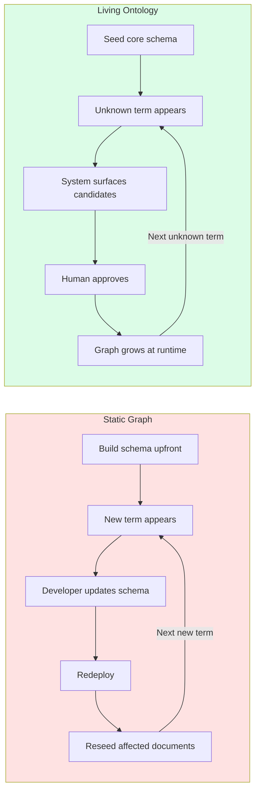

At two jurisdictions the static approach is manageable. At twenty jurisdictions with regulations changing constantly in multiple languages it becomes a full-time engineering bottleneck. The living ontology removes that bottleneck.

---

## Problem 3: Universal Schema Collapses Legal Nuance

### The scaling problem he is facing

The long-term goal is universal coverage of all government regulations worldwide. The naive approach is to build one schema that every jurisdiction maps into.

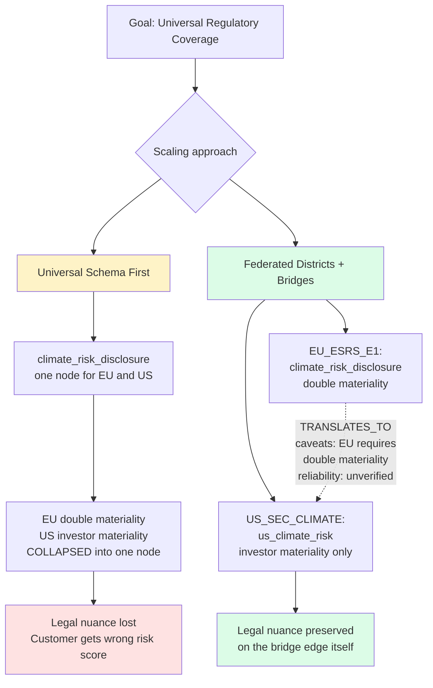

### Why this matters legally

EU ESRS E1 requires **double materiality** — the company must assess both how climate change affects the company AND how the company affects climate. US SEC climate rules require only **investor materiality** — how does climate affect investors.

These are not the same obligation. A company compliant with EU requirements is not automatically compliant with US requirements. Collapsing them into one node in a universal schema makes the system unable to surface this difference — which is exactly the risk signal Scorealytics is selling.

### How federation preserves nuance

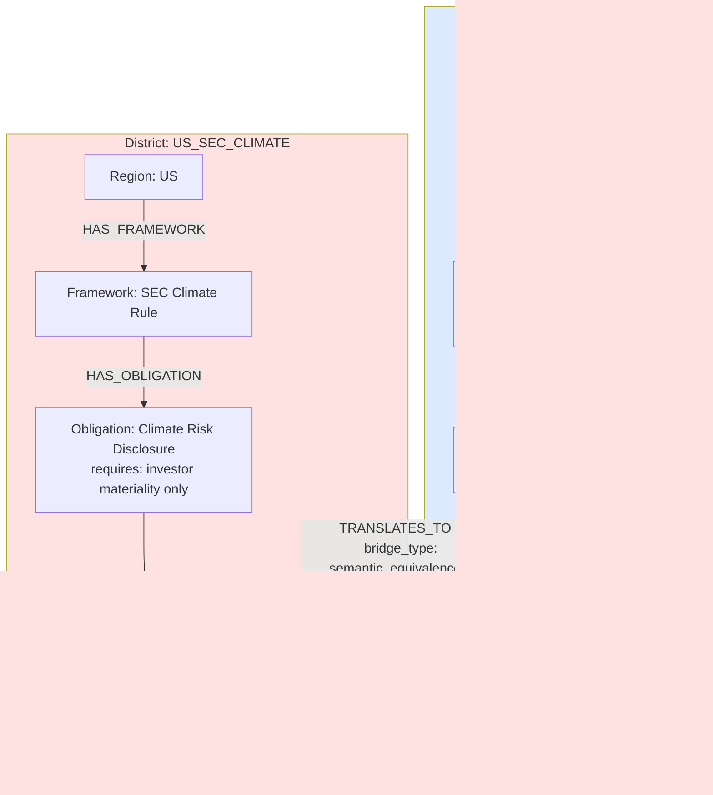

The bridge edge carries the difference as data. The system knows these are related concepts AND knows they are not the same obligation. That distinction is what produces an accurate risk score.

### The federated analyze response

```json
{
  "local_result": {
    "jurisdiction": "EU_ESRS_E1",
    "impact_status": "partially_aligned",
    "confidence_score": 0.78
  },
  "federated_context": [
    {
      "target_jurisdiction": "US_SEC_CLIMATE",
      "bridge_type": "semantic_equivalence",
      "confidence": 0.72,
      "caveats": [
        "EU_requires_double_materiality",
        "US_focuses_on_investor_materiality_only"
      ],
      "impact_if_expanded_to_us": "aligned_with_caveats",
      "reliability": "unverified"
    }
  ],
  "federated_confidence": {
    "local_score": 0.78,
    "bridge_score": 0.72,
    "combined_score": 0.75,
    "bridge_reliability": "unverified"
  }
}
```

The response tells you: this policy is partially aligned in the EU, and if you expand to the US there is a related requirement but with caveats — EU requires double materiality which the US does not. That is the risk signal. That is what Scorealytics is selling.

---

## How All Three Solutions Work Together

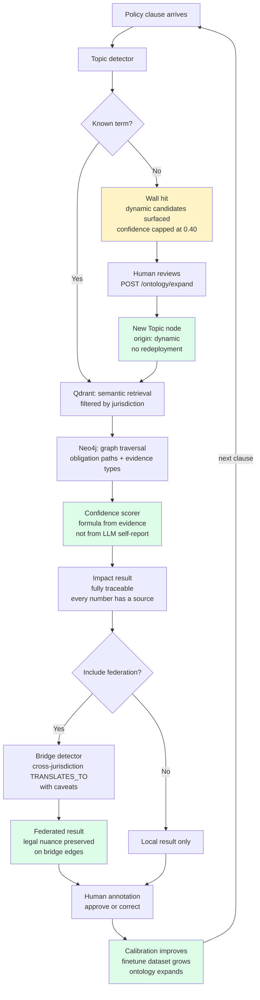

---

## The Direct Answer to His Question

He asked: *"How do you get a generative LLM to give accurate confidence scores?"*

The answer this system demonstrates:

**Do not ask the LLM for a confidence score. Compute it from evidence the system can measure independently of the LLM.**

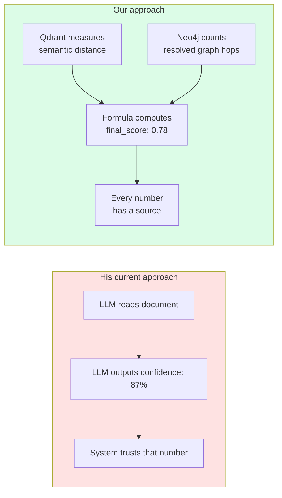

The 0.78 in our system can be audited step by step back to specific retrieval evidence. The 87% in his system cannot. In a legal context where wrong answers have real consequences for customers, that difference is the entire product.

---

## Current System Status

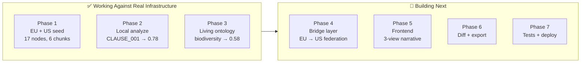

### What each working endpoint proves right now

| Endpoint | What it proves |
|---|---|
| `POST /seed` | Real vectors in Qdrant, real graph in Neo4j, embedder running |
| `POST /analyze` (CLAUSE_001) | Vector + graph combination producing traceable confidence |
| `POST /analyze` (UNKNOWN_001) | Static vocabulary wall detected, candidates surfaced, no hallucination |
| `POST /ontology/expand` | Living ontology — biodiversity promoted to real Topic node at runtime |
| `POST /analyze` (UNKNOWN_001 re-run) | Wall lifted after human approval, confidence 0 → 0.58 |

The demo is not a pitch for how these problems could be solved. It is a working proof that they already are.
